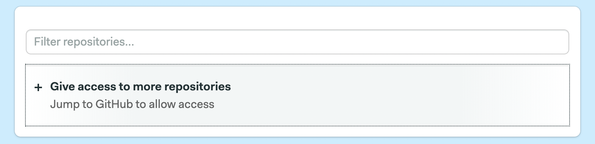
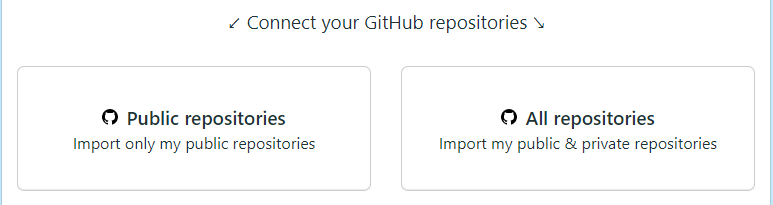
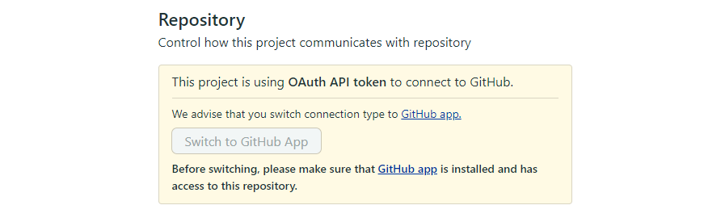
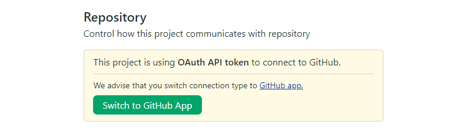
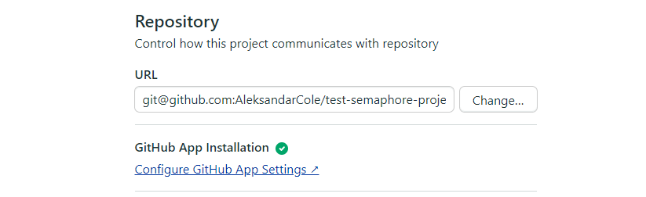

# Connecting your GitHub account and Semaphore

### Signing up on Semaphore with GitHub account
In order to support SSO via GitHub Semaphore uses [OAuth app](https://github.com/settings/connections/applications/328c742132e5407abd7d).

Semaphore will require read access for your GitHub email address in order to sign up/log in. 

Once you sign up, there are two different ways to give access to your repositories - the OAuth app or the GitHub App.

### OAuth App vs. GitHub App
Originally Semaphore interacted with GitHub via the OAuth app. On DATE, 2021 GitHub App was introduced as a new way to connect Semaphore and GitHub. 

**All organizations created before this date will have both OAuth and GitHub app available and can choose between these two ways to connect their repositories. All organizations created after this date have only GitHub App available as the method of connecting GitHub repositories.**

The difference between OAuth Apps and GitHub Apps is described in [GitHub documentation](https://docs.github.com/en/developers/apps/about-apps):

> By default, only organization owners can manage the settings of GitHub Apps in an organization. To allow additional users to manage GitHub Apps in an organization, an owner can grant them GitHub App manager permissions.
> 
> By contrast, users authorize OAuth Apps, which gives the app the ability to act as the authenticated user. For example, you can authorize an OAuth App that finds all notifications for the authenticated user. You can always revoke permissions from an OAuth App.

Using GitHub App is the advised method of connecting your repositories because of two main advantages:

- **More granular permission** - Using GitHub App allows you to give access to each repository individually.
- **No OAuth token owner** - GitHub app doesn't rely on the OAuth token of the original Semaphore project owner, making the user offboarding easier. 

Another important difference is that OAuth App creates a webhook on each GitHub repository while GitHub App uses a single webhook per GitHub App installation. 
This makes webhook troubleshooting a bit harder for GitHub App projects.

### Connecting a repository via GitHub app
In order to connect the repository via [Semaphore GitHub App](#) three conditions need to be met:
1. You can view the repository on GitHub with your account
2. The GitHub App is installed on the GitHub organization/account that repository belongs to
3. The GitHub App is given access either to All repositories or the one you want to connect.

If the conditions above are not met, you will see the empty repository list when trying to create the project:

To give access to more repositories:

1. Click on the "Give access to more repositories"
2. Select GitHub account/organization on which you want to install the app
3. Select "All repositories" or pick individual ones you want to give access to. 
4. You will be returned to the repository list in Semaphore and repositories should appear. 

You can always edit and update the access permissions of each installed GitHub App. 

**Note: You might not be able to install the GitHub app on the GitHub organisations that you're not the owner of. In such cases you can follow the steps above to request the installation but the repositories will not be available until installation is approved by the owner in GitHub. Once you request the installation, GitHub organization owner will receive the email request for approval.**

### Connecting a repository via OAuth token (Legacy)
As of DATE, 2021, this method of connecting the repositories is considered deprecated. Even though it will still be available to organizations created before this date, we advise users to [transfer their projects to the GitHub app](#). Organizations created after this date do not have the option to connect repositories via the OAuth app. 

When creating your first Semaphore project select the "GitHub - Legacy" tab. You can give Semaphore access to:

- All public repositories.
- All public and private repositories.

You can always check which access level you gave on [Profile Settings page](https://me.semaphoreci.com/account).

Please note that the access can always be fully revoked on the [Semaphore OAuth App page](https://github.com/settings/connections/applications/328c742132e5407abd7d).

Access to the **GitHub organization** repositories may need to be granted by the organization owner by going to the [OAuth App page](https://github.com/settings/connections/applications/328c742132e5407abd7d) and clicking "Grant" next to the organization name.

If you gave full access to Semaphore but you only see your personal repositories it might mean that the GitHub organization owner hasn't granted Semaphore access to the organization yet. 

Note that Semaphore usually needs some time to sync with any access changes on GitHub. If all the access has been properly given but you still don't see the repository in the list click the "Sync repos" button to force a refresh. Your repository should appear after a few seconds and a page refresh. 

For more information on how to troubleshoot connections between Semaphore and GitHub via the OAuth app please check our [GitHub OAuth - connection troubleshooting](https://docs.semaphoreci.com/account-management/checking-the-connection-between-github-and-semaphore-2.0/) guide.

### Transferring from OAuth to GitHub app
You can easily transfer your OAuth projects to GitHub App authorisation by following these instructions:

1. Open the Semaphore project you want to transfer
2. Go to project Settings and select Repository settings
3. If your project is using OAuth to connect to repository you will see the following screen:

In this example, the GitHub App does not have access to the repository you want to transfer.

4. Click on the GitHub app link and install the app making sure you give access to the repository in question.
5. Once the GitHub App is installed an access given, go back to project repository settings and click "Switch to GitHub Apps"

6. If your project is switched successfully your Repository Settings page should look like this:

### What GitHub permissions you need for certain Semaphore actions
