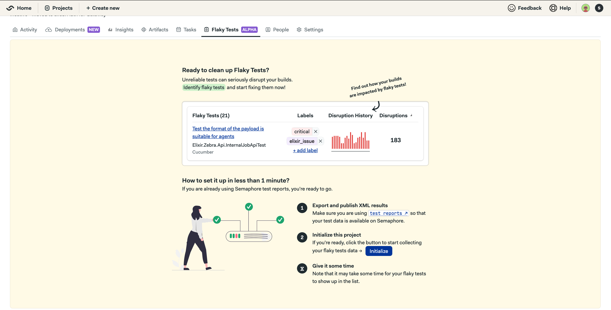
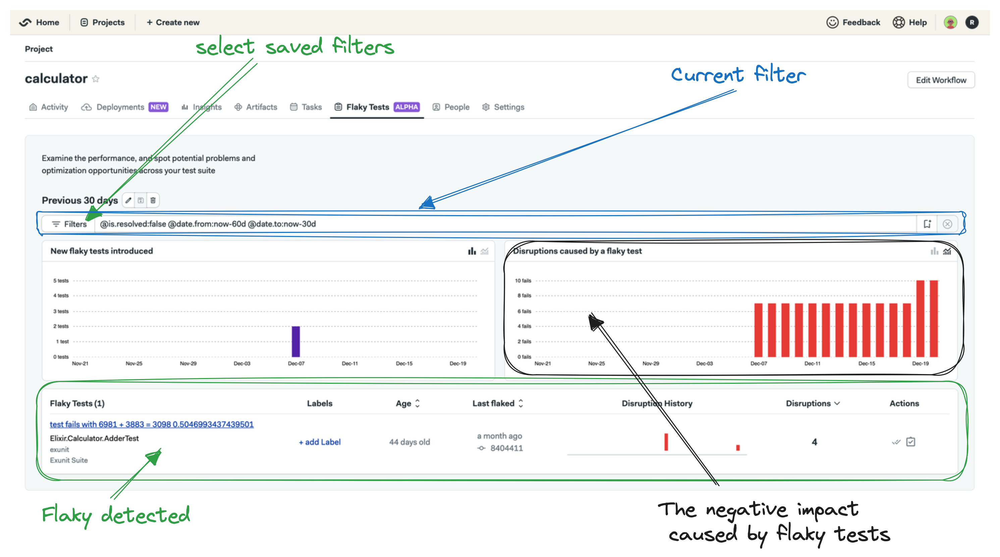
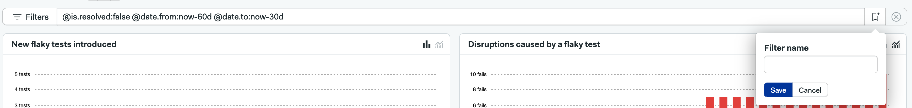
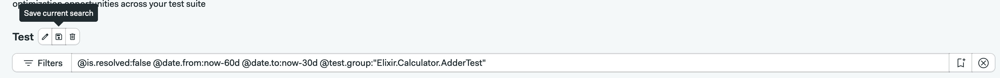
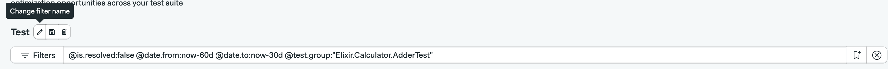
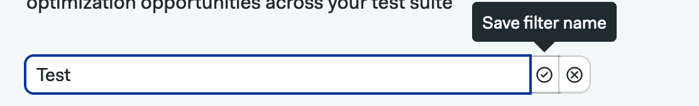
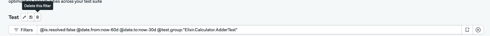
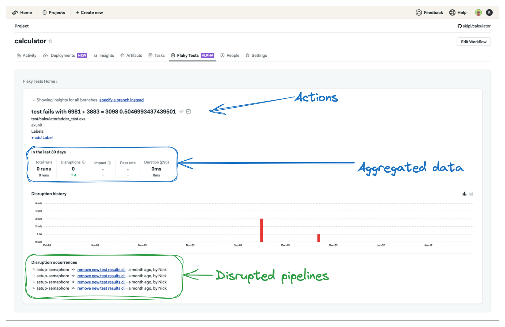

# Flaky Tests

!!! plans "Available on: Startup Scaleup"

Flaky test detection helps identify and manage unreliable tests in a test suite.
By detecting flaky tests, development teams can take specific actions to address
these issues and improve the overall reliability of their testing pipeline.

!!! warning "Note: A test is considered flaky when it produces different results within the same Git commit. For example, the test may fail at one point and subsequently pass without any alterations to the codebase."

## Configuring flaky tests

There are two steps needed to enable flaky tests detection, the first is to set up [test reports][test-reports-ref] in your projects,
and the second is to go to your project and initialize the flaky tests detection.

To initialize the flaky tests detection, go to:

1. Your project in Semaphore;
2. Click in Flaky tests tab;
3. Click Initialize.

!!! warning "Note: It may take some time for flaky tests to be detected as we begin processing your pipeline runs."

##  Flaky Tests UI

In the Flaky Tests UI, you can filter, sort, mark tests as resolved, link tickets, and access a detailed view for deeper analysis..

### Filtering

The Flaky Tests UI provides multiple filtering options, allowing you to refine results based on criteria such as status, date, and test name and many others
see the table bellow for an exastive list.

| Filter key        | Filter Name         | Filter Type         |
| :--------------:  | :-----------------: | :-----------------: | 
| @git.branch       | Git branch          | text                |
| @git.commit_sha   | Git commit sha      | text                |
| @test.name        | Test name           | text                |
| @test.group       | Group that the test is assigned to | text |
| @test.file        | Test file           | text                |
| @test.class.name  | Name of the test class | text             |
| @test.suite       | Name of the test suite | text             |
| @test.runner      | Name of the test runner | text            |
| @metric.age       | Time passed in days since first flake | numeric |
| @metric.pass_rate | Pass rate of a test | numeric             |
| @metric.disruptions | Number of disruptions of a test | numeric |
| @label            | Assigned label to a test | text           |
| @is.resolved      | Filter by resolved or unresolved tests | boolean |
| @is.scheduled     | Filter by scheduled or unscheduled tests | boolean |
| @date.from        | Starting date range   | text             | 
| @date.to          | End of the filtering range | text        | 

#### Text:

Text filters allow you to specify criteria using alphanumeric characters. Examples include filtering by test name, Git branch, file names, or labels.

!!! info "Special cases"
    * The `@date.from` and `@date.to` are special cases, you can specify both the date in the following format: YYYY-MM-DD or now-30d (30 could be replaced any number of days).
    * Wildcard characters (* or %) can be used if you want to do searches based on a specified pattern, example: @test.group:"Elixir.Calculator*". 
 

#### Numeric:
Numeric filters enable you to set criteria based on numerical values. You can use operations such as greater than (>), less than (<), equal to (=), not equal to (!=), greater than or equal to (>=), and less than or equal to (<=). Examples include filtering by the age of a flaky test, pass rate, or the number of disruptions.

#### Boolean:

Boolean filters limit options to true or false values. This type is useful for filters that represent binary conditions. Examples include filtering tests based on whether they are resolved or unresolved, scheduled or unscheduled.

#### Create new filter

These are the steps to create a new filter:

1. Type the query in the searchbox;
2. Search by pressing return key;
3. Click "Create new filter" button on the right hand side of the search box;
4. Give the new filter a name and click Save button.

#### Edit existing filter

These are the steps to edit an existing filter:

1. Select the filter in the filter dropdown;
2. Change the search query;
3. Click "Save current query" button.

#### Rename a filter

These are the steps to change a filter name:

1. Select the filter to be renamed;
2. Click "Change filter name";
3. Give it the updated name;
4. Click "Save filter name" button.

#### Remove filter

These are the steps to delete a filter:

1. Select the filter to be deleted;
2. Click "Delete this filter";

#### Default filters

When you first initialize the Flaky Tests detection, there are 5 default filters for you to use.

!!! warning "Note:You can remove the default filters if you wish, but be sure to keep at least one filter, whether default or custom. Failure to retain at least one filter will prompt a request to initialize your flaky tests detection again. This does not impact the processing of your flaky tests."

| Filter name | Filter value |
|-------------| -------------|
| Current 30 days | @is.resolved:false @date.from:now-30d |
| Previous 30 days | @is.resolved:false @date.from:now-60d @date.to:now-30d |
| Current 90 days | @is.resolved:false @date.from:now-90d |
| Master branch only | @is.resolved:false @git.branch:master @date.from:now-60d |
| More than 10 disruptions | @is.resolved:false @date.from:now-90d @metric.disruptions:>10 |

### Sorting

You can sort the table using three columns: Flaky Test Age (since first flaked), Last Flaked, and Disruptions. By default, sorting is based on the number of disruptions, in descending order.

### Actions

You have several actions you can take on a flaky test. For instance, you can attach a label to assign a team or team member responsible for fixing the test, such as adding a label with the team name.
Additionally, you can mark a flaky test as resolved or mark it as unresolved if it was previously marked as resolved. Another option is to link a ticket to a flaky test, providing the ability to filter by scheduled status.

#### Mark as resolved/unresolved

To mark a flaky test as resolved or unresolved, locate the flaky test, and in the actions column, click the first button (Mark as resolved).

#### Link to ticket

To add a ticket link to your flaky test, start by locating the flaky test. In the actions column, click on the second button (Create a ticket for this test). Copy the flaky test information in markdown and save the link after creating the ticket.

If needed, you can unlink an existing ticket by clicking the "Unlink" option.

#### Labels

To add labels, click the "+ add label" button, type the label name, and click "OK". Keep in mind that there is a limit of 3 labels that can be added to a flaky test.

### Charts

There are to charts at the top of the page, they visually show the number of new flaky tests and the number of disruptions caused by the flaky tests.

The "New flaky tests" chart defaults to displaying data in a daily overview. However, you can opt for a cumulative view of new flaky tests by clicking
the "Cumulative overview" button located on the top right-hand side of the chart.

The "Disruptions caused by a flaky test" chart presents data in a cumulative overview by default. If you prefer a daily overview,
you can select this option by clicking the "Daily overview" button at the top right-hand side of the chart.

### Detailed view

In the detailed view, you encounter the same set of actions available in the main view. You can add labels to a flaky test, mark it as resolved or unresolved, and include a link to the ticket where the test is being addressed. Additionally, you'll find aggregated data detailing the impact of the selected flaky test, such as the P95 runtime, total number of runs, and the pass rate of the test.

The detailed view also provides a list of flaky occurrences, allowing you to navigate to the specific jobs where the test diverged. Furthermore, a wider view of the Disruption History chart is available for analysis. You have the option to select the branch for which you want to view data; by default, the displayed data encompasses all branches.

### Known issues

* While creating a new filter, you need to search, before saving the filter otherwise the contents of the filter do not get saved correctly.
* Deleting a filter does not automatically switch to the next on the list.

## See also

- [Test reports][test-reports-ref]
- [Startup plan](/account-management/startup-plan/)
- [Scaleup plan](/account-management/scaleup-plan/)

We would like to hear feedback from you! <a href="mailto:rlopes@renderedtext.com?subject=Organization health issue">Contact us</a> if you find a bug or have questions.

[test-reports-ref]: ../essentials/test-summary.md