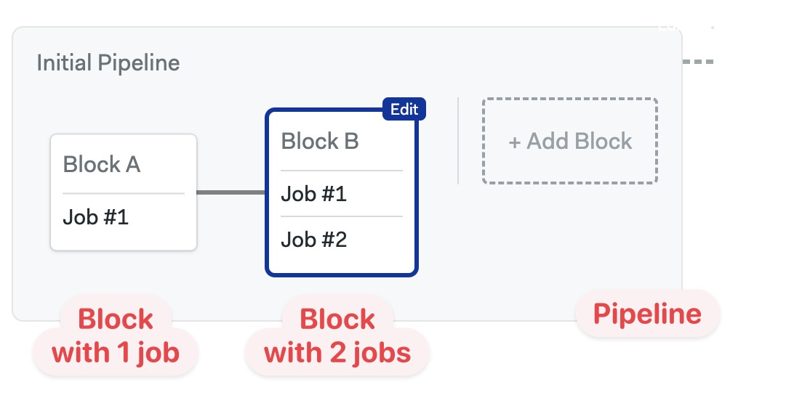
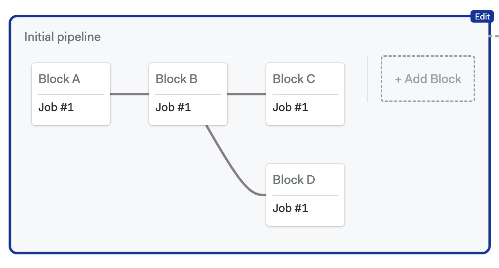

# Key Concepts

THIS CONTENT NEEDS MORE WORK

Semaphore uses a hierarchical system to determine in which order to [run the jobs](../using-semaphore/jobs).

## Jobs, blocks and pipelines

Jobs are grouped into *blocks*. Every job must belong to a block. All jobs in a block *run in parallel* in no particular order.

Blocks are connected via dependencies and *run in sequence*. Only once all the jobs in the first block finish, the following blocks can start. You can make complex flowcharts using block dependencies.

A *pipeline* is a group of blocks. Pipelines are typically used to fulfill specific goals like "build and test" or "deploy". But there is no rule; you can organize your pipelines in any shape.

Semaphore will always start running jobs in blocks with no dependencies. Then, it will move along the dependency graph until all jobs have finished.

## Workflows

A workflow is a group of pipelines via promotions. You can connect pipelines with conditional execution to build even more complex flowcharts.

