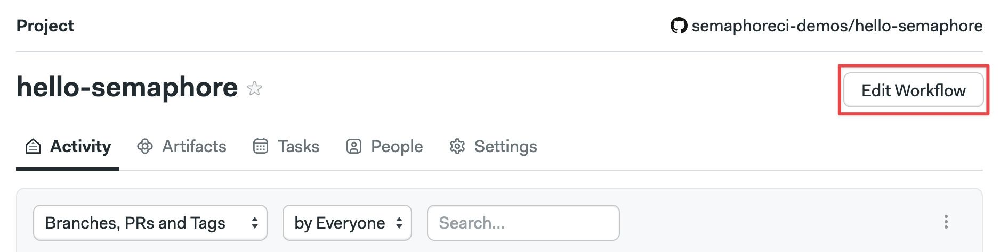
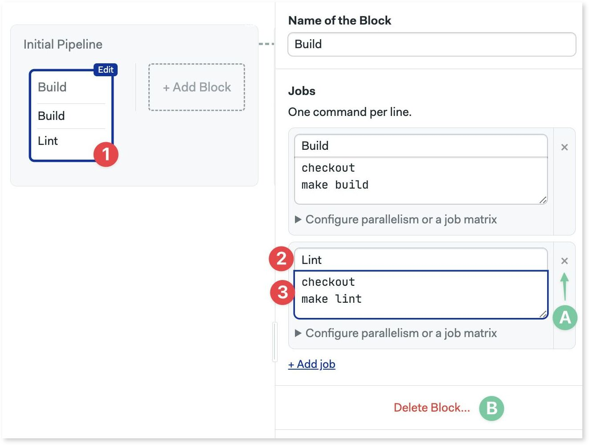
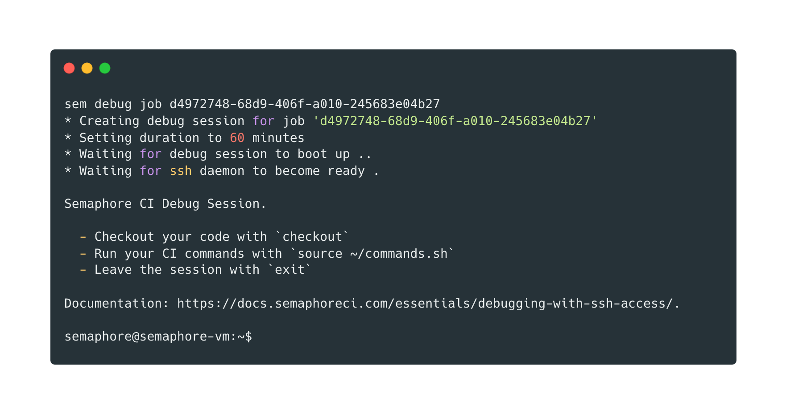
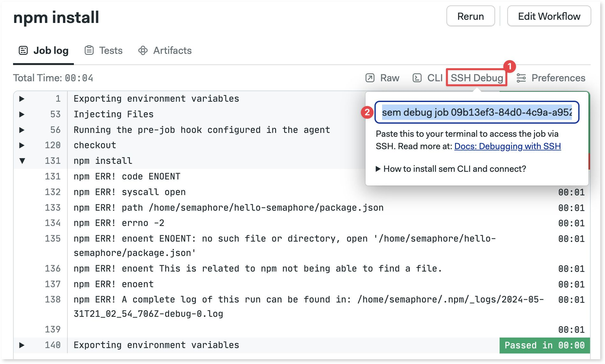

# Jobs

import Tabs from '@theme/Tabs';
import TabItem from '@theme/TabItem';
import VideoTutorial from '@site/src/components/VideoTutorial';

Jobs get stuff done. This page explains how jobs work, how you can configure them, and what settings are available.

## Job lifecycle {#job-lifecycle}

Jobs run arbitrary shell commands inside a dedicated environment called [agent](./pipelines#agents). Agents are ephemeral Docker containers, Kubernetes pods, or x86/ARM VMs running Linux, macOS, or [Windows] (TODO: link to self-hosted)

When a job is scheduled, the following happens:

1. **Allocate agent from pool**: pick a suitable agent from the warm pool of agents.
2. **Initialize environment**: execute setup steps such as importing environment variables, loading SSH keys, mounting [secrets](#secrets), and installing the [Semaphore toolbox](#toolbox)
3. **Run commands**: execute your commands inside the agent
4. **End job and save logs**: the job activity log is exported and saved for future inspection
5. **Destroy agent**: the used agent is discarded, along with all its files


:::info

Agents can be non-ephemeral when using [self-hosted agents].

:::

## How to create a job {#job-create}

You can create a job with the visual editor or by editing the YAML directly in the `.semaphore` folder.

<Tabs groupId="editor-yaml">
<TabItem value="editor" label="Editor" default>

Open your [project](./projects) on Semaphore and press **Edit Workflow**.



1. Select the first block
2. Type your shell commands
3. Press **Run the workflow** > **Looks good, Start →**


 
</TabItem>
<TabItem value="yaml" label="YAML">

1. Create a file called `.semaphore/semaphore.yml` at the repository's root
2. Define an [agent](./pipelines#agents)
3. Create a `blocks` key and type the block's `name`
4. Add a `task.jobs` key. The value is a list of jobs
5. Type the job's `name`
6. Add the job's `commands`. The value is a list of shell commands (one line per list item)
7. Save the file, commit and push it to your remote repository

You can use the following code as a starting point:

```yaml title=".semaphore/semaphore.yml"
version: v1.0
name: Initial Pipeline
agent:
  machine:
    type: e1-standard-2
    os_image: ubuntu2004
blocks:
  - name: 'Block #1'
    dependencies: []
    task:
      jobs:
        - name: 'Job #1'
          commands:
            - 'echo "hello, world!"'
```

</TabItem>
</Tabs>

Semaphore automatically starts the job. Open the job to follow the progress and view the log.


:::info

A *block* is a group of jobs that [share common settings](#block-settings).

:::

### Run jobs in parallel {#jobs-parallel}

Jobs added to the same block not only [share settings](#block-settings) but also run in parallel.

<Tabs groupId="editor-yaml">
<TabItem value="editor" label="Editor">

To run two jobs in parallel:

1. Press **+ Add job**
2. Type the job name
3. Type the job shell commands



You can delete a job by pressing the X sign next to it. To delete the whole block, scroll down and click on **Delete block...**.

</TabItem>
<TabItem value="yaml" label="YAML">

1. Add a new `name` item under `jobs`
2. Add your shell commands (one per line) under `commands`
3. Save the file, commit and push it to your repository

```yaml title=".semaphore/semaphore.yaml"
version: v1.0
name: Initial Pipeline
agent:
  machine:
    type: e1-standard-2
    os_image: ubuntu2004
blocks:
  - name: 'Block #1'
    dependencies: []
    task:
      jobs:
        - name: 'Job #1'
          commands:
            - echo 'this is job
        # highlight-start
        - name: 'Job #2'
          commands:
            - echo 'this is job
        # highlight-end
```

</TabItem>
</Tabs>

:::note

Jobs always run in an isolated environment. Because each job gets a different [agent](./pipelines#agents), they cannot share files or data when running on the same block.

:::

### Run jobs in sequence {#jobs-sequence}

If you want to run jobs one after the other, i.e. not in parallel, you must define them in separate blocks.

<Tabs groupId="editor-yaml">
<TabItem value="editor" label="Editor">

1. Click on **+Add Block**
2. Type the names and commands of the second jo b
3. Adjust dependencies to define execution order


</TabItem>
<TabItem value="yaml" label="YAML">

1. Add a new job entry under `blocks`
2. Add a `dependencies`. List the names of the dependent blocks.
 
```yaml title=".semaphore/semaphore.yml"
version: v1.0
name: Initial Pipeline
agent:
  machine:
    type: e1-standard-2
    os_image: ubuntu2004
blocks:
  - name: 'Block #1'
    dependencies: []
    task:
      jobs:
        - name: 'Job #1'
          commands:
            - echo 'this is job
  # highlight-start
  - name: 'Block #2'
    dependencies:
      - 'Block #1'
    task:
      jobs:
        - name: 'Job #1'
          commands:
            - echo 'this is job
  # highlight-end
```

</TabItem>
</Tabs>

:::tip

Since jobs always run in a completely isolated space, all local files are lost when the job ends. Use the [checkout](#checkout) and [artifact](#artifact) commands to share and persist files between jobs.

:::

### Changing execution order

The order in which jobs and blocks run is defined by the dependencies of each block. Dependencies are explained in detail in the [pipelines page](./pipelines#dependencies).

## Semaphore toolbox {#toolbox}

The [Semaphore toolbox] is a set of command line tools to carry essential tasks in your jobs such as cloning the repository or moving data between jobs.

The most-used tools in the [Semaphore toolbox] are: 

- [checkout] to checkout the code from the remote repository
- [cache] to speed up jobs by caching downloaded files
- [artifact] to move files between jobs and save build artifacts

### checkout {#checkout}

[Checkout] clones the remote repository and `cd`s into the cloned repository so you're ready to work.

The following example shows how to work with a Node.js project. The checkout command is needed to clone the repository so we can get `package.json` and `package-lock.json`.

```shell
checkout
npm install
```
Checkout, like all the tools in the toolbox, are shell scripts. 

All the tools in the toolbox should be added in the correct order in the command section of the job, the [block prologue/epilogue](#prologue), or in the [pipeline prologue/epilogue](./pipelines#settings).

<Tabs groupId="editor-yaml">
<TabItem value="editor" label="Editor">


</TabItem>
<TabItem value="yaml" label="YAML">

```yaml title=".semaphore/semaphore.yml"
version: v1.0
name: Initial Pipeline
agent:
  machine:
    type: e1-standard-2
    os_image: ubuntu2004
blocks:
  - name: Install
    dependencies: []
    task:
      jobs:
        - name: npm install
          commands:
            # highlight-next-line
            - checkout
            - npm install
```

</TabItem>
</Tabs>

<details>
 <summary>How does checkout work?</summary>
 <div>
 During agent initialization, Semaphore sets four [environment variables](#environment-variables) that define how checkout works:
 - SEMAPHORE_GIT_URL: the URL of the repository (e.g. git@github.com:mycompany/myproject.git).
 - SEMAPHORE_GIT_DIR: the path where the repository is to be cloned (e.g. `/home/semaphore/myproject`)
 - SEMAPHORE_GIT_SHA: the SHA key for the HEAD used for `git reset -q --hard`
 - SEMAPHORE_GIT_DEPTH: checkout does by default a shallow clone. This is the depth level for the shallow clone. Defaults to 50
 </div>
</details>

### cache {#cache}

:::note

Using `cache` in [self-hosted agents] requires additional setup steps.

:::

The main function of the [cache] is to speed up job execution by caching downloaded files. As a result, it's a totally optional feature. 

Cache can detect dependency folders. Let's say we want to speed up `npm install`:

```shell
checkout
# highlight-next-line
cache restore
npm install
# highlight-next-line
cache store
```

The highlighted lines show how to use the cache:

- **cache store**: saves `node_modules` to non-ephemeral storage. It knows it's a Node project because it found `package.json` in the working folder.
- **cache restore**: retrieves the cached copy of `node_modules` to the working directory.

Cache is not limited to Node.js. It works with several languages and frameworks. Also, you can use cache with any kind of file or folder but in that case, you need to [supply additional arguments].


### artifact {#artifact}

:::note

Using `artifact` in [self-hosted agents] requires additional setup steps.

:::

The [artifact] command can be used as:

- a way to move files between jobs and runs
- as persistent storage for artifacts such as compiled binaries or bundles

The following example shows how to persist files between jobs. In the first job we have:

```shell
checkout
npm run build
artifact push workflow dist
```

In the following jobs, we can access the content of the dist folder with:

```shell
artifact pull workflow dist
```

Let's do another example: this time we want to save the compiled binary `hello.exe`:

```shell
checkout
go build 
artifact push project hello.exe
```

Artifacts can be viewed and downloaded from the Semaphore project.


<details>
 <summary>Artifact namespaces</summary>
 <div>
    Semaphore has three separate namespaces of artifacts: job, workflow, and project. The syntax is:

    ```shell
    artifact pull|push job|workflow|project /path/to/file/or/folder
    ```

    The namespace used controls at what level the artifact is accessible:

    - job artifacts are only accessible to the job that created it. Useful for collecting debugging data
    - workflow artifacts are accessible to all jobs in all running [pipelines](./pipelines). The main use case is to pass data between jobs.
    - project artifacts are always accessible. They are ideal for storing final deliverables. 

 </div>
</details>


## Debugging jobs {#debug-jobs}

Semaphore makes it easy to troubleshoot jobs. You can debug a job [interactively with an SSH session](#ssh-into-agent) or see the job log in real-time.

### Why my job has failed? {#debug-job}

When the first command in the job ends in a non-zero status the job ends immediately with error. By default, no new jobs start once a job has failed.

Open the job log to see why it failed. The problematic command is shown in red. You can click on the commands to expand their output.


:::tip

To keep running the job even on a failed command, append `|| true` to the problematic line. For example:

```shell
echo "the next command might fail, that's OK, I don't care"
# highlight-next-line
command_that_might_fail || true
echo "continuing job..."
```

:::

### Interactive debug with SSH {#ssh-into-agent}

You can debug a job interactively by SSHing into the agent — a particularly powerful feature for troubleshooting.



:::note

If this is the first time using an interactive session you need to [install and connect] the Semaphore command line tool.

:::

To open an interactive session, open the job log and:

1. Click on **SSH Debug**
2. Copy the command shown
3. Run the command in a terminal



You'll be presented with a welcome message like this:

```shell
* Creating debug session for job 'd5972748-12d9-216f-a010-242683a04b27'
* Setting duration to 60 minutes
* Waiting for the debug session to boot up ...
* Waiting for ssh daemon to become ready.

Semaphore CI Debug Session.

 - Checkout your code with `checkout`
 - Run your CI commands with `source ~/commands.sh`
 - Leave the session with `exit`
```

You have entered into the agent before the actual job has started. The job commands are stored in `$HOME/commands.sh`.

To run the job in the SSH session execute:

```shell
source ~/commands.sh
```

You can actually run anything in the agent, including commands that were not actually part of the job. Exit the session to end the job. 

By default, the duration of the SSH session is limited to one hour. To run longer debug sessions, pass the duration flag to the previous command as shown below:

```shell
sem debug job <job-id> --duration 3h
```

:::note

Interactive sessions may be unavailable when [access policies for secrets](./organizations#secret-access-policy) is enabled.

:::

### Inspecting running jobs {#attach-job}

You can use SSH to attach a console to a running job. The steps are the same as [debugging a job](#ssh-into-agent). The only difference is that Semaphore presents the following command (only while a job is running):

```shell
sem attach <job-id>
```
You can explore running processes, inspect the environment variables, and take a peek at the log files to help identify problems with your jobs.

:::note

Inspecting running jobs may be unavailable when [access policies for secrets](./organizations#secret-access-policy) is enabled.

:::

### Port forwarding {#port-forwarding}

When SSH is not enough to troubleshoot an issue, you can forward use port forwarding to connect to services running inside the agent.

A typical use case for this feature is troubleshooting end-to-end tests. Let's say a test is failing and you can't find any obvious cause in the logs. Port forwarding the HTTP port in the agent to your local machine can reveal how the application "looks" to the tests.

To start a port-forwarding session:

```shell
sem port-forward <job-id> <local-port> <remote-port>
```

For example, to forward an application running on port 3000 to your machine on port 6000, run this while the job is running:

```shell
sem port-forward <job-id> 6000 3000
```

You can now connect to `http://localhost:6000` to view the application running remotely in the agent.

:::note

Port-forwarding only works for Virtual Machine-based agents. It's not available in [Docker environments](./pipelines#docker-environments).

:::

## Block settings {#block-settings}

Block settings apply to every job inside. Select a block to view its settings.

### Prologue {#prologue}

The prologue contains shell commands that run before every job begins. Use this to run common setup commands like downloading dependencies, setting the runtime version, or starting test services.

<Tabs groupId="editor-yaml">
<TabItem value="editor" label="Editor">

1. Select the block
2. Open the prologue section and add your shell commands. 

In the example below we use [checkout](#checkout) to clone the repository at the start of every job in the block.


</TabItem>
<TabItem value="yaml" label="YAML">

1. Locate the block you wish to add the prologue to
2. Add the `prologue` under `tasks`
3. The `commands` are prepended to all jobs in the block. 

In the example below we use [checkout](#checkout) to clone the repository at the start of every job in the block.

```yaml title=".semaphore/semaphore.yml"
version: v1.0
name: Initial Pipeline
agent:
  machine:
    type: e1-standard-2
    os_image: ubuntu2004
blocks:
  - name: Build
    dependencies: []
    task:
      # highlight-start
      prologue:
        commands:
          - checkout
      # highlight-end
      jobs:
        - name: Build
          commands:
            - make build
        - name: Lint
          commands:
            - make lint
```

</TabItem>
</Tabs>

### Epilogue {#epilogue}

The *epilogue* contains commands to run after each job ends. There are three types of epilogue:

- **Execute always**: always runs after the job ends, even if the job failed.
- **If the job has passed**: commands to run when the job passes (all commands in the job exited with zero status).
- **If the job has failed**: commands to run when the job failed (one command in the job exited with non-zero status).

<Tabs groupId="editor-yaml">
<TabItem value="editor" label="Editor">

1. Select the block to add the epilogue to
2. Open the epilogue section (you may need to scroll down) and add your commands in the right box.

In the example below we use [artifact](#artifact) to save build artifacts or log files.


</TabItem>
<TabItem value="yaml" label="YAML">

1. Find the block where you wish to add the epilogue
2. Add the `epilogue` types you wish key under `tasks`

In the example below we use [artifact](#artifact) to save build artifacts or log files.

```yaml title=".semaphore/semaphore.yml"
version: v1.0
name: Initial Pipeline
agent:
  machine:
    type: e1-standard-2
    os_image: ubuntu2004
blocks:
  - name: Build
    dependencies: []
    task:
      # highlight-start
      epilogue:
        always:
          commands:
            - echo "the job ended"
        on_pass:
          commands:
            - 'echo "job passed, saving build artifact"'
            - artifact push project a.out
        on_fail:
          commands:
            - 'echo "job failed, saving build log"'
            - artifact push job build.log
      # highlight-end
      prologue:
        commands:
          - checkout
      jobs:
        - name: Build
          commands:
            - make build
        - name: Lint
          commands:
            - make lint
```

</TabItem>
</Tabs>


### Environment variables {#environment-variables}

Environment variables are exported into the shell environment of every job in the block. You must supply the variable name and its value. A block can have any number of environment variables.

<Tabs groupId="editor-yaml">
<TabItem value="editor" label="Editor">

To add an environment variable:
1. Select the block
2. Open the Environment Variables section (you may need to scroll down)
3. Set your variable name and value
4. Press **+Add env vars** if you need more variables


</TabItem>
<TabItem value="yaml" label="YAML">

1. Locate the block where you add the environment variables
2. Add `env_vars` key under `task`
3. Edit the variables `name` and `value`. You can have many variables under `env_vars`

```yaml title=".semaphore/semaphore.yml"
version: v1.0
name: Initial Pipeline
agent:
  machine:
    type: e1-standard-2
    os_image: ubuntu2004
blocks:
  - name: Build
    dependencies: []
    task:
      # highlight-start
      env_vars:
        - name: NODE_ENV
          value: production
        - name: FOO
          value: bar
      # highlight-end
      jobs:
        - name: Build
          commands:
            - checkout
            - npm run build
```

:::info

Numeric values need to be included in quotes.

:::

</TabItem>
</Tabs>

<details>
 <summary>Environment variables or shell exports?</summary>
 <div>

    You can define environment variables in two ways:

    - by putting them in the [environment variables](#environment-variables) section
    - by using `export` commands in the job window: `export NODE_ENV="production"`

 </div>
</details>

### Secrets {#secrets}

<VideoTutorial title="How to use secrets" src="https://www.youtube.com/embed/rAJIRX81DeA"/>

Secrets store sensitive data such as API keys, passwords, or SSH keys. Secrets are enabled at the block level and available to all the jobs in the block.

You must create the secret before you can add it to a block. How you create the secret depends on its scope:

- [Organization secrets](./organizations#secrets) are available globally
- [Project secrets](./projects#secrets) are available only to the pipelines belonging to a [project](./projects)
- [Environment credentials](./promotions#credentials) fine-grained secrets only available to specific [pipelines](./pipelines)

Once created, the values are no longer visible to users. Secrets are automatically decrypted at runtime when the job starts. Their values are available as environment variables or mounted as files.

<Tabs groupId="editor-yaml">
<TabItem value="editor" label="Editor">

1. Select the block 
2. Open the secrets section (you may need to scroll down)
3. Enable the checkbox next to the secret

The secret values are now available for all jobs in the block.


</TabItem>
<TabItem value="yaml" label="YAML">

1. Locate the block where you want to add the secrets
2. Add a `secrets` key under `tasks`
3. List the names of the secrets to import

The secret values are now available for all jobs in the block.

```yaml title=".semaphore/semaphore.yaml"
version: v1.0
name: Initial Pipeline
agent:
  machine:
    type: e1-standard-2
    os_image: ubuntu2004
blocks:
  - name: AWS Login Test
    dependencies: []
    task:
      # highlight-start
      secrets:
        - name: awskey
      # highlight-end
      jobs:
        - name: List buckets
          commands:
            - echo "Accessing $AWS_DEFAULT_REGION"
            - aws s3 ls
```

</TabItem>
</Tabs>

### Skip/run conditions {#skip-run}

You can choose to skip or run the block only under certain conditions. When a block is skipped, none of the contained jobs run. 

Use cases for this feature include skipping a block on certain branches, or only running it when files in a defined folder have changed.

<Tabs groupId="editor-yaml">
<TabItem value="editor" label="Editor">

1. Select the block
2. Open the **Skip/Run conditions** section (you may need to scroll down)
3. Select **Run this block when...** or **Skip this block when...**
4. Type the [conditions] to run or skip the block


</TabItem>
<TabItem value="yaml" label="YAML (Run/When)">

1. Select the block where to edit the conditions
2. Under the block `name` add `run` and `when`
3. Type the condition that causes the block to run

```yaml title=".semaphore/semaphore.yml"
version: v1.0
name: Initial Pipeline
agent:
  machine:
    type: e1-standard-2
    os_image: ubuntu2004
blocks:
  - name: Build
    dependencies: []
    # highlight-start
    run:
      when: branch = 'master'
    # highlight-end
    task:
      jobs:
        - name: Build
          commands:
            - checkout
            - npm run build
```

</TabItem>
<TabItem value="yaml2" label="YAML (Skip/When)">


1. Select the block where to edit the conditions
2. Under the block `name`, add `skip` and `when` keys
3. Type the condition that causes the block to be skipped

```yaml title=".semaphore/semaphore.yml"
version: v1.0
name: Initial Pipeline
agent:
  machine:
    type: e1-standard-2
    os_image: ubuntu2004
blocks:
  - name: Build
    dependencies: []
    # highlight-start
    skip:
      when: branch = 'master'
    # highlight-end
    task:
      jobs:
        - name: Build
          commands:
            - checkout
            - npm run build
```

</TabItem>
</Tabs>


### Agent {#agent-override}

Here you can override the pipeline-level [agent](./pipelines#agents) for a specific job. You can select X86/ARM VMs running Linux, macOS, or Windows ([self-hosted only]). In addition, the agent can run in Kubernetes pods or [Docker environments](./pipelines#docker-environments).

<Tabs groupId="editor-yaml">
<TabItem value="editor" label="Editor">

1. Select the block
2. Open the **Agent** section (you may need to scroll down)
3. Select the **Environment Type**
4. Select the **OS Image**
5. Select the **Machine Type**


</TabItem>
<TabItem value="yaml" label="YAML">

1. Select the block where you want to override the agent.
2. Add an `agent` key under the `task`
3. Set the `machine` and `os_image`

```yaml title=".semaphore/semaphore.yaml"
version: v1.0
name: Initial Pipeline
agent:
  machine:
    type: e1-standard-2
    os_image: ubuntu2004
blocks:
  - name: Build
    dependencies: []
    # highlight-start
    task:
      agent:
        machine:
          type: a1-standard-4
          os_image: macos-xcode15
    # highlight-end
      jobs:
        - name: Build
          commands:
            - checkout
            - npm run build
```

</TabItem>
</Tabs>
