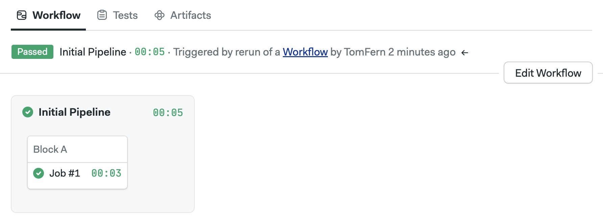

# Jobs

Jobs are the building blocks of Continuous Integration. Everything that happens, happens in a job. Jobs execute user-defined shell commands in a clean, well-defined environment. Semaphore will spin up a new VM for each job and destroy it once it is finished.



## How to create a job

To create a new job, open the workflow editor and:

1. Press **+ Add Block**. The block settings appear on the right
2. Type the block's name 
3. Type the job's name
4. Type your shell commands


To save your changes and start the job:

1. Press on **Run the workflow**
2. Press on **Looks good, Start**


A workflow will automatically start and run the job. You can view the job's log by clicking on the job name at any time.


<details>
  <summary>What are blocks?</summary>
  <div>Blocks group jobs. All jobs in Semaphore must belong in a block. Even if you only have one job, it must go in a block. Jobs in a block run in parallel in no particular order.</div>
</details>

## Success and failure conditions

If at least one of the commands in a job ends with non-zero exit status, the job will be *marked as failed* and the pipeline will stop with error. No new jobs will be started once a job has failed.


:::tip

If you want to keep running the job even when a command fails you can append `|| true` to the failing line. For example:

```shell
echo "the next command might fail, that's OK"
# highlight-next-line
command_that_might_fail || true
echo "continuing job..."
```

:::

## How to run jobs in parallel

Blocks are groups of jobs. All jobs in the same block *run in parallel* in no specific order. 

To run a second job that runs in parallel:

1. Press **+ Add job**
2. Type the job name
3. Type the job shell commands


:::info

Because each job runs in a separate environment, you cannot share files or data between jobs in the same block.

:::

## How to run jobs in sequence

If you want to run jobs one after the other, i.e. not in parallel, you must define them in separate blocks.

1. Press **+ Add Block** to create a second block.
2. Type the block's name
3. Type the job's name
4. Type the job commands
5. Adjust dependencies to define execution order


:::info

Semaphore will always start with the blocks that have no dependencies and move along the dependency graph until all blocks are done.

:::

## Persisting changes between jobs

Semaphore will create a new VM for every job. The only way to share files between jobs is with non-ephemeral storage.

Semaphore Cloud provides two ways to save data between jobs:
- **cache**: every project in Semaphore includes a fixed-size temporary cache. The cache is typically used to save downloaded dependencies.
- **artifacts**: you can push and pull files and folders from the artifact store.

:::warning

Jobs run in their own VM. When the job ends, the whole environment where it was running is destroyed; so any changes you did not explicitly save will be lost.

:::

## Delete a job

To delete a single job:
1. Select the block containing the job you want to delete
2. On the right menu, press the "X" symbol on the top-right side of the job.
3. Confirm deletion


You can also remove jobs by deleting a block. 
1. Select the block you want to delete
2. Scroll down to the right menu. Press **Delete Block...**
3. Confirm deletion


:::warning

Deleting a block deletes all it's children jobs.

:::


## Block settings

Block settings apply to every child's job. Select any block to view its settings.

### Prologue and epilogue

The *prologue* contains shell commands that run before every job begins. Use this to run common setup commands like downloading dependencies, setting the runtime version, or starting test services.

The *epilogue* contains commands to run after each job ends. There are three types of epilogue:
- **Execute always**: always runs after the job ends, even if the job failed.
- **If the job has passed**: commands to run when the job passes (all commands in the job exited with zero status).
- **If the job has failed**: commands to run when the job failed (one command in the job exited with non-zero status).

### Environment variables

Environment variables will be exported into the shell environment of every job in the block. You must supply the variable name and its value. A block can have any number of environment variables.

To add an environment variable:
1. Select the block
2. Open the Environment Variables section
3. Set your variable name and value
4. Press **+Add env vars** if you need more variables
5. Press the X if you need to delete a variable


<details>
  <summary>Environment variables or shell exports?</summary>
  <div>
        <p>You can define block-level environment variables in two ways:</p>
        <ul>
            <li>By adding name-values under the <strong>environment variables section</strong></li>
            <li>By using export in the job command window:<pre>export NODE_ENV="production"</pre></li>
        </ul>
  </div>
</details>

### Secrets

Secrets work like environment variables. The main difference is that they are stored in encrypted format. Selecting a secret from the list will decrypt the secret and inject its files or variables into all jobs in the block.

Use secrets to store sensitive data like API keys, passwords, or SSH key files without revealing their contents.

### Skip/run conditions

You can choose to skip or run the block only under certain conditions. When a block is skipped, none of the contained jobs run. 

Use cases for this feature include skipping a block on certain branches, or only running it when files in a defined folder have changed.

### Agent

This option lets you change the machine and operating system where the job runs.
