# Jobs

import Tabs from '@theme/Tabs';
import TabItem from '@theme/TabItem';

Jobs get stuff done. This page explains how jobs work, how you can configure them, and what settings are available.

## Job lifecycle

Jobs run user-defined shell commands inside a dedicated environment called an *agent*. Agents are ephemeral Docker containers, Kubernetes pods, or VMs running Linux, MacOS, or Windows.

When a job is scheduled, Semaphore will:
1. **Schedule gent from pool**: pick a suitable agent from the warm pool of agents.
2. **Initialize environment**: execute setup steps such as importing environment variables, loading SSH keys, mounting secrets, and installing the Semaphore CLI toolbox
3. **Run commands**: execute your commands inside the agent
4. **End job and save logs**: when the job ends, its activity log is exported and saved for future inspection
5. **Destroy agent**: the used agent is discarded.

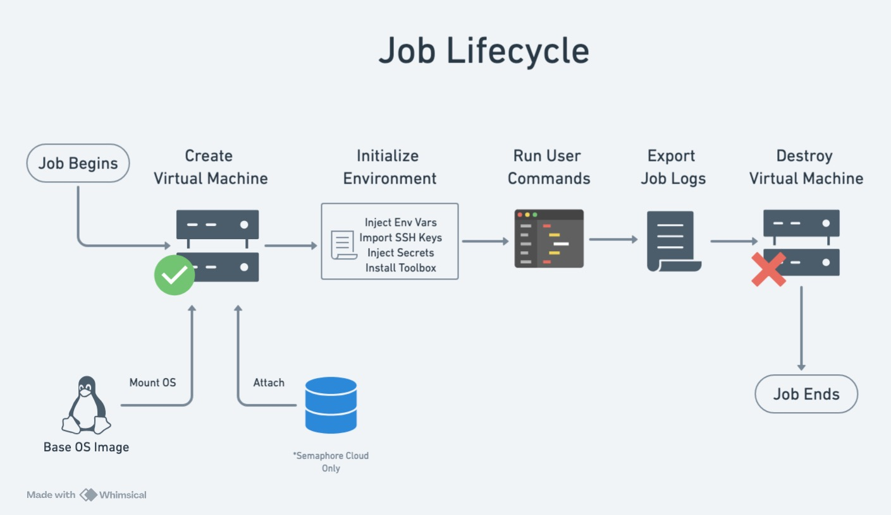

:::info

Agents can be non-ephemeral when using *self-hosted agents*.

:::

## Blocks

Every job in Semaphore exists inside a block. Blocks provide a convenient way to group jobs that share settings like [environment variables](#environment-variables). By default, jobs *do not share state* even when on the same block.

Jobs in the same block *run in parallel*. Here jobs #1, #2, and #3 run simultaneously.

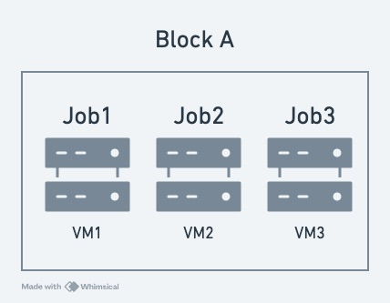

You can add dependencies to blocks to orchestrate complex workflows. For more details, check [pipelines](./pipelines.md).

## How to create a job

You can create a job using YAML or by editing your pipeline in the visual workflow editor.

<Tabs groupId="jobs">
  <TabItem value="editor" label="Editor" default>
    1. Press **+ Add Block**. The block settings appear on the right
    2. Type the block's name
    3. Type the job's name
    4. Type your shell commands
    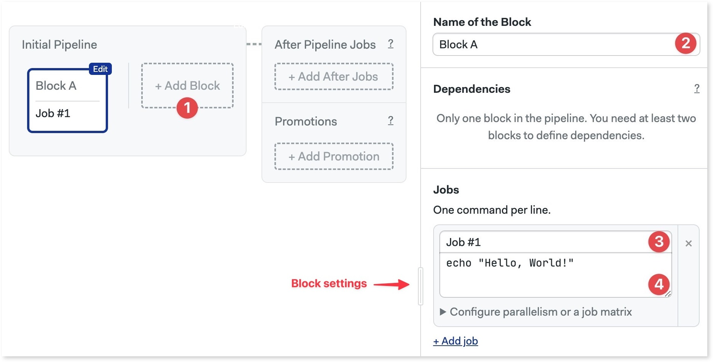
    
    To save your changes and start the job:

    1. Press on **Run the workflow**
    2. Press on **Looks good, Start**

    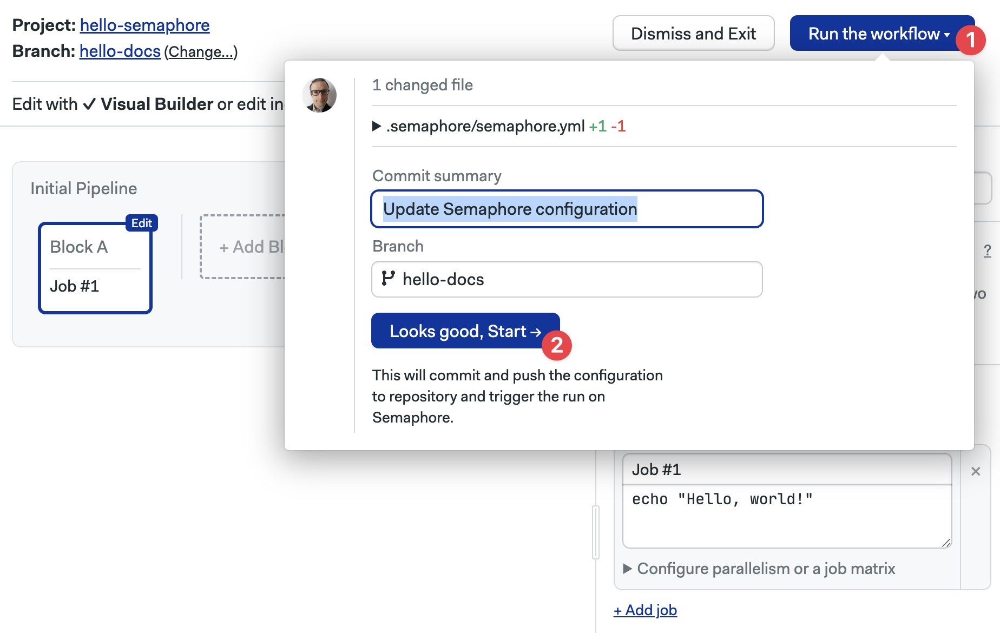
  </TabItem>
  <TabItem value="yaml" label="YAML">
    1. Create a pipeline file called `.semaphore/semaphore.yml` at the repository's root
    2. Define an *agent*
    3. Create a `blocks` key. The block's value is a list
    4. Start with the block's `name`
    5. Add a `task.jobs` key. The job's value is a lit
    6. Type the job's `name`
    7. Add the job's `commands`. The value is a list of shell commands (one line per list item)
    8. Save the file, commit and push it to your remote repo

    ```yaml title=".semaphore/semaphore.yml"
    version: v1.0
    name: Initial pipeline
    agent:
      machine:
        type: e1-standard-2
        os_image: ubuntu2004
    # highlight-start
    blocks:
      - name: Build
        task:
          jobs:
            - name: Make
              commands:
                - checkout
                - make build
    # highlight-end
    ```
  </TabItem>
</Tabs>

Semaphore will detect a change in the remote repository and automatically start the job. Open the project in Semaphore to follow the progress and view the job log.

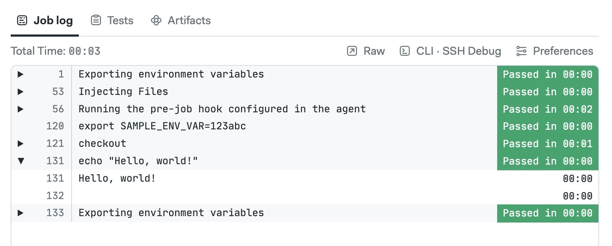

<details>
  <summary>Where are my files?</summary>
  <div>Remember that each job gets a brand new agent, so besides a few pre-installed utilities, there is nothing in the local disk. Semaphore provides tools to persist files and move them between jobs.</div>
</details>

## Semaphore toolbox

Most CI platforms provide primitives in their config to do standard actions like checking out the code from the repository. For example, GitHub Actions has a [checkout action](https://github.com/actions/checkout) while CircleCI has a [checkout step](https://circleci.com/docs/hello-world/). 

Semaphore is different: it doesn't provide YAML primitives for standard tasks like persisting files or checking out code. They add unnecessary complexity to the YAML syntax. Instead, Semaphore gives you the *toolbox*, which is a suite of shell scripts that let you achieve all these tasks and more.

The most-used tools in the Semaphore toolbox are: 
- *checkout* to checkout the code from the remote repository
- *cache* to speed up jobs by caching downloaded files
- *artifact* lets you move files between jobs and store build artifacts

### checkout

*Checkout* clones the remote repository into the agent so your job has a working copy of your codebase. It also `cd`s into the cloned repository so you're ready to work.

Let's say we want to clone the repository and install Node.js dependencies:

```shell
checkout
npm install
```

Checkout, like all the tools in the toolbox, are shell scripts. They are typed in the command section of the job like any other script.

<Tabs groupId="jobs">
  <TabItem value="editor" label="Editor">
  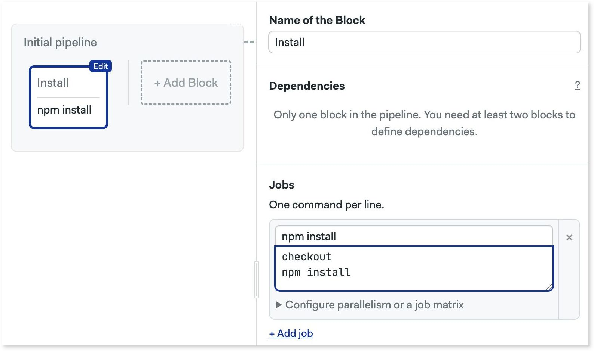
  </TabItem>
  <TabItem value="yaml" label="YAML">
  ```yaml title=".semaphore/semaphore.yml"
  version: v1.0
  name: Initial pipeline
  agent:
    machine:
      type: e1-standard-2
      os_image: ubuntu2004
  blocks:
    - name: Install
      task:
        jobs:
          - name: npm install
            commands:
              - checkout
              - npm install
  ```
  </TabItem>
</Tabs>

<details>
  <summary>How checkout works</summary>
  <div>
  During agent initialization, Semaphore sets four *environment variables* that define how checkout works:
  - SEMAPHORE_GIT_URL: the URL of the repository (e.g. git@github.com:mycompany/myproject.git).
  - SEMAPHORE_GIT_DIR: the path where the repository will be cloned (e.g. `/home/semaphore/myproject`)
  - SEMAPHORE_GIT_SHA: the SHA key for the HEAD used for `git reset -q --hard`
  - SEMAPHORE_GIT_DEPTH: checkout does by default a shallow clone. This is the depth level for the shallow clone. Defaults to 50
  </div>
</details>


### cache

The main function of the *cache* is to speed up job execution by caching downloaded files. As a result, it's a totally optional feature. 

Cache can detect dependency folders. Let's say we want to speed up `npm install`:

```shell
checkout
# highlight-next-line
cache restore
npm install
# highlight-next-line
cache store
```

The highlighted lines show how to use the cache:

- cache store: saves `node_modules` to non-ephemeral storage.
- cache restore: retrieves the cached copy of `node_modules` to the working directory.

Cache is not limited to Node.js. It works with several languages and frameworks. Also, you can use cache with any kind of file or folder but in that case, you need to *supply additional arguments*.

:::info

cache and artifact only works in Semaphore Cloud

:::

### artifact

The *artifact* command can be used as:

- a way to move files between jobs and runs
- as persistent storage for artifacts such as compiled binaries or bundles

The following example shows how to persist files between jobs. In the first job we have:

```shell
checkout
npm run build
artifact push workflow dist
```

In the following jobs, we can access the content of the dist folder with:

```shell
artifact pull workflow dist
```

Let's do another example: this time we want to save the compiled binary `hello.exe`:

```shell
checkout
go build 
artifact push project hello.exe
```

Artifacts can be viewed and downloaded from the Semaphore project.

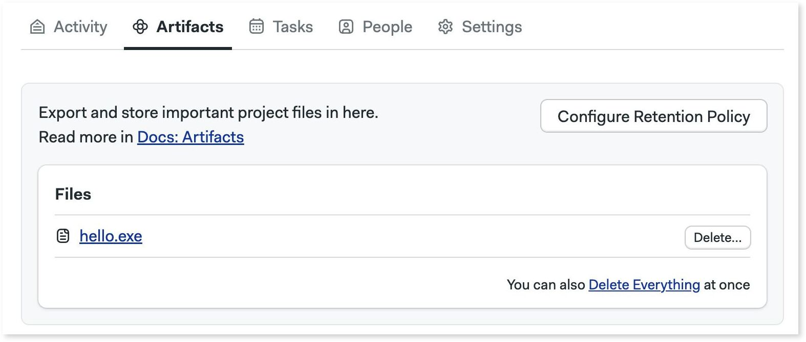


:::info

cache and artifact only works in Semaphore Cloud

:::

## Debugging jobs

Semaphore provides superb tools to debug and troubleshoot jobs. For instance, you can create an [interactive SSH session](#ssh-into-agent) to try out several solutions without having to re-run all the jobs.

### Why my job has failed?

If at least one of the commands in a job ends with non-zero exit status, the job will be *marked as failed* and the pipeline will stop with error. No new jobs will be started once a job has failed.

Open the job log to see why it failed. The problematic command will be shown in red and expanded.

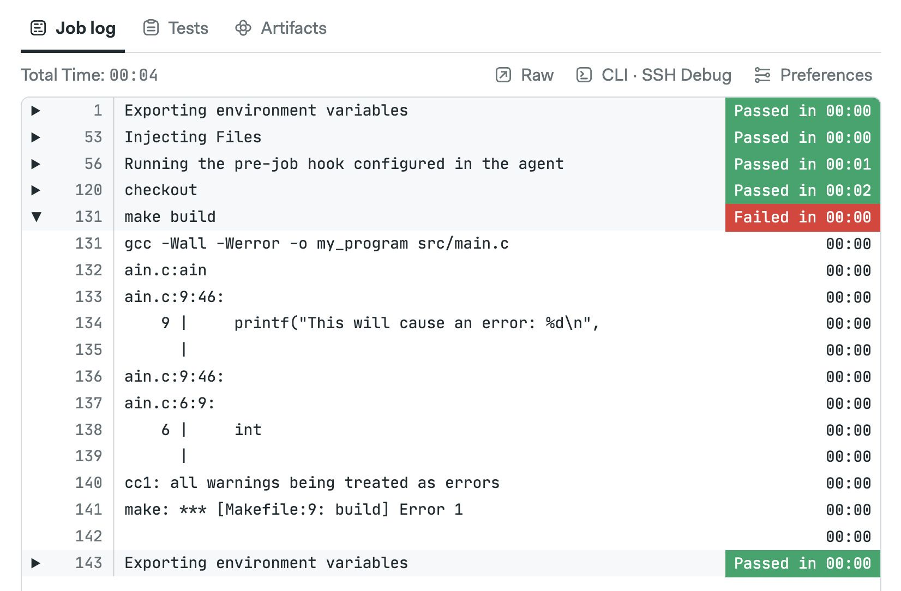


:::tip

To keep running the job even on a failed command, append `|| true` to the problematic line.

```shell
echo "the next command might fail, that's OK"
# highlight-next-line
command_that_might_fail || true
echo "continuing job..."
```

:::

### Interactive debug with SSH {#ssh-into-agent}

You can debug a job interactively by SSHing into the agent — a particularly powerful feature for troubleshooting.

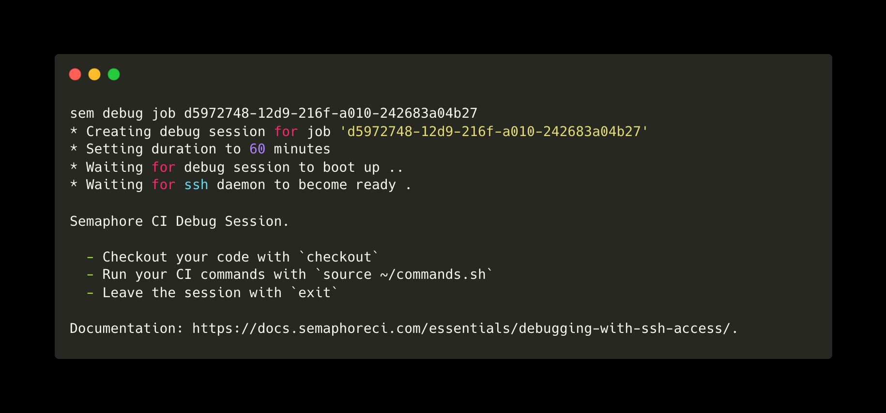

To open a debugging session for the first time:

1. Click on **SSH Debug** in the job log view
2. Open the "How to install ..." section
3. Install the *sem cli*: copy and paste the command in a terminal
4. Authorize sem cli to access your organization: copy and paste the command into a terminal
5. Start the SSH session: copy and paste the command in a terminal 

You only need to execute steps 3 and 4 the first time you start a debug session.

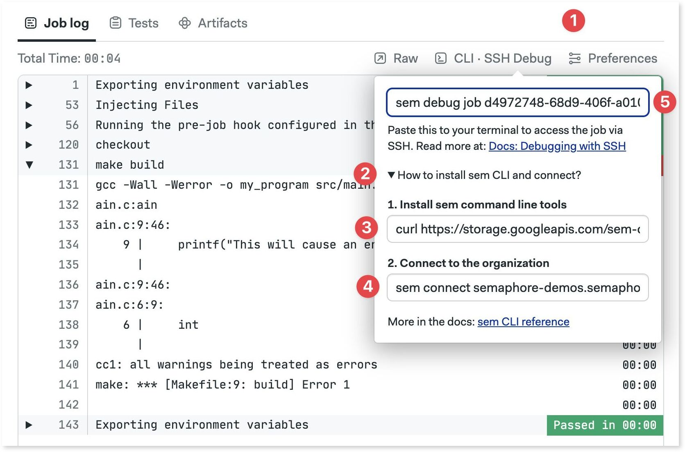

You'll be presented with a welcome message like this:

```shell
* Creating debug session for job 'd5972748-12d9-216f-a010-242683a04b27'
* Setting duration to 60 minutes
* Waiting for the debug session to boot up ...
* Waiting for ssh daemon to become ready.

Semaphore CI Debug Session.

  - Checkout your code with `checkout`
  - Run your CI commands with `source ~/commands.sh`
  - Leave the session with `exit`
```

You have entered into the agent before the actual job has started. The contents of `commands.sh` are the job commands. So, you can execute `source ~/commands.sh` to start it. You can actually run anything in the agent, including commands that were not actually part of the job.

## How to run jobs sequentially

If you want to run jobs one after the other, i.e. not in parallel, you must define them in separate blocks.

<Tabs groupId="jobs">
  <TabItem value="editor" label="Editor">


  1. Create the first block and job
  2. Add a second block and job
  3. Adjust dependencies to define execution order

  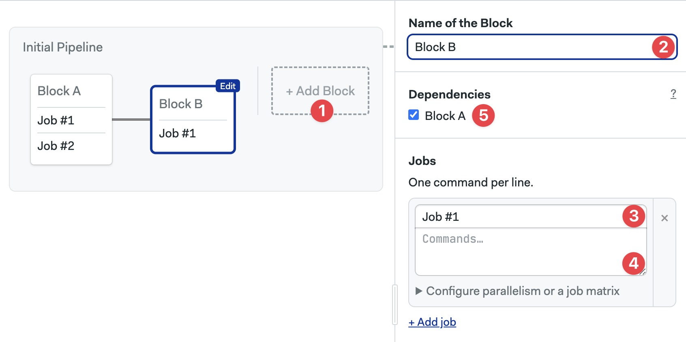
  </TabItem>
  <TabItem value="yaml" label="YAML">

  1. Add a new job entry under `blocks`
  2. Add a `dependencies`. List the names of the dependent blocks.
      
  ```yaml title=".semaphore/semaphore.yml"
  version: v1.0
  name: Initial pipeline
  agent:
    machine:
      type: e1-standard-2
      os_image: ubuntu2004
  blocks:
    - name: Build
      task:
        jobs:
          - name: Make
            commands:
              - checkout
              - make build
    # highlight-start
    # block added
    - name: Test
      dependencies:
        - Build
      task:
        jobs:
          - name: Test
            commands:
              - checkout
              - make test
    # highlight-end
  ```

  </TabItem>
</Tabs>

:::info

Semaphore will always start with the blocks that have no dependencies and move along the dependency graph until all blocks are done.

:::

## How to run jobs in parallel

Blocks are groups of jobs. All jobs in the same block *run in parallel* in no specific order. 

<Tabs groupId="jobs">
  <TabItem value="editor" label="Editor">


  To run a second job that runs in parallel:

  1. Press **+ Add job**
  2. Type the job name
  3. Type the job shell commands

  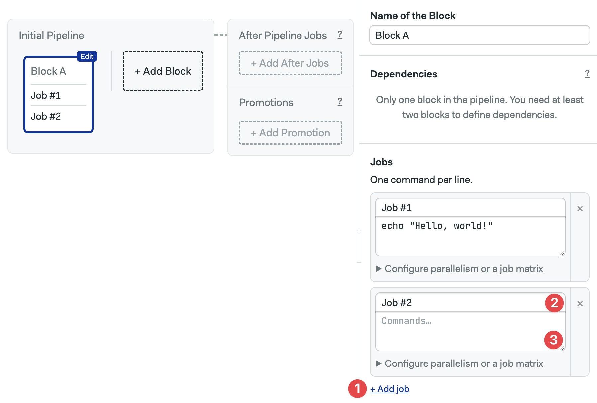


  </TabItem>
    <TabItem value="yaml" label="YAML">

  1. Add a new `name` item under `jobs`
  2. Add your shell commands (one per line) under `commands`
  3. Save the file, commit and push it to your repository

  ```yaml title=".semaphore/semaphore.yaml"
  version: v1.0
  name: Initial pipeline
  agent:
    machine:
      type: e1-standard-2
      os_image: ubuntu2004
  blocks:
    - name: Build and Lint
      dependencies: []
      task:
        jobs:
          - name: Build
            commands:
              - checkout
              - make build
          # highlight-start
          # job added
          - name: Lint
            commands:
              - checkout
              - make lint
          # highlight-end
  ```

  </TabItem>
</Tabs>

:::info

Because each job runs in a separate environment, you cannot share files or data between jobs in the same block.

:::


## How to delete a job {#delete-job}

If the block only contains the job you want to delete you must [delete the block](#block-delete) instead.

<Tabs groupId="jobs">
  <TabItem value="editor" label="Editor">

  1. Select the block containing the job you want to delete
  2. On the right menu, press the "X" symbol on the top-right side of the job.
  3. Confirm deletion

  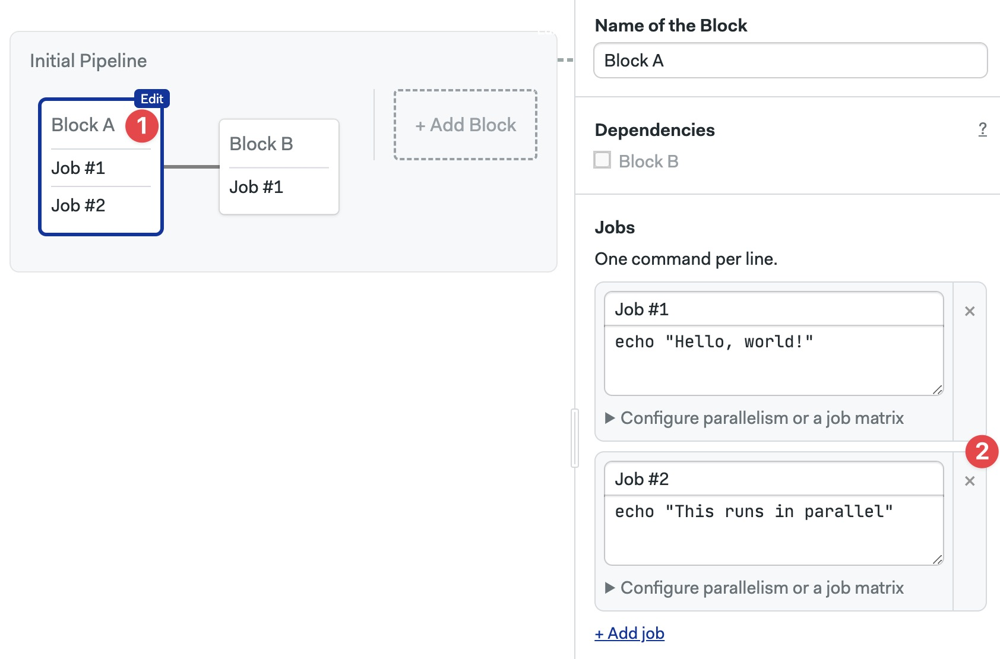
  </TabItem>
  <TabItem value="yaml" label="YAML">
  1. Delete the `name` entry in the block
  2. Delete all `commands` inside the job

  ```yaml title=".semaphore/semaphore.yml"
  version: v1.0
  name: Initial pipeline
  agent:
    machine:
      type: e1-standard-2
      os_image: ubuntu2004
  blocks:
    - name: Build and Lint
      dependencies: []
      task:
        jobs:
          - name: Build
            commands:
              - checkout
              - make build
          # highlight-start
          # job to delete
          - name: Lint
            commands:
              - checkout
              - make lint
          # highlight-end
  ```
  </TabItem>
</Tabs>


## How to delete a block {#block-delete}

Deleting a block also **deletes all its jobs**. You can also [delete single jobs](#delete-job).

<Tabs groupId="jobs">
  <TabItem value="editor" label="Editor">

  1. Select the block you want to delete
  2. Scroll down to the right menu. Press **Delete Block...**
  3. Confirm deletion

  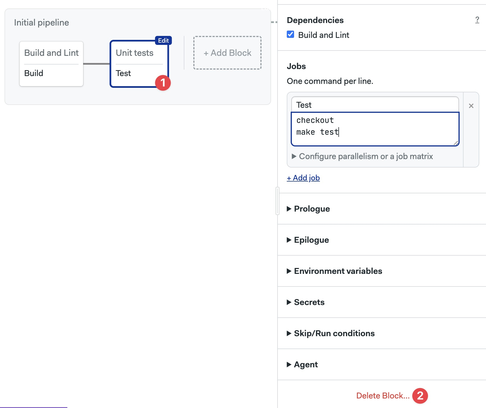

  </TabItem>
  <TabItem value="yaml" label="YAML">
  1. Find the block you wish to delete under `blocks`
  2. Delete the whole block with all its child jobs
  3. Adjust dependencies on other blocks as necessary

  ```yaml title=".semaphore/semaphore.yml"
  version: v1.0
  name: Initial pipeline
  agent:
    machine:
      type: e1-standard-2
      os_image: ubuntu2004
  blocks:
    - name: Build and Lint
      dependencies: []
      task:
        jobs:
          - name: Build
            commands:
              - checkout
              - make build
    # highlight-start
    # block to delete
    - name: Unit tests
      dependencies:
        - Build and Lint
      task:
        jobs:
          - name: Test
            commands:
              - checkout
              - make test
    # highlight-end
  ```
  </TabItem>
</Tabs>


:::warning

Deleting a block deletes all it's children jobs.

:::

## Block settings

Block settings apply to every child's job. Select any block to view its settings.

### Prologue

The prologue contains shell commands that run before every job begins. Use this to run common setup commands like downloading dependencies, setting the runtime version, or starting test services.

<Tabs groupId="jobs">
  <TabItem value="editor" label="Editor">

  1. Select the block
  2. Open the prologue section and add your shell commands
  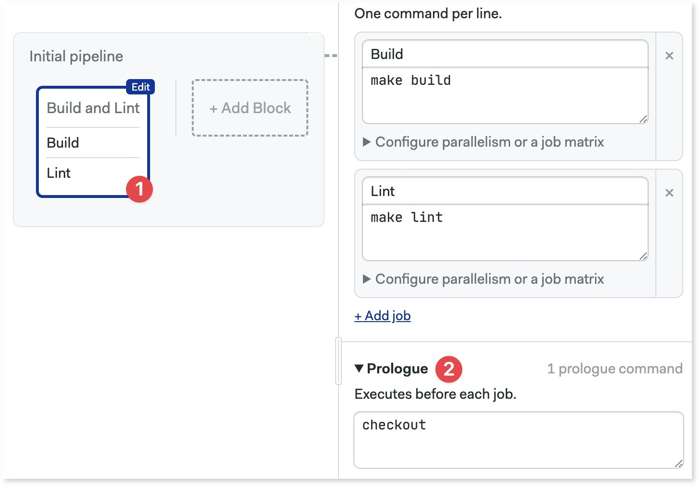

  </TabItem>
  <TabItem value="yaml" label="YAML">

  1. Locate the block you wish to add the prologue to
  2. Add the `prologue` under `tasks`

  ```yaml title=".semaphore/semaphore.yml"
  version: v1.0
  name: Initial pipeline
  agent:
    machine:
      type: e1-standard-2
      os_image: ubuntu2004
  blocks:
    - name: Build and Lint
      dependencies: []
      task:
        jobs:
          - name: Build
            commands:
              - make build
          - name: Lint
            commands:
              - make lint
        # highlight-start
        prologue:
          commands:
            - checkout
        # highlight-end
  ```

  </TabItem>
</Tabs>

### Epilogue

The *epilogue* contains commands to run after each job ends. There are three types of epilogue:
- **Execute always**: always runs after the job ends, even if the job failed.
- **If the job has passed**: commands to run when the job passes (all commands in the job exited with zero status).
- **If the job has failed**: commands to run when the job failed (one command in the job exited with non-zero status).

<Tabs groupId="jobs">
  <TabItem value="editor" label="Editor">

  1. Select the block to add the epilogue to
  2. Open the epilogue section and add your commands in the right box
  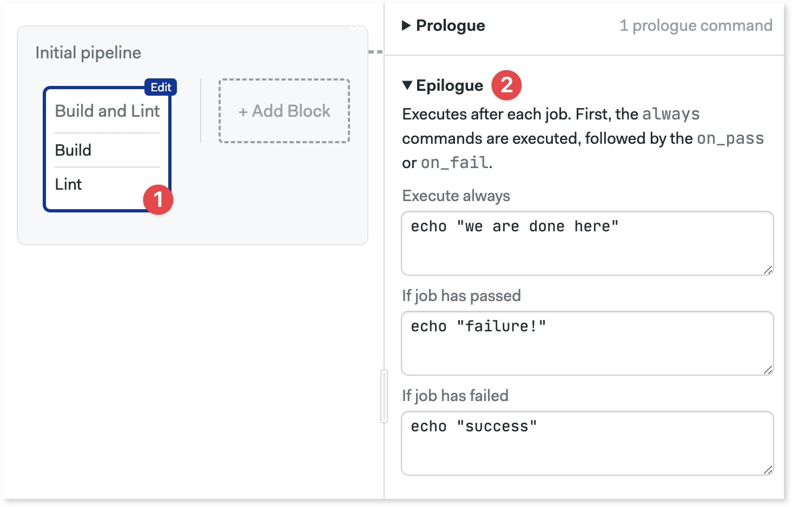

  </TabItem>
  <TabItem value="yaml" label="YAML">
  1. Find the block where you wish to add the epilogue
  2. Add the `epilogue` types you wish key under `tasks`

  ```yaml title=".semaphore/semaphore.yml"
  version: v1.0
  name: Initial pipeline
  agent:
    machine:
      type: e1-standard-2
      os_image: ubuntu2004
  blocks:
    - name: Build and Lint
      dependencies: []
      task:
        jobs:
          - name: Build
            commands:
              - make build
          - name: Lint
            commands:
              - make lint
        # highlight-start
        epilogue:
          always:
            commands:
              - echo "we are done here"
          on_pass:
            commands:
              - echo "failure!"
          on_fail:
            commands:
              - echo "success"
        # highlight-end
  ```
  </TabItem>
</Tabs>


### Environment variables {#environment-variables}

Environment variables will be exported into the shell environment of every job in the block. You must supply the variable name and its value. A block can have any number of environment variables.

<Tabs groupId="jobs">
  <TabItem value="editor" label="Editor">

  To add an environment variable:
  1. Select the block
  2. Open the Environment Variables section
  3. Set your variable name and value
  4. Press **+Add env vars** if you need more variables
  5. Press the X if you need to delete a variable

  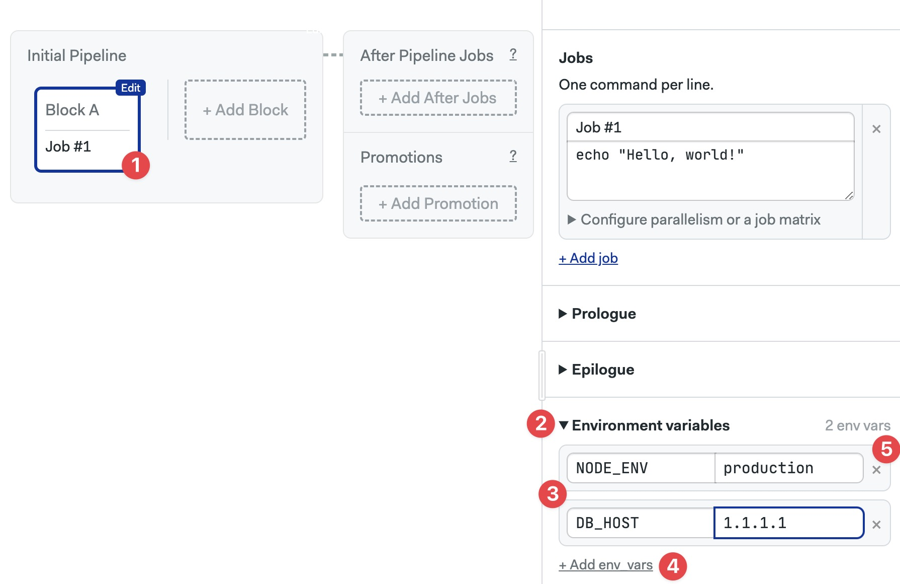
  </TabItem>
  <TabItem value="yaml" label="YAML">

  1. Locate the block where you add the environment variables
  2. Add `env_vars` key under `task`
  3. Edit the variables `name` and `value`. You can have many variables under `env_vars`

  ```yaml title=".semaphore/semaphore.yml"
  version: v1.0
  name: Initial pipeline
  agent:
    machine:
      type: e1-standard-2
      os_image: ubuntu2004
  blocks:
    - name: Build and Lint
      dependencies: []
      task:
        jobs:
          - name: Build
            commands:
              - checkout
              - npm run build
        # highlight-start
        env_vars:
          - name: NODE_ENV
            value: production
          - name: FOO
            value: bar
        # highlight-end
  ```
  </TabItem>
</Tabs>


<details>
  <summary>Environment variables or shell exports?</summary>
  <div>
        <p>You can define block-level environment variables in two ways:</p>
        <ul>
            <li>By adding name-values under the <strong>environment variables section</strong></li>
            <li>By using export in the job command window:<pre>export NODE_ENV="production"</pre></li>
        </ul>
  </div>
</details>

### Secrets

Secrets work like environment variables. The main difference is that they are stored in encrypted format. Selecting a secret from the list will decrypt the secret and inject its files or variables into all jobs in the block.

Use secrets to store sensitive data like API keys, passwords, or SSH key files without revealing their contents.

<Tabs groupId="jobs">
  <TabItem value="editor" label="Editor">

  1. Select the block where you want to add the secrets
  2. Open the secrets section and select the secrets to import
  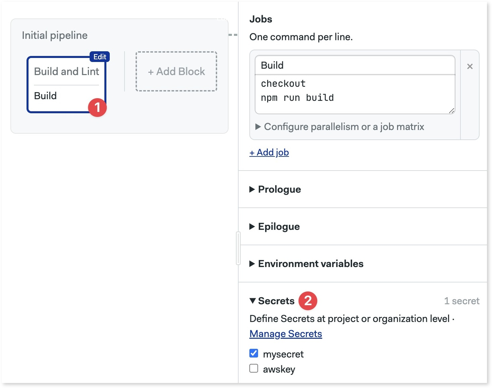

  </TabItem>
  <TabItem value="yaml" label="YAML">
  1. Locate the block where you want to add the secrets
  2. Add a `secrets` key under `tasks`
  3. List the names of the secrets to import

  ```yaml title=".semaphore/semaphore.yaml"
  version: v1.0
  name: Initial pipeline
  agent:
    machine:
      type: e1-standard-2
      os_image: ubuntu2004
  blocks:
    - name: Build and Lint
      task:
        jobs:
          - name: Build
            commands:
              - checkout
              - npm run build
        # highlight-start
        secrets:
          - name: mysecret
          - name: awskey
        # highlight-end
  ```
  </TabItem>
</Tabs>


### Skip/run conditions

You can choose to skip or run the block only under certain conditions. When a block is skipped, none of the contained jobs run. 

Use cases for this feature include skipping a block on certain branches, or only running it when files in a defined folder have changed.

<Tabs groupId="jobs">
  <TabItem value="editor" label="Editor">

  1. Select the block to apply conditions
  2. To disable conditions choose "Always run this block"
  3. To enable conditions select either "Run this block when..." or "Skip this block when..."
  4. Type the conditions to run or skip the block

  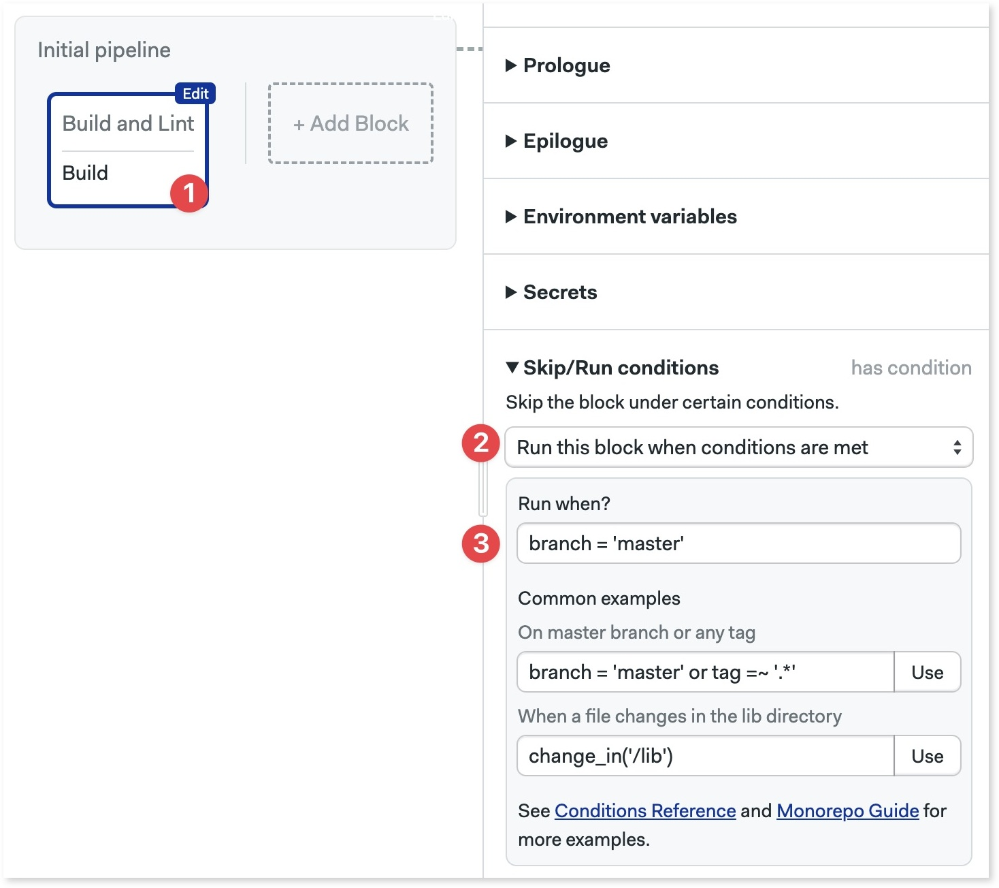

  </TabItem>
  <TabItem value="yaml" label="YAML (Run/When)">

  1. Select the block where to edit the conditions
  2. Under the block `name` add `run` and `when`
  3. Type the condition that causes the block to run

  ```yaml title=".semaphore/semaphore.yml"
  version: v1.0
  name: Initial pipeline
  agent:
    machine:
      type: e1-standard-2
      os_image: ubuntu2004
  blocks:
    - name: Build and Lint
      dependencies: []
      task:
        jobs:
          - name: Build
            commands:
              - checkout
              - npm run build
      # highlight-start
      run:
        when: branch = 'master'
      # highlight-end
  ```

  </TabItem>
  <TabItem value="yaml2" label="YAML (Skip/When)">


  1. Select the block where to edit the conditions
  2. Under the block `name`, add `skip` and `when` keys
  3. Type the condition that causes the block to be skipped

  ```yaml title=".semaphore/semaphore.yml"
  version: v1.0
  name: Initial pipeline
  agent:
    machine:
      type: e1-standard-2
      os_image: ubuntu2004
  blocks:
    - name: Build and Lint
      dependencies: []
      task:
        jobs:
          - name: Build
            commands:
              - checkout
              - npm run build
      # highlight-start
      skip:
        when: branch = 'master'
      # highlight-end
  ```

  </TabItem>
</Tabs>


### Agent

The agent is the VM type and operating system that runs the jobs. Every pipeline has a default agent, but you can override the agent for specific blocks.

<Tabs groupId="jobs">
  <TabItem value="editor" label="Editor">

  1. Select the block to override the agent
  2. Open the agent section and check the option "Override global agent definition"
  3. Select the environment type
  4. Select the OS image
  5. Select the machine type

  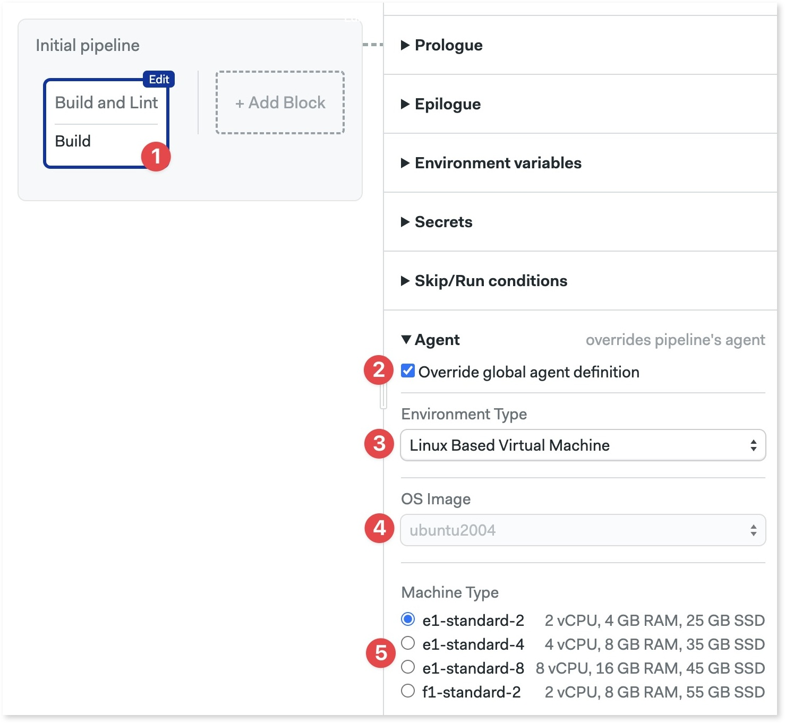

  </TabItem>
  <TabItem value="yaml" label="YAML">

  1. Select the block where you want to override the agent.
  2. Add an `agent` key under the `task`
  3. Set the `machine` and `os_image`

  ```yaml title=".semaphore/semaphore.yaml"
  version: v1.0
  name: Initial pipeline
  agent:
    machine:
      type: e1-standard-2
      os_image: ubuntu2004
  blocks:
    - name: Build and Lint
      dependencies: []
      task:
        jobs:
          - name: Build
            commands:
              - checkout
              - npm run build
        # highlight-start
        agent:
          machine:
            type: e1-standard-2
            os_image: ubuntu2004
        # highlight-end
  ```
  </TabItem>
</Tabs>
