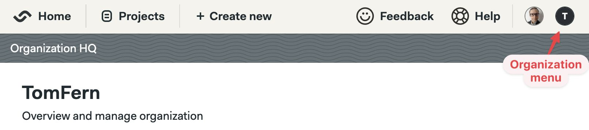
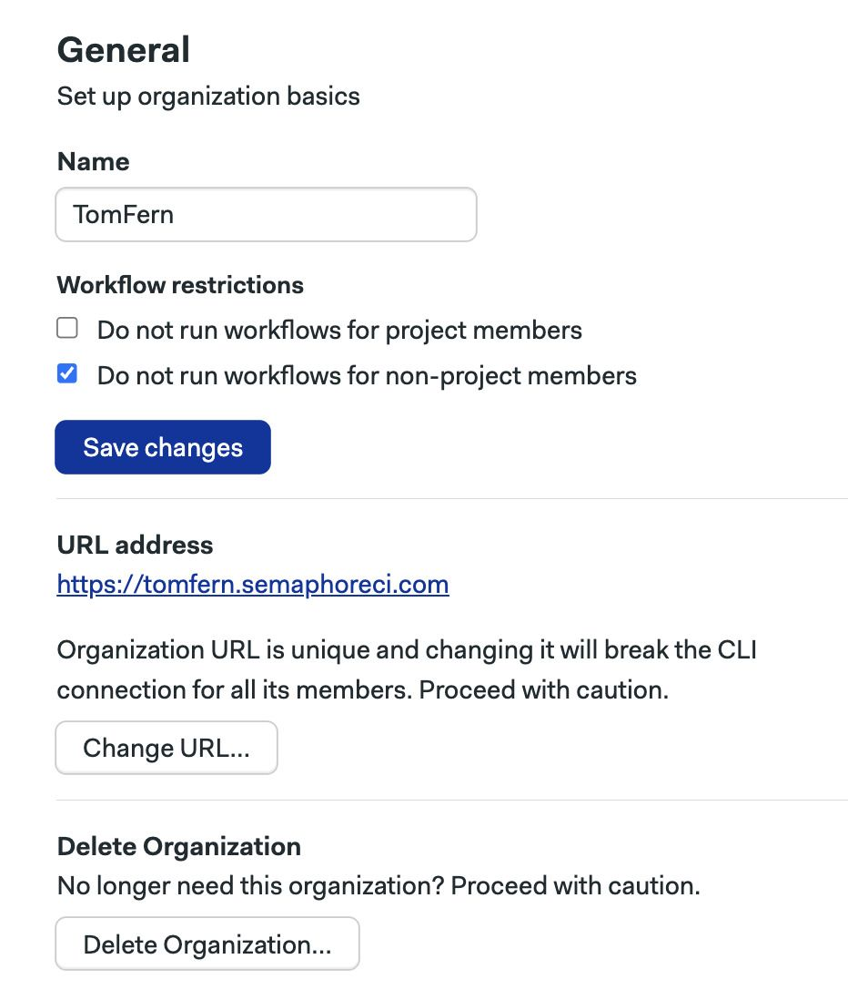
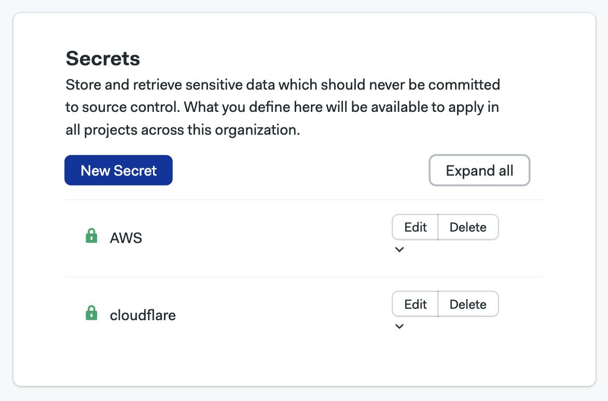
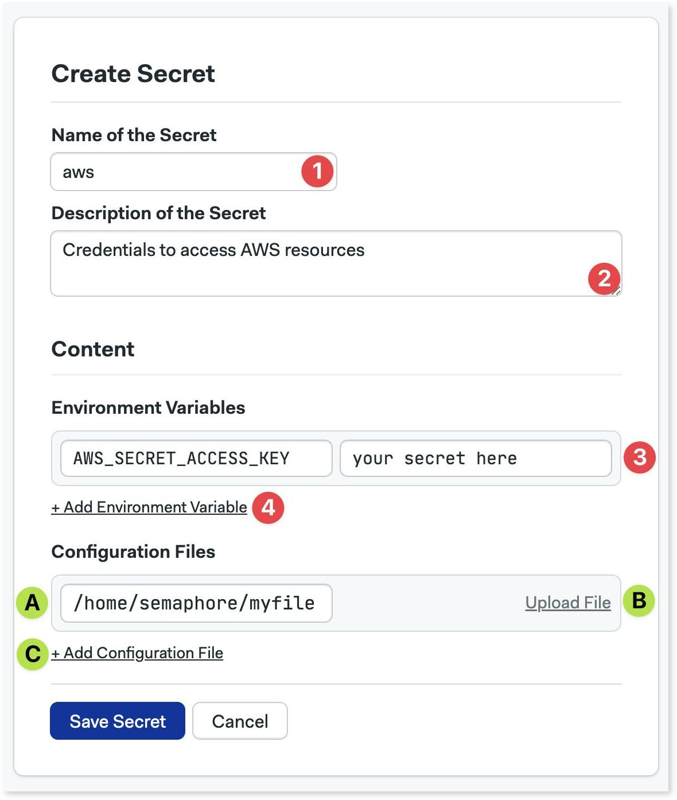
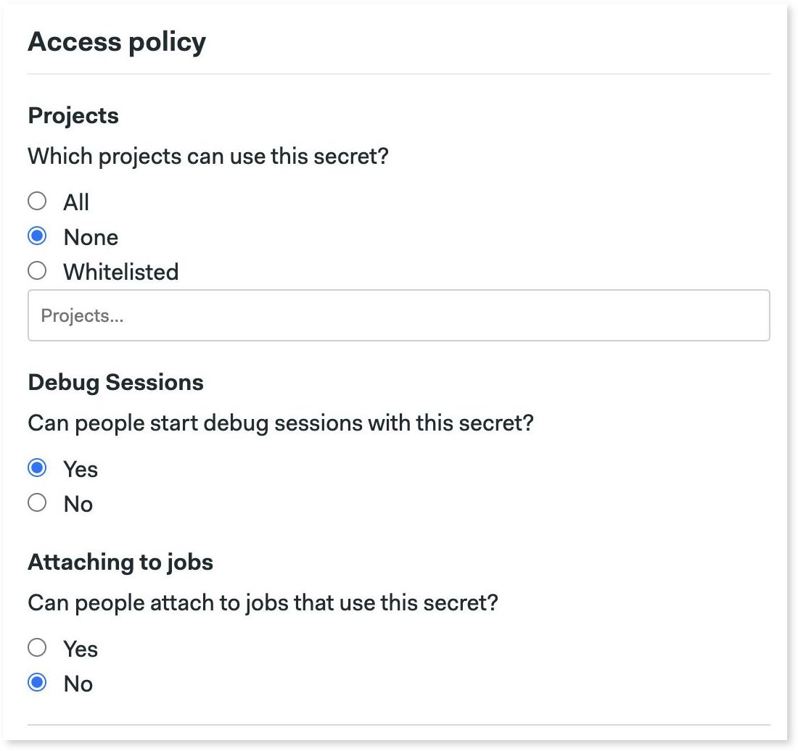
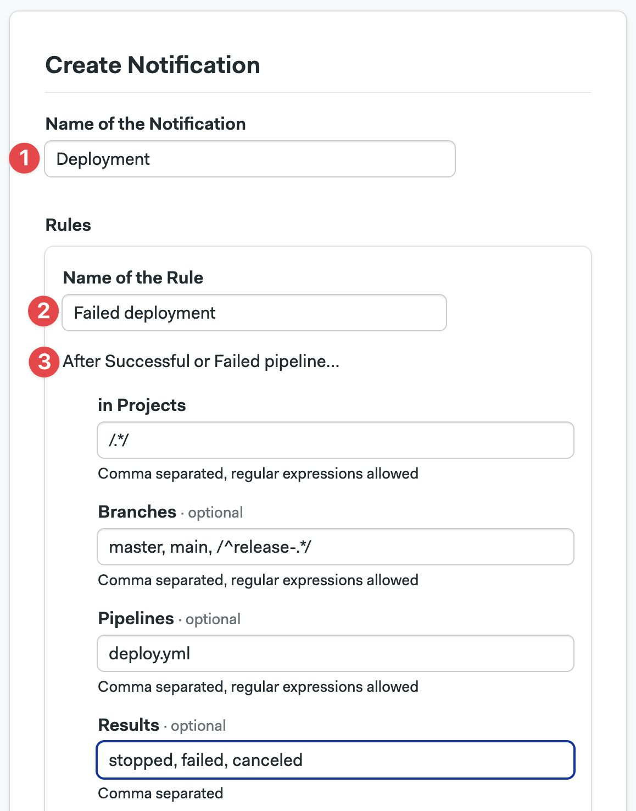
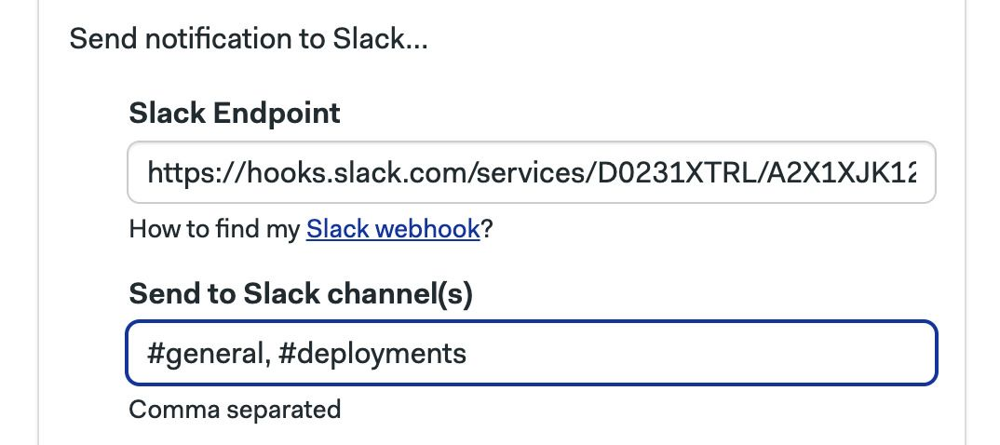
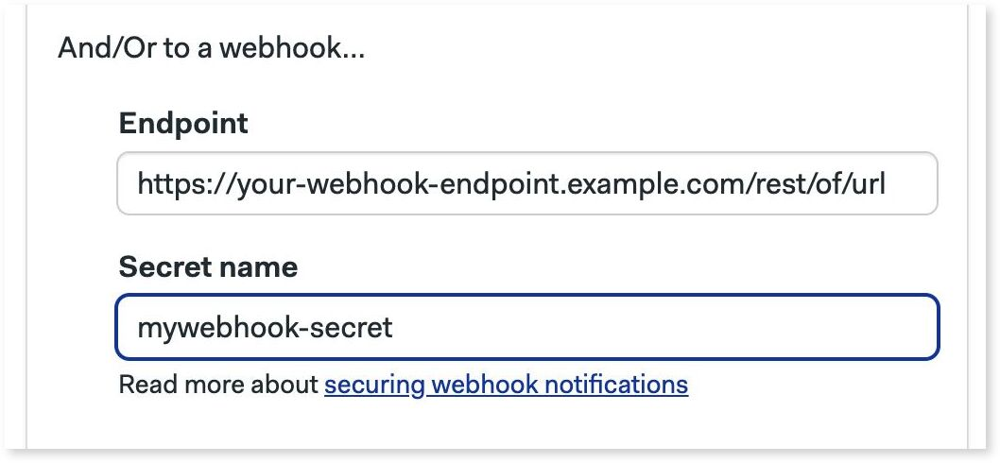
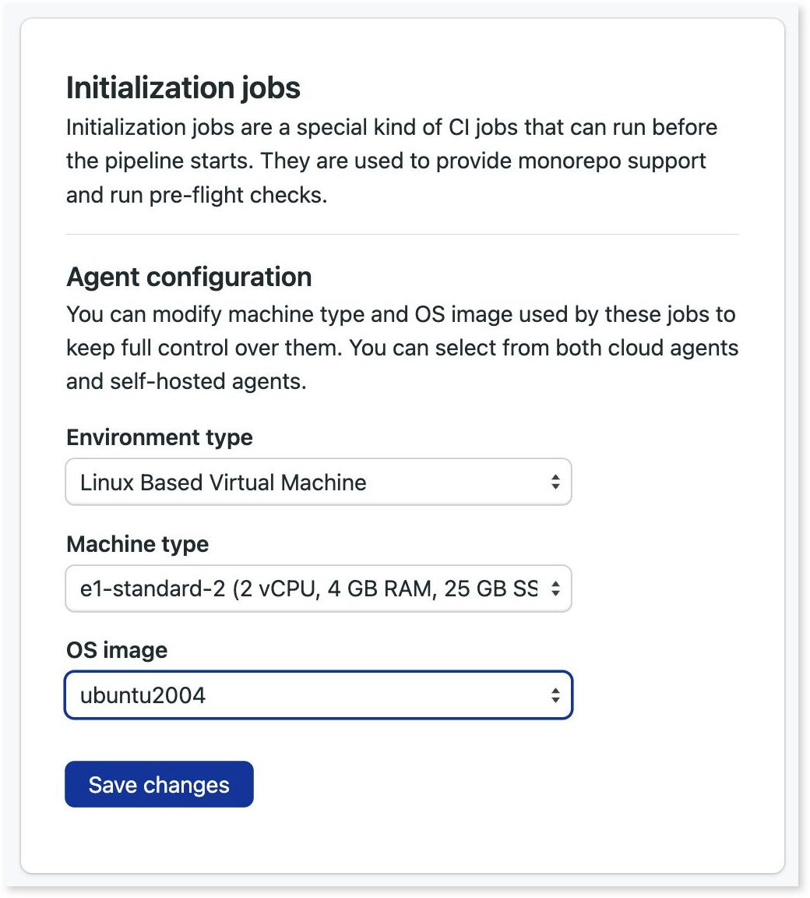

# Organizations

import Tabs from '@theme/Tabs';
import TabItem from '@theme/TabItem';
import Available from '@site/src/components/Available';
import VideoTutorial from '@site/src/components/VideoTutorial';

Organizations are the administrative unit in Semaphore. This page explains how to create organizations, manage users, and what settings are available.

## Overview {#overview}

The fist time you log in to Semaphore you'll be prompted to create an *organization*. An organization is the basic unit of administration. 

All organizations have a name, a [billing plan](https://semaphoreci.com/pricing), one or more administrators and collaborators, and settings to manage how to run your [pipelines](./pipelines).

## How to change organizations {#org-selection}

Switch the active organization to change its settings or view its projects.

<Tabs groupId="ui-cli">
<TabItem value="ui" label="UI">

To view or create other organizations, open the organization menu on the top right corner and select **Change Organization**.



</TabItem>
<TabItem value="cli" label="CLI">

1. Install and connect the _Semaphore command line_
2. Run `sem context` to show the organizations connected to the tool. The active organization has an asterisk (*) next to it
    ```shell title="View connected organizations"
    $ sem context
        myorg1_semaphoreci_com
        myorg2_semaphoreci_com
        # highlight-next-line
      * myorg3_semaphoreci_com
    ```
3. Change organization with `sem context <organization-name>`
    ```shell title="Change active organization"
    $ sem context myorg1_semaphoreci_com
    switched to context "myorg1_semaphoreci_com"
    ```

</TabItem>
</Tabs>

## Managing users {#people}

Semaphore uses roles to manage user access. You can add an unlimited number of persons to your organization.

To manage users in your organization, open the organization menu and select **People**.

### Organization roles {#roles}

The default organization roles are:

- **Members**
  - Can create new [projects](./projects)
  - Can view existing notifications and settings.
- **Admins**
  - Can view, manage, and modify everything within the organization except general settings and financial information.
  - Get admin access to every project inside the organization
- **Owners**
  - Can do everything within the organization, including changing general settings and deleting it
  - By default, this role is assigned to the user that creates the organization
  - Get admin access to every project inside the organization 


The **People** tab shows users in your organization along with their:

- Semaphore usernames
- GitHub or BitBucket handles
- Role

TODO: people screenshot (rtx can be a starting point)

### How to add users {#add-people}

To add a user, press the **Add people** button. You have two options:

- By their GitHub handle
  - Type their GitHub handle and press **Invite**
  - Invitees will receive an email to join the organization
- By shared GitHub organization
  - The list shows users who already belong in the same GitHub organization as you
  - Select the users and optionally type an email
  - Press **Add selected** to add them to the organization

TODO: people screenshot

### How to change user roles {#roles-people}

To change the role of a user, press the **Change Role** button next to the person.

TODO: image


### How to create user groups {#add-groups}

<Available plans={['Scaleup']}/>

User groups allows you to manage users in bulk. Instead of managing users one by one, add them to a group and assign a role to it.

To create a group, open the organization menu and select **People**. 

1. Press on **Create group**
2. Type in the group name and description
3. Type the names of the persons to add to the group
4. Press **Save changes** to create the group

TODO: image

### How to change the role of a group {#group-role}

To change the role of a group, press the **Change Role** button next to the group.

TODO: image

### How to add/remove users to a group {#change-groups}

To add or remove users in a group, press the **Modify group** button next to it.

- Press the **X** button to remove the user from the group
- Type the name of the persons you want to add to the group
- Press **Save changes** to finish editing the group

TODO: image

https://docs.semaphoreci.com/security/groups/groups/

## Managing ownership {#manage-ownership}

TODO: https://docs.semaphoreci.com/account-management/organizations/

## Organization settings {#org-settings}

To access your organization settings, open the organization menu and click on **Settings**.

### General settings {#general-settings}

Your organization main settings.  Here, you can change its name, its URL, and control how workflows run.

TODO: we need to explain this "Do not run workflows for project/non-project members"



### Secrets overview {#secrets}

Create encrypted environment variables and files to inject in your [jobs](./jobs)

Secrets allows you to keep files and environment variables with sensitive data secure. You can use secrets to store API Tokens for deployments, database passwords, or SSH keys.

:::tip 

Secrets are available to all the [projects](./projects) in the organization. If you need more fine grained control, use the [credentials in environments](./promotions#credentials).

:::



### How to create a secret {#secret-create}

<VideoTutorial title="How to use secrets" src="https://www.youtube.com/embed/rAJIRX81DeA"/>

You can create secrets using the UI or the command line.


<Tabs groupId="ui-cli">
<TabItem value="ui" label="UI">

Navigate to the organization settings and select **Secrets**

1. Press **New Secret**
2. Enter the name of the secret
3. Add an optional description
4. Type the environment variable name and its value
5. Add more variables as needed

To upload files such as SSH keys:

- (A) Type the path of file. This is where the file is injected in the [agent](./pipelines#agents)
- (B) Upload the file
- (C) Add more files as needed

<details>
<summary>Show me</summary>
<div>


</div>
</details>

</TabItem>
<TabItem value="cli" label="CLI">

To create a secret using the Semaphore command line tool use:

```shell title="Creating a secret"
sem create secret <secret-name> \
    -e <VAR_NAME>=<var_value> \
    -f <local_file_path>:<agent_file_path>
```

You can define multiple environment variables at once:

```shell title="Defining multiple variables example"
sem create secret awskey \
    -e AWS_ACCESS_KEY_ID=your-value \
    -e AWS_SECRET_KEYID=your-value
```

In addition, you can upload multiple files as secrets:

```shell title="Creating multiple secret files example"
sem create secret sshkeys \
    -f $HOME/.ssh/id_rsa:/home/semaphore/.ssh/id_rsa \
    -f $HOME/.ssh/id_rsa.pub:/home/semaphore/.ssh/id_rsa.pub
```

To view all organization secrets:

```shell title="Viewing organization secrets"
$ sem get secret
NAME                   AGE
awskey                 1d
sshkeys                1d
```

To view a specific secret use `sem get secret <secret-name>`:

```shell title="Viewing a secret"
$ sem get secret awskey
apiVersion: v1beta
kind: Secret
metadata:
  name: awskey
  id: 31887bfb-fac5-4f5b-9a6a-059ecebcc851
  create_time: 1556828155
  update_time: 1621528405
data:
  env_vars:
  - name: AWS_ACCESS_KEY_ID
    value: your-value-here
  - name: AWS_SECRET_ACCESS_KEY
    value: your-value-here
  files: []
```

To edit a secret:

1. Run `sem edit secret <secret-name>`
2. Make your changes in the editor
3. When done, save and exit the editor to save your changes

</TabItem>
</Tabs>


### Access policy for secrets {#secret-access-policy}

<Available plans={['Scaleup']}/>

When creating or editing a secret, you can manage control where and who can use secrets on three levels:

- **Projects**: the secret is available on all, none, or a list of projects
- **Debug Sessions**: persons connecting with [debug session](./jobs#debug-jobs) can see the contents of the secrets. Here you can disable debug sessions for jobs using this secret
- **Attaching to jobs**: likewise, [attaching to a running job](./jobs#attach-job) can likewise expose secrets. Disabling this option prevents this secret to be viewed

<details>
<summary>Show me</summary>
<div>

</div>
</details>

### Slack notifications {#slack-notifications}

Send notifications to Slack and other webhook-based services. Notifications are sent when a pipeline finishes running so your team get instant feedback on the result. 

<Tabs groupId="ui-cli">
<TabItem value="ui" label="UI">

To create a notification, navigate to **Notifications** and press **New Notification**

1. Type the name of the notification
2. Type the name of the rule to fires the notification
3. You can supply optional filters for this rule:
   - **Projects**: comma-separated list of [projects](./projects) where it applies
   - **Branches**: comma-separated list of Git branches
   - **Pipelines**: comma-separated list [pipeline](./pipelines) YAML files that need to run in order to fire the notification
   - **Results**: comma-separated list of results. Valid values are: "passed", "failed", "stopped", or "canceled"

<details>
<summary>Show me</summary>
<div>

</div>
</details>

:::note

Regular expressions must wrapped in forward slashes, e.g. `/.*/` matches all values. You can use regular expressions in Projects, Branches, and Pipelines.

:::

To send Slack notifications:

1. Copy the [Slack webhook](https://slack.com/help/articles/360041352714-Build-a-workflow--Create-a-workflow-that-starts-outside-of-Slack) for your Slack Workspace
2. Type the comma-separated list of channels to receive the message

<details>
<summary>Show me</summary>
<div>

</div>
</details>

To send notifications to other webhook-based services:

1. Create a organization [secret](#secrets) containing the environment variable `WEBHOOK_SECRET` and a secret value. Rememeber the name of this secret, e.g. "mywebhook-secret"
2. Copy the URL of the webhook that receives the notification
3. Type the name of the secret created on step 1, e.g. "mywebhook-secret"

<details>
<summary>Show me</summary>
<div>

</div>
</details>

:::note

The value contained in the secret is sent along with the payload on notification to help secure the message. You can should validate that the secret value matches before accepting the message on the receiving end.

:::


At this point, you can create additional rules or save the changes by pressing **Save Notification**.

</TabItem>
<TabItem value="cli" label="CLI">

TODO: via CLI and tabs


"passed", "failed", "stopped", or "canceled"

https://docs.semaphoreci.com/essentials/slack-notifications/

https://docs.semaphoreci.com/essentials/webhook-notifications/


</TabItem>
</Tabs>


### IP Allow List {#ip-list}

Filter access to your organization by IP.

TODO: get access to this feature

### Initialization jobs {#initialization-jobs}

Configure how pipelines are initialized.

Semaphore must run some initialiation steps before it can start a [pipeline](./pipelines). It must fetch and validate the pipeline YAML and, in some cases like _monorepos_ or _pre-flight checks_, even do a full repository clone.

By default, Semaphore chooses automatically which kind of [agent](./pipelines#agents) run the initialization job, but in this section you can customize it for all [projects](./projects).

<details>
<summary>Show me</summary>
<div>

</div>
</details>

### Okta integration {#okta-integration}

<Available plans={['Scaleup']} />

TODO: TBD

### Contacts {#contacts}

Manage your contact information.

In this section, you can add contact details in case the Semaphore Support Team needs to reach you. Add your name, phone number and email in three categories:

- **Finance**: used any billing-related messaging related to your organization
- **Main**: used as the primary point of communication
- **Security**: used to discuss any issues related to security in your organization

## Audit logs {#audit-log}

TODO: TBD

## Activity monitor {#activity-monitor}

TODO: TBD

## Plans and billing {#plans}

TODO: TBD