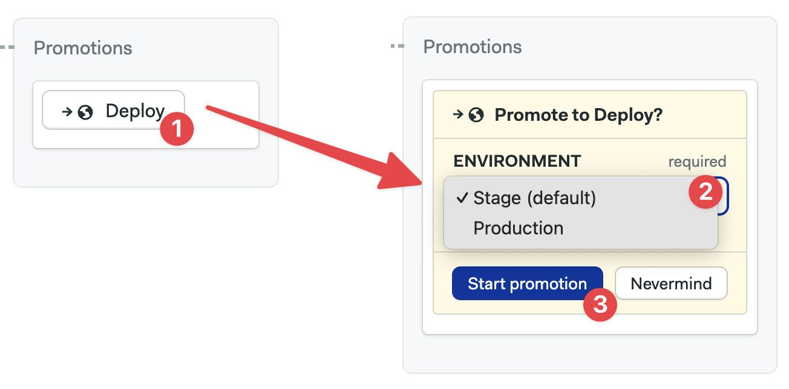
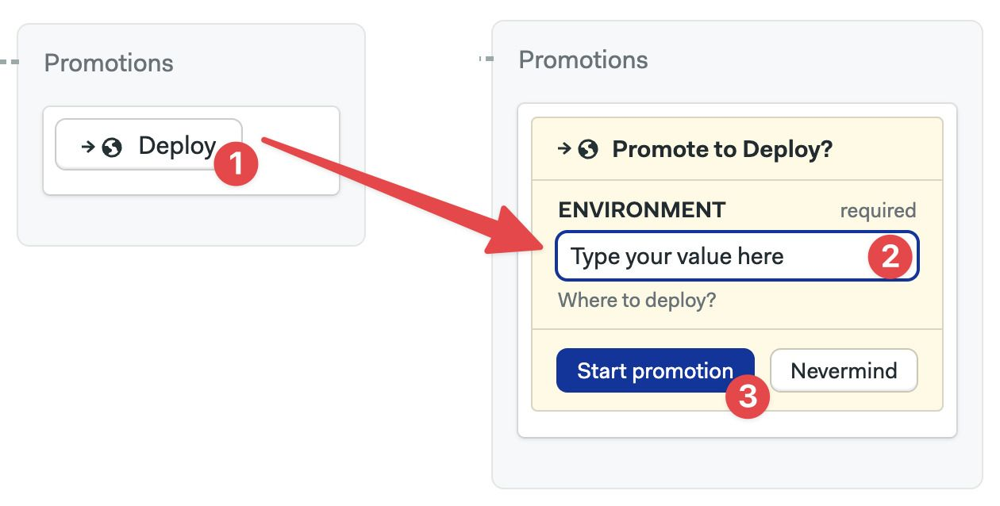
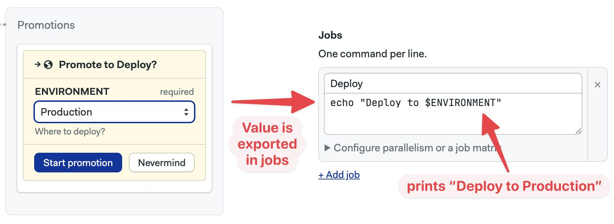
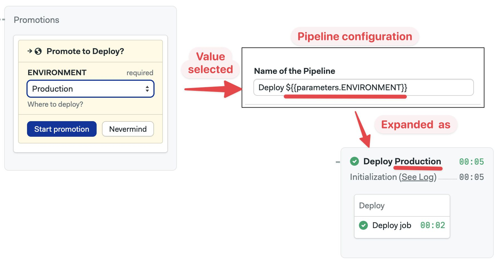

# Pipelines

import Tabs from '@theme/Tabs';
import TabItem from '@theme/TabItem';

## Overview

The pipeline is the configuration unit. Each pipeline is encoded as a YAML file. By default, Semaphore will look for the first pipeline in the path `.semaphore/semaphore.yml` relative to the root of your repository. 

For reference, here is an example pipeline with its respective YAML.

<Tabs groupId="editor-yaml">
 <TabItem value="editor" label="Example pipeline">
 
 </TabItem>
 <TabItem value="yaml" label="YAML">
 ```yaml title=".semaphore/semaphore.yml"
 version: v1.0
 name: Initial pipeline
 agent:
 machine:
 type: e1-standard-2
 os_image: ubuntu2004
 blocks:
 - name: Build
 task:
 jobs:
 - name: Build
 commands:
 - checkout
 - npm install
 - npm run build
 - artifact push workflow dist
 - name: Test
 dependencies:
 - Build
 task:
 jobs:
 - name: Unit tests
 commands:
 - checkout
 - artifact pull workflow dist
 - 'npm run test:unit'
 - name: Integration
 commands:
 - checkout
 - artifact pull workflow dist
 - 'npm run test:integration'
 - name: UI Tests
 dependencies:
 - Test
 task:
 jobs:
 - name: UI tests
 commands:
 - checkout
 - artifact pull workflow dist
 - npm run serve &
 - 'npm run test:ui'
 ```
 </TabItem>
</Tabs>

## Job execution order {#dependencies}

A pipeline is a group of [blocks](./jobs#blocks) connected by dependencies. Semaphore will automatically compute the execution graph based on the declared block dependencies.

In the following example:

- Block B and C depend on Block A. So, Block B and C won't start until all Block A is done. 
- Block D only starts when Block B AND Block C have finished.


<details>
 <summary>What if we removed all dependencies?</summary>
 <div>If we removed dependencies between blocks then all of them would run in parallel. 
 Functionally, it would be the same as having all jobs in one big block</div>
</details>

## Pipeline settings {#settings}

Pipeline settings are applied to all jobs it contains. You can change pipeline settings with the editor or directly in the YAML.

<Tabs groupId="editor-yaml">
 <TabItem value="editor" label="Editor">
 
 </TabItem>
 <TabItem value="yaml" label="YAML">
 ```yaml title=".semaphore/semaphore.yml"
 version: v1.0
 name: Initial pipeline
 # highlight-next-line
 agent:
 machine:
 type: e1-standard-2
 os_image: ubuntu2004
 # highlight-next-line
 execution_time_limit:
 hours: 2
 # highlight-next-line
 fail_fast:
 stop:
 when: 'true'
 # highlight-next-line
 auto_cancel:
 running:
 when: 'true'
 global_job_config:
 # highlight-next-line
 prologue:
 commands:
 - echo "this is the prologue"
 # highlight-next-line
 epilogue:
 always:
 commands:
 - 'echo "epilogue: is always executed"'
 on_pass:
 commands:
 - 'echo "epilogue: executed only if job passes"'
 on_fail:
 commands:
 - 'echo "epilogue: executed only if job fails"'
 blocks:
 - name: Build
 task:
 jobs:
 - name: Build
 commands:
 - checkout
 - npm install
 - npm run build
 ```
 </TabItem>
</Tabs>


The pipeline settings are:

1. **Agent**: the *agent environment* where the jobs in the pipeline will run — [unless overriden](./jobs#agent-override).
2. **Machine Type**: the hardware where the jobs run. Semaphore Cloud provides several *machine types* out of the box. You can add more types using *self-hosted agents*.
3. **Prologue**: similar to the [block prologue](./jobs#prologue), these commands will be prepended to the job commands in the pipeline.
4. **Epilogue**: like the [block epilogue](./jobs#epilogue), these commands will be appended to the job commands in the pipeline. You add commands that are executed when the job passes, fails, or always runs.
5. **Execution time limit**: time limit for job execution. Defaults to 1 hour. Any jobs running longer than this limit will be forcibly stopped.
6. **Fail-fast**: defines what to do when a job fails. Here you can configure the Semaphore to stop all running jobs as soon as one fails or set custom behaviors.
7. **Auto-cancel**: define what happens if changes are pushed to the repository while a pipeline is running. By default, Semaphore will queue these runs. You can, for example, stop the current pipeline and run the newer commits instead.
8. **YAML file path**: you can override where the pipeline config file is located in your repository.


### Agents

Agents are the environment where jobs run. Semaphore keeps a pool of warm agents at all times to be sure there's always one ready to work.

Semaphore Cloud provides the following agent types:
- *Linux Machines* presented as VMs or [Docker containers](#docker-environments)
- *Apple macOS Machines*

:::info

You can register additional machines as agents for your organization by *installing self-hosted agents*.

:::

To select the agent running your jobs by default:

<Tabs groupId="editor-yaml">
 <TabItem value="editor" label="Editor">

 1. Select the pipeline
 2. Select the "Environment Type": Linux, Mac, or Docker
 3. Select the "Operating System" version
 4. Select the *machine type*

 The available hardware changes depending on the type of environment you selected.

 

 </TabItem>
 <TabItem value="yaml" label="YAML">

 1. Add the `agent` and `machine` keys
 2. Add the hardware `type`. The value must be one of the supported *machine types*
 3. Add the `os_image`. Value must be one of the supported *operating systems*

 ```yaml title=".semaphore/semaphore.yml"
 version: v1.0
 name: Initial Pipeline
 # highlight-start
 agent:
 machine:
  type: e1-standard-2
  os_image: ubuntu2004
 # highlight-start
 blocks:
 - name: 'Block #1'
  task:
  jobs:
  - name: 'Job #1'
  commands:
  - checkout
 ```
 </TabItem>
</Tabs>

### Docker containers {#docker-environments}

Jobs can run inside Docker containers. This allows you to define a custom-build environment with pre-installed tools and dependencies needed for your project.

You can run multiple containers at the same time. The job will run in the first container (called `main`) and connect the rest of the containers to the same network. You can reach the other containers using their names as DNS records are injected into the main container.


:::tip

If you want to build and run Docker images in your jobs, check the *working with Docker Images documentation*.

:::

To run the job inside a Docker container:

<Tabs groupId="editor-yaml">
 <TabItem value="editor" label="Editor">
 1. Select the pipeline
 2. In "Environment Types" select "Docker Container(s)"
 3. Select the *machine type*
 4. Type the name of the container
 5. Optionally, add environment variables
 6. Optionally, add more containers

 

 </TabItem>
 <TabItem value="yaml" label="YAML">

 1. Add the `agent` and `machine`
 2. Add a `containers` key
 3. Each list item is a container. The first one must be called `main`
 4. Add the `image`
 5. Optionally add more containers

 ```yaml title=".semaphore/semaphore.yml"
 version: v1.0
 name: Initial Pipeline
 agent:
 machine:
  type: e1-standard-2
  os_image: ubuntu2004
 containers:
  - name: main
  image: 'semaphoreci/ubuntu:20.04'
  - name: web
  image: nginx
 blocks:
 - name: 'Block #1'
  task:
  jobs:
  - name: 'Job #1'
  commands:
  - 'curl http://web'
 ```

 </TabItem>
</Tabs>

:::warning

Due to the introduction of [Docker Hub rate limits](https://docs.semaphoreci.com/ci-cd-environment/docker-authentication/), Semaphore will automatically redirect any pulls from the semaphoreci Docker Hub repository to the *Semaphore Container Registry*.

:::

### After pipeline jobs

You can configure jobs to run once a pipeline stops, even if it ended due to a failure, stopped, or canceled.

After-pipeline jobs are executed in parallel. Typical use cases for after-pipeline jobs are sending notifications, collecting *test results*, or submitting metrics to an external server.

You can add after-pipeline jobs using YAML or the editor.

<Tabs groupId="editor-yaml">
 <TabItem value="editor" label="Editor">
 1. Press **+Add After Jobs**
 2. Type the name of the job
 3. Add your commands
 4. Optionally, you can add more jobs
 5. To delete them, click the X next to the job
 
 </TabItem>
 <TabItem value="yaml" label="YAML">
 1. Add `after_pipeline` key at the top level of the YAML.
 2. Create a `task.jobs` key
 3. Add the list of jobs with `name` and `commands`
 ```yaml title=".semaphore/semaphore.yml"
 version: v1.0
 name: Initial pipeline
 agent:
 machine:
 type: e1-standard-2
 os_image: ubuntu2004
 blocks:
 - name: Build
 task:
 jobs:
 - name: Build
 commands:
 - checkout
 - make build
 # highlight-start
 after_pipeline:
 task:
 jobs:
 - name: Submit metrics
 commands:
 - "export DURATION_IN_MS=$((SEMAPHORE_PIPELINE_TOTAL_DURATION * 1000))"
 - echo "ci.duration:${DURATION_IN_MS}|ms" | nc -w 3 -u statsd.example.com
 # highlight-end
 ```
 </TabItem>
</Tabs>

## Connecting pipelines {#promotions}

Your repository can contain more than one pipeline. We use *promotions* to tie pipelines together. Promotions define which pipelines should run next.


Using promotions we can create a tree-like structure where pipelines branch off other pipelines. The root of the tree is the default pipeline located at `.semaphore/semaphore.yml` relative to the repository's root.


Promoted pipelines are typically used for continuous delivery and continuous deployment. The following example shows the initial pipeline branching into two continuous delivery pipelines: production and development. In each of these two, we define the sequence of [jobs](./jobs) needed to deploy the application in the respective environment.

### Promotion triggers

When a promotion is triggered the child pipeline starts to run. There are three options for triggering a promotion:

- **Manual promotions**: the default. Start the next pipeline by pressing a button.
- **Auto promotions**: start on certain conditions such as when all tests have passed on the "master" branch.
- **Parameterized promotions**: pass values as environment variables into the next pipelines. Allows us to reuse the same pipeline configuration for different tasks.

### How to add promotions

Promotions are defined in the pipeline from which the child pipelines branch off.

<Tabs groupId="editor-yaml">
 <TabItem value="editor" label="Editor">

 1. Press **+Add Promotion** 
 2. Set a descriptive name for the promotion
 3. Configure the new pipeline and add jobs as needed

 

 </TabItem>
 <TabItem value="yaml" label="YAML">

 1. Create a new pipeline file in the `.semaphore` folder, e.g. `deploy.yml`
 2. Edit the pipeline from which the new one (from step 1) branches off, e.g. `semaphore.yml` 
 3. Add the `promotions` key at the root level of the YAML
 4. Type the `name` of the promotion
 5. Type the `pipeline_file` filename of the pipeline created in step 1.

 ```yaml title=".semaphore/semaphore.yml"
 version: v1.0
 name: Initial pipeline
 agent:
 machine:
  type: e1-standard-2
  os_image: ubuntu2004
 blocks:
 - name: Build
  dependencies: []
  task:
  jobs:
  - name: Build
  commands:
  - checkout
  - make build
 # highlight-start
 promotions:
 - name: Promotion 1
  pipeline_file: deploy.yml
 # highlight-end
 ```
 </TabItem>
</Tabs>

### How to delete promotions {#manual-promotion}

You can delete promotions when you no longer need them.

<Tabs groupId="editor-yaml">
 <TabItem value="editor" label="Editor">

 1. Press on the promotion you wish to delete
 2. Click on **Delete Promotion**
 3. Confirm the action

 :::danger

 Deleting a promotion this way also deletes all the child pipeline files.

 :::

 

 </TabItem>
 <TabItem value="yaml" label="YAML">

 1. Open the pipeline file containing the promotion you wish to delete
 2. Remove either the whole `promotions` section or individual items under the key
 3. (Optional) Delete the pipeline file referenced in the removed `pipeline_file` key

 ```yaml title=".semaphore/semaphore.yml"
 version: v1.0
 name: Initial pipeline
 agent:
 machine:
  type: e1-standard-2
  os_image: ubuntu2004
 blocks:
 - name: Build
  dependencies: []
  task:
  jobs:
  - name: Build
  commands:
  - checkout
  - make build
 # highlight-start
 # remove all the following lines
 promotions:
 - name: Promotion 1
  pipeline_file: deploy.yml
 # highlight-end
 ```

 </TabItem>
</Tabs>

### Automatic promotions

Automatic promotions start a pipeline on user-defined conditions.

After [adding a promotion](#manual-promotion), you can set automatic conditions. Whenever Semaphore detects these conditions are fulfilled the child pipeline will automatically start.

<Tabs groupId="editor-yaml">
 <TabItem value="editor" label="Editor">

 1. Open the promotion you wish to autostart
 2. Enable the checkbox **Enable automatic promotion**
 3. Type in the *start conditions*

 

 </TabItem>
 <TabItem value="yaml" label="YAML">

 1. Open the pipeline file containing the promotion you wish to autostart
 2. Add an `auto_promote` key
 3. Add a child `when` key. Type in the *start conditions*

 ```yaml title=".semaphore/semaphore.yml"
 version: v1.0
 name: Initial pipeline
 agent:
 machine:
  type: e1-standard-2
  os_image: ubuntu2004
 blocks:
 - name: Build
  dependencies: []
  task:
  jobs:
  - name: Build
  commands:
  - checkout
  - make build
 promotions:
 - name: Promotion 1
  pipeline_file: deploy.yml
  # highlight-start
  auto_promote:
  when: branch = 'master' AND result = 'passed'
  # highlight-end
 ```

 </TabItem>
</Tabs>

## Parameterized promotions {#parameters}

Parameterized promotions allow you to propagate environment variables on all jobs in the next pipeline. 

Use parameters to reduce the amount of pipeline duplication. For example, if you create a parametrized pipeline that reads the target environment from a variable, you can reuse it to deploy an application to production and testing environments. Parameters work with [manual](#how-to-add-promotions) and [automatic](#automatic-promotions) promotions.


### How to add parameters

To add parameters to a promotion, follow these steps:

<Tabs groupId="editor-yaml">
 <TabItem value="editor" label="Editor">

 1. Press the promotion you wish to add parameters to
 2. Click **+Add Environment Variable**
 3. Set the variable name 
 4. Set an optional description
 5. Set optional valid options. Leave blank to input value as freeform text
 6. Enable the "This is a required parameter" checkbox if the parameter is mandatory
 7. Set a default value (only when the parameter is mandatory)
 8. Add more parameters as needed

 

 </TabItem>
 <TabItem value="yaml" label="YAML">

 1. Edit the file where you wish to add the parameters
 2. Add a `parameters.env_vars` key
 3. Every list item is a new parameter. Set the `name` of the environment variable
 4. Type an optional `description`
 5. Optionally set `required` to `true|false`
 6. Optionally set `options`. Each item in the list is a valid option. Leave blank to input value as freeform text
 7. If `required: true`, set the `default_value`. Optional parameters don't have a default value

 ```yaml title=".semaphore/semaphore.yml"
 version: v1.0
 name: Initial pipeline
 agent:
  machine:
  type: e1-standard-2
  os_image: ubuntu2004
 blocks:
  - name: Build
  dependencies: []
  task:
  jobs:
  - name: Build
  commands:
  - checkout
  - make build
 promotions:
  - name: Deploy
  pipeline_file: deploy.yml
  # highlight-start
  parameters:
  env_vars:
  - required: true
  options:
  - Stage
  - Production
  default_value: Stage
  description: Where to deploy?
  name: ENVIRONMENT

  - required: false
  description: Release name?
  name: RELEASE
  # highlight-end
 ```
 </TabItem>
</Tabs>

:::info

When a pipeline is triggered with [automatic promotions](#automatic-promotions) the parameter values are automatically filled following these rules:

- Mandatory parameters use the default value
- Optional parameters are left blank

:::

### Promoting with the UI

Once you have [added a parameter](#how-to-add-parameters), you can select its value from the Semaphore UI.

1. Press the promotion button
2. Select or type in the value. Optional parameters can be left blank
3. Press **Start promotion**

<Tabs>
 <TabItem value="options" label="Select value from options">
 
 </TabItem>
 <TabItem value="freeform" label="Freeform type value">
 
 </TabItem>
</Tabs>

### Promoting with the API

You can pass parameter values to the promotion when it is triggered using the *Semaphore API*.

The following is an example of a curl call that includes parameters:

```shell
curl -H "Authorization: Token {api_token}" \
 -d "name={promotion_name}&pipeline_id={parent_pipeline_id}&{param_1_name}={param_1_value}&{param_2_name}={param_2_value}" \
 -X POST "https://{org_name}.semaphoreci.com/api/v1alpha/promotions"
```

:::info

Only supported in Semaphore Cloud.

:::

### Accessing parameters in jobs

Parameters are exported as [environment variables](./jobs#environment-variables) in all the jobs contained in the promoted pipeline.

You can access the parameter value by directly using the environment variable in your commands.

<Tabs groupId="editor-yaml">
 <TabItem value="editor" label="Editor">
 
 </TabItem>
 <TabItem value="yaml" label="YAML">

 The parameters are accessible are regular environment variables in the `commands` section.

 ```yaml title="deploy.yml"
 version: v1.0
 name: Deploy pipeline
 agent:
 machine:
 type: e1-standard-2
 os_image: ubuntu2004
 blocks:
 - name: Deploy
 task:
 jobs:
 - name: Deploy
 commands:
 # highlight-next-line
 - echo "Deploy to $ENVIRONMENT"
 ```
 </TabItem>
</Tabs>


### Accessing parameters in pipeline 

You can access parameter values in pipeline elements like the pipeline name.

Parameters can be accessed in the pipeline configuration using the `${{parameters}}` namespace. For example, if you defined a parameter called `ENVIRONMENT`, you can read its value in the pipeline config as:

```shell
${{parameters.ENVIRONMENT}}
```

Parameters are available in the following places:

- Pipeline `name`
- Pipeline *queue name* (only available via YAML)
- As the name of a [secret](./jobs#secrets) (only available in YAML)

<Tabs groupId="editor-yaml">
 <TabItem value="editor" label="Editor">
 
 </TabItem>
 <TabItem value="yaml" label="YAML">
 The following YAML pipeline shows all the places where a parameter value can be used:

 ```yaml title="deploy.yml"

 version: v1.0
 # highlight-next-line
 name: 'Deploy to ${{parameters.ENVIRONMENT}}'
 agent:
 machine:
 type: e1-standard-2
 os_image: ubuntu2004
 # highlight-start
 queue:
 name: '${{parameters.ENVIRONMENT}}-queue'
 scope: project
 # highlight-end
 blocks:
 - name: Param. promotions example
 task:
 jobs:
 - name: Using promotion as env. var
 commands:
 # highlight-next-line
 - echo "Deploy to $ENVIRONMENT"
 secrets:
 # highlight-next-line
 - name: 'secrets-for-${{parameters.ENVIRONMENT}}'
 ```
 </TabItem>
</Tabs>
