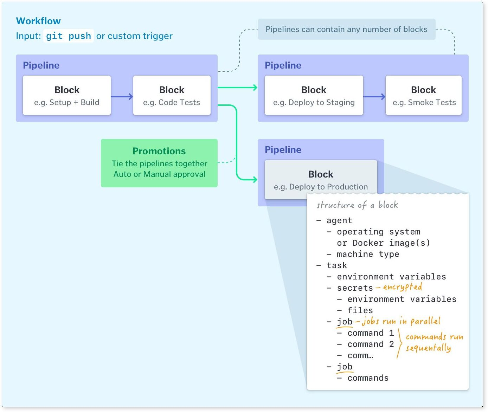
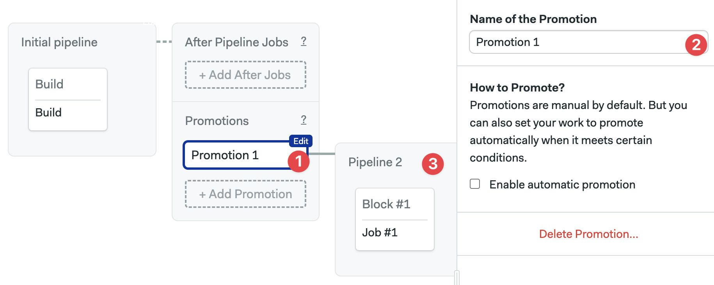
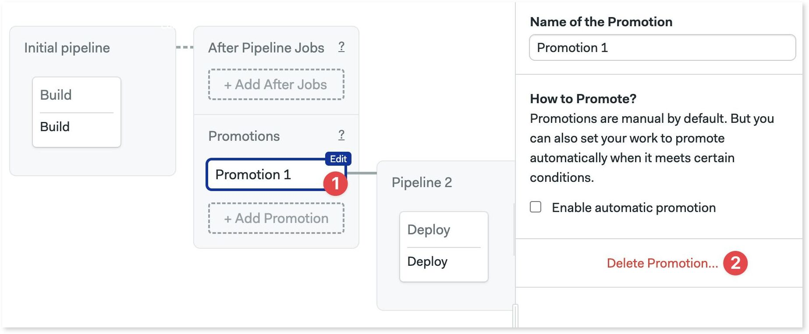
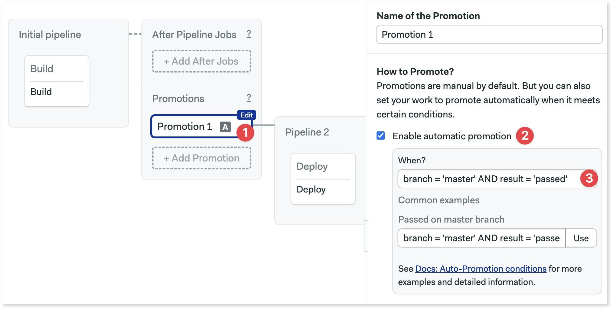
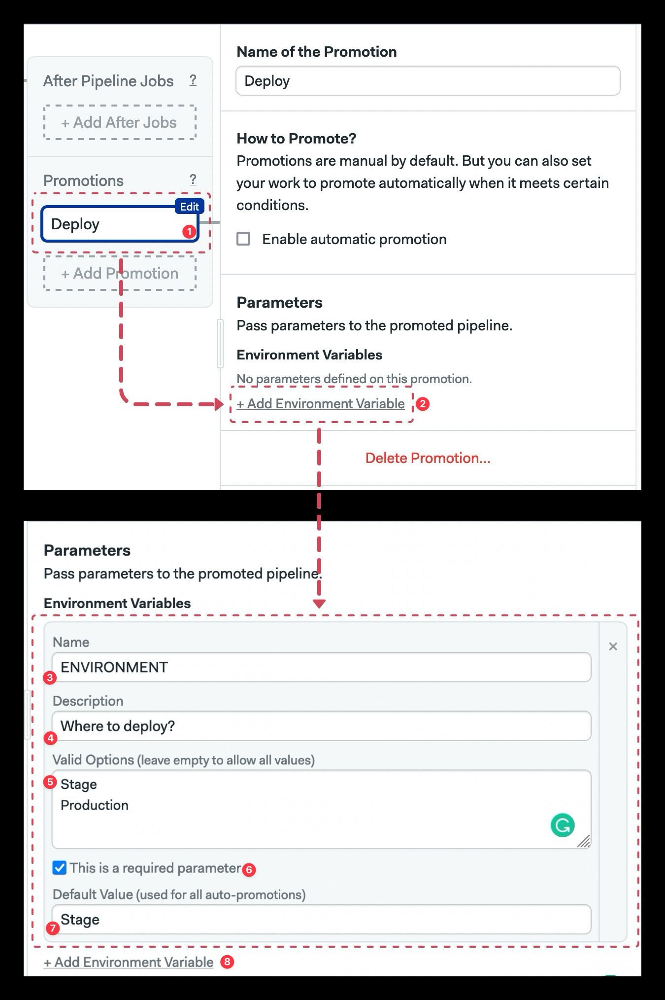

# Pipelines

import Tabs from '@theme/Tabs';
import TabItem from '@theme/TabItem';

## Overview

The pipeline is the configuration unit. Each pipeline is encoded as a YAML file. By default, Semaphore will look for the first pipeline in the path `.semaphore/semaphore.yml` relative to the root of your repository. 

For reference, here is an example pipeline with its respective YAML.

<Tabs groupId="jobs">
  <TabItem value="editor" label="Pipeline">
  
  </TabItem>
  <TabItem value="yaml" label="YAML">
  ```yaml title=".semaphore/semaphore.yml"
  version: v1.0
  name: Initial pipeline
  agent:
    machine:
      type: e1-standard-2
      os_image: ubuntu2004
  blocks:
    - name: Build
      task:
        jobs:
          - name: Build
            commands:
              - checkout
              - npm install
              - npm run build
              - artifact push workflow dist
    - name: Test
      dependencies:
        - Build
      task:
        jobs:
          - name: Unit tests
            commands:
              - checkout
              - artifact pull workflow dist
              - 'npm run test:unit'
          - name: Integration
            commands:
              - checkout
              - artifact pull workflow dist
              - 'npm run test:integration'
    - name: UI Tests
      dependencies:
        - Test
      task:
        jobs:
          - name: UI tests
            commands:
              - checkout
              - artifact pull workflow dist
              - npm run serve &
              - 'npm run test:ui'
  ```
  </TabItem>
</Tabs>

## Job execution order {#dependencies}

A pipeline is a group of [blocks](./jobs#blocks) connected by dependencies. Semaphore will automatically compute the execution graph based on the declared block dependencies.

In the following example:

- Block B and C depend on Block A. So, Block B and C won't start until all Block A is done. 
- Block D only starts when Block B AND Block C have finished.


<details>
  <summary>What if we removed all dependencies?</summary>
  <div>If we removed dependencies between blocks then all of them would run in parallel. 
  Functionally, it would be the same as having all jobs in one big block</div>
</details>

## Pipeline settings {#settings}

Pipeline settings are applied to all jobs it contains. You can change pipeline settings with the editor or directly in the YAML.

<Tabs groupId="jobs">
  <TabItem value="editor" label="Editor">
  
  </TabItem>
  <TabItem value="yaml" label="YAML">
  ```yaml title=".semaphore/semaphore.yml"
  version: v1.0
  name: Initial pipeline
  # highlight-next-line
  agent:
    machine:
      type: e1-standard-2
      os_image: ubuntu2004
  # highlight-next-line
  execution_time_limit:
    hours: 2
  # highlight-next-line
  fail_fast:
    stop:
      when: 'true'
  # highlight-next-line
  auto_cancel:
    running:
      when: 'true'
  global_job_config:
    # highlight-next-line
    prologue:
      commands:
        - echo "this is the prologue"
    # highlight-next-line
    epilogue:
      always:
        commands:
          - 'echo "epilogue: is always executed"'
      on_pass:
        commands:
          - 'echo "epilogue: executed only if job passes"'
      on_fail:
        commands:
          - 'echo "epilogue: executed only if job fails"'
  blocks:
    - name: Build
      task:
        jobs:
          - name: Build
            commands:
              - checkout
              - npm install
              - npm run build
  ```
  </TabItem>
</Tabs>


The pipeline settings are:

1. **Agent**: the *agent environment* where the jobs in the pipeline will run — [unless overriden](./jobs#agent-override).
2. **Machine Type**: the hardware where the jobs run. Semaphore Cloud provides several *machine types* out of the box. You can add more types using *self-hosted agents*.
3. **Prologue**: similar to the [block prologue](./jobs#prologue), these commands will be prepended to the job commands in the pipeline.
4. **Epilogue**: like the [block epilogue](./jobs#epilogue), these commands will be appended to the job commands in the pipeline. You add commands that are executed when the job passes, fails, or to run always.
5. **Execution time limit**: time limit for job execution. Defaults to 1 hour. Any jobs running longer than this limit will be forcibly stopped.
6. **Fail-fast**: defines what to do when a job fails. Here you can configure the Semaphore to stop all running jobs as soon as one fails or set custom behaviors.
7. **Auto-cancel**: define what happens if changes are pushed to the repository while a pipeline is running. By default, Semaphore will queue these runs. You can, for example, stop the current pipeline and run the newer commits instead.
8. **YAML file path**: you can override where the pipeline config file is located in your repository.

### After pipeline jobs

You can configure jobs to run once a pipeline stops, even if it ended due to a failure, stopped, or cancelled.

After-pipeline jobs are executed in parallel. Typical use cases for after-pipeline jobs are sending notifications, collecting *test results*, or submitting metrics to an external server.

You can add after-pipeline jobs using YAML or the editor.

<Tabs groupId="jobs">
  <TabItem value="editor" label="Editor">
  1. Press **+Add After Jobs**
  2. Type the name of the job
  3. Add your commands
  4. Optionally, you can add more jobs
  5. To delete them, click the X next to the job
  
  </TabItem>
  <TabItem value="yaml" label="YAML">
  1. Add `after_pipeline` key at the top level of the YAML.
  2. Create a `task.jobs` key
  3. Add the list of jobs with `name` and `commands`
  ```yaml title=".semaphore/semaphore.yml"
  version: v1.0
  name: Initial pipeline
  agent:
    machine:
      type: e1-standard-2
      os_image: ubuntu2004
  blocks:
    - name: Build
      task:
        jobs:
          - name: Build
            commands:
              - checkout
              - make build
  # highlight-start
  after_pipeline:
    task:
      jobs:
        - name: Submit metrics
          commands:
            - "export DURATION_IN_MS=$((SEMAPHORE_PIPELINE_TOTAL_DURATION * 1000))"
            - echo "ci.duration:${DURATION_IN_MS}|ms" | nc -w 3 -u statsd.example.com
  # highlight-end
  ```
  </TabItem>
</Tabs>

## Connecting pipelines {#promotions}

Your repository can contain more than one pipeline. We use *promotions* to tie pipelines together. Promotions define which pipelines should run next.



Using promotions we can create a tree-like structure where pipelines branch of other pipelines. The root of the tree is the default pipeline located at `.semaphore/semaphore.yml` relative to the repository's root.


Promoted pipelines are typically used for continuous delivery and continuous deployment. The following example shows the initial pipeline branching into two continuous delivery pipelines: production and development. In each of these two, we define the sequence of [jobs](./jobs) needed to the deploy the application in the respective environment.

### Promotion triggers

When a promotion is triggered the child pipeline starts to run. There are three optios for triggering a promotion:

- **Manual promotions**: the default. Start the next pipeline by pressing a button.
- **Auto promotions**: start on certain conditions such as when all test have passed on the "master" branch.
- **Parameterized promotions**: pass values as environment variables into the next pipelines. Allows us to reuse the same pipeline configuration for different tasks.

### How to add promotions

Promotions are defined in the pipeline from which the child pipelines branch off.

<Tabs groupId="jobs">
  <TabItem value="editor" label="Editor">

  1. Press **+Add Promotion** 
  2. Set a descriptive name for the promotion
  3. Configure the new pipeline and add jobs as needed

  

  </TabItem>
  <TabItem value="yaml" label="YAML">

  1. Create a new pipeline file in the `.semaphore` folder, e.g.  `deploy.yml`
  2. Edit the pipeline from which the new one (from step 1) branches off, e.g. `semaphore.yml` 
  3. Add the `promotions` key at the root level of the YAML
  4. Type the `name` of the promotion
  5. Type the `pipeline_file` filename of the pipeline created in step 1.

  ```yaml title=".semaphore/semaphore.yml"
  version: v1.0
  name: Initial pipeline
  agent:
    machine:
      type: e1-standard-2
      os_image: ubuntu2004
  blocks:
    - name: Build
      dependencies: []
      task:
        jobs:
          - name: Build
            commands:
              - checkout
              - make build
  # highlight-start
  promotions:
    - name: Promotion 1
      pipeline_file: deploy.yml
  # highlight-end
  ```
  </TabItem>
</Tabs>

### How to delete promotions {#manual-promotion}

You can delete promotions when you no loger need them.

<Tabs groupId="jobs">
  <TabItem value="editor" label="Editor">

  1. Press on the promotion you wish to delete
  2. Click on **Delete Promotion**
  3. Confirm the action

  :::danger

  Deleting a promotion this way also deletes all the child pipeline files.

  :::

  

  </TabItem>
  <TabItem value="yaml" label="YAML">

  1. Open the pipeline file containing the promotion you wish to delete
  2. Remove either the whole `promotions` section or individual items under the key
  3. (Optional) delete the pipeline file referenced in the removed `pipeline_file` key

  ```yaml title=".semaphore/semaphore.yml"
  version: v1.0
  name: Initial pipeline
  agent:
    machine:
      type: e1-standard-2
      os_image: ubuntu2004
  blocks:
    - name: Build
      dependencies: []
      task:
        jobs:
          - name: Build
            commands:
              - checkout
              - make build
  # highlight-start
  # remove the all the following lines
  promotions:
    - name: Promotion 1
      pipeline_file: deploy.yml
  # highlight-end
  ```

  </TabItem>
</Tabs>

### Automatic promotions

Automatic promotions start a pipeline on user-defined conditions.

After [adding a promotion](#manual-promotion), you can set automatic conditions. Whenever Semaphore detects these conditions are fulfilled the child pipeline will automatically start.

<Tabs groupId="jobs">
  <TabItem value="editor" label="Editor">

  1. Open the promotion you wish to autostart
  2. Enable the checkbox **Enable automatic promotion**
  3. Type in the *start conditions*

  

  </TabItem>
  <TabItem value="yaml" label="YAML">

  1. Open the pipeline file containing the promotion you wish to autostart
  2. Add an `auto_promote` key
  3. Add a child `when` key. Type in the *start conditions*

  ```yaml title=".semaphore/semaphore.yml"
  version: v1.0
  name: Initial pipeline
  agent:
    machine:
      type: e1-standard-2
      os_image: ubuntu2004
  blocks:
    - name: Build
      dependencies: []
      task:
        jobs:
          - name: Build
            commands:
              - checkout
              - make build
  promotions:
    - name: Promotion 1
      pipeline_file: deploy.yml
      # highlight-start
      auto_promote:
        when: branch = 'master' AND result = 'passed'
      # highlight-end
  ```

  </TabItem>
</Tabs>

### Parameterized promotions

Parameterized promotions allows you to propagate environment variables on all jobs in the next pipeline. 

Use parameters to reduce the amount of pipeline duplication. For example, if youn create a parametrized  pipeline that reads the target environment from a variable, you can reuse it to deploy an application to production and testing environments. Parameters work with [manual](#how-to-add-promotions) and [automatic](#automatic-promotions) promotions.

To add parameters to a promotion, follow these steps:

<Tabs groupId="jobs">
  <TabItem value="editor" label="Editor">

  1. Press the promotion you wish to add parameters to
  2. Click **+Add Environment Variable**
  3. Set the variable name 
  4. Set an optional description
  5. Set optional valid options
  6. Enable the "This is a required parameter" checkbox if the parameter is mandatory
  7. Set an default value. Only available if the parameter is set to mandatory
  8. Add more parameters as needed

  

  </TabItem>
  <TabItem value="yaml" label="YAML">

  1. Edit the file where you wish to add the parameters
  2. Add a `parameters.env_vars` key
  3. Every list item is a new parameter. Set the `name` of the environment variable
  4. Type an optional `description`
  5. Optionally set `required` to `true|false`
  6. Optionally set `options`. Each item is the list is a valid option
  7. If `required: true`, set the `default_value`

  ```yaml title=".semaphore/semaphore.yml"
    version: v1.0
    name: Initial pipeline
    agent:
      machine:
        type: e1-standard-2
        os_image: ubuntu2004
    blocks:
      - name: Build
        dependencies: []
        task:
          jobs:
            - name: Build
              commands:
                - checkout
                - make build
    promotions:
      - name: Deploy
        pipeline_file: deploy.yml
        # highlight-start
        parameters:
          env_vars:
            - required: true
              options:
                - Stage
                - Production
              default_value: Stage
              description: Where to deploy?
              name: ENVIRONMENT

            - required: false
              description: Release name?
              name: RELEASE
        # highlight-end
    ```
  </TabItem>
</Tabs>


## Deployment targets

WIP

Deployment target

https://docs.semaphoreci.com/essentials/deployment-targets/

Deployment Targets allow you to apply strict conditions for who can start individual pipelines and under which conditions. Using them, you have the ability to control who has the ability to start specific promoted pipelines or select git references (branches and tags).

Combining the functionality of promotions and Deployment Targets gives you a full toolset to configure secure Continuous Deployment pipelines. This is backwards compatible with your previous setup.

The core advantage of using Deployment Targets is multi-faceted access control, i.e. taking many factors into account while granting the right to promote. Moreover, they are backed with a dedicated secret, unique per Deployment Target and inaccessible to outside Deployments. Last but not least, Deployment Targets give you a clear overview of your previous deployments, so you can see which version was shipped and by whom.


