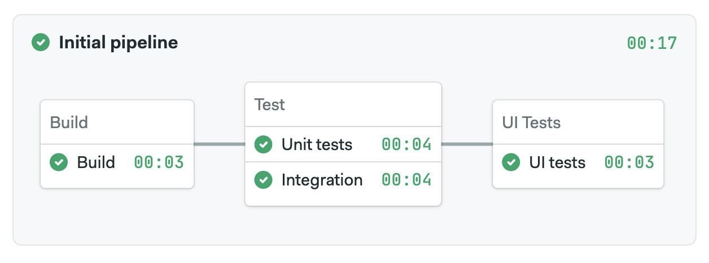
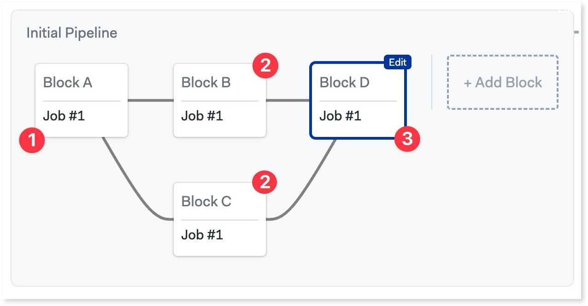
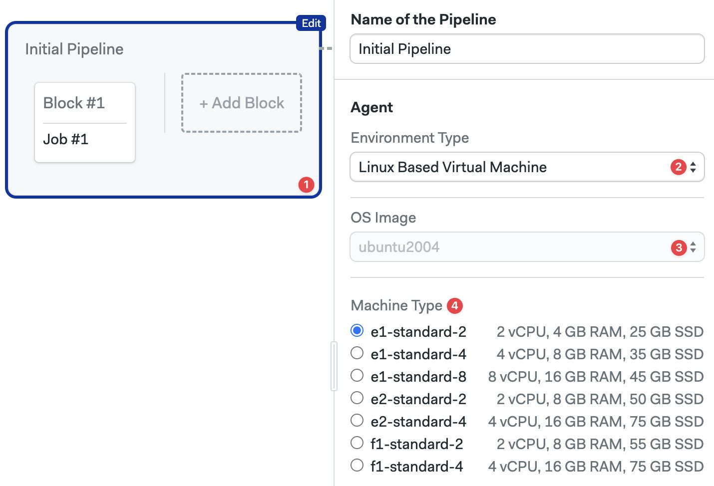
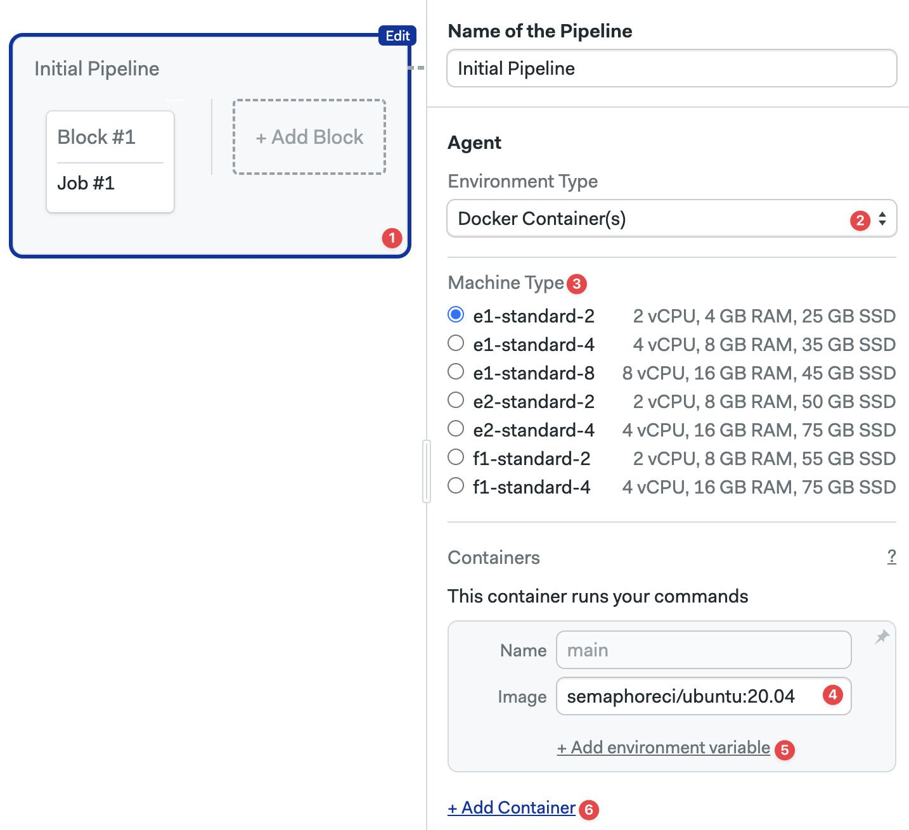
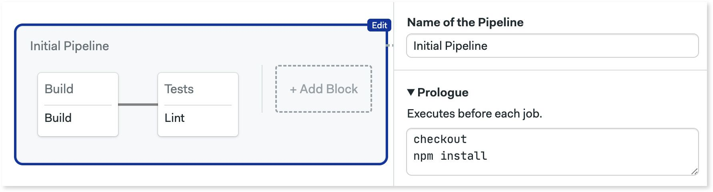
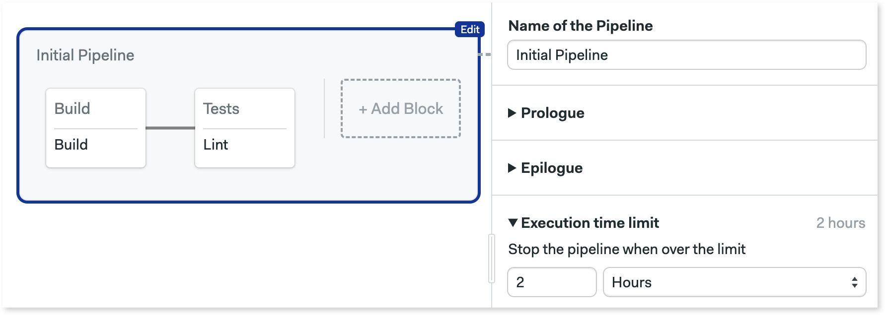
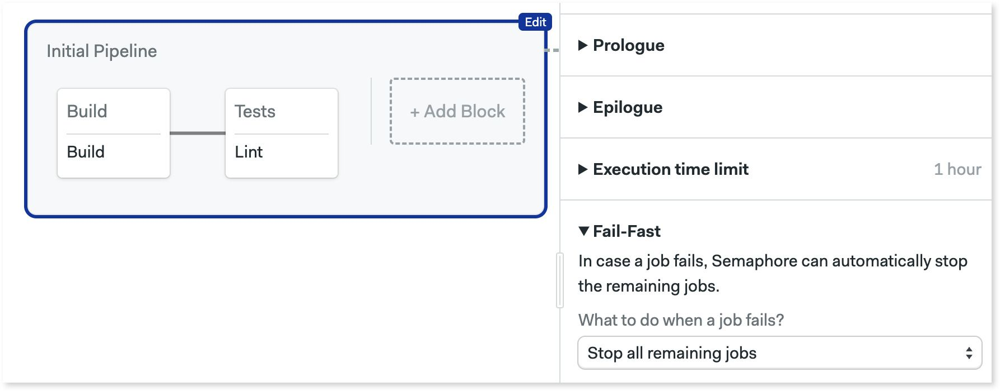
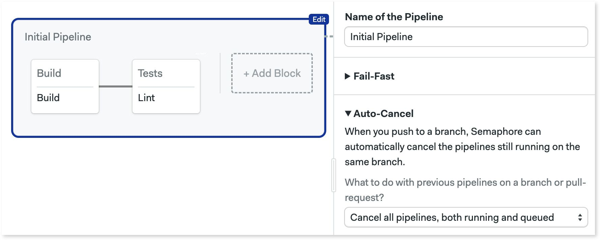
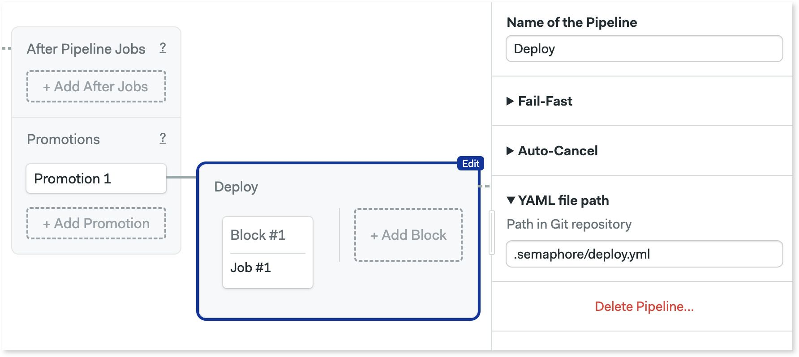
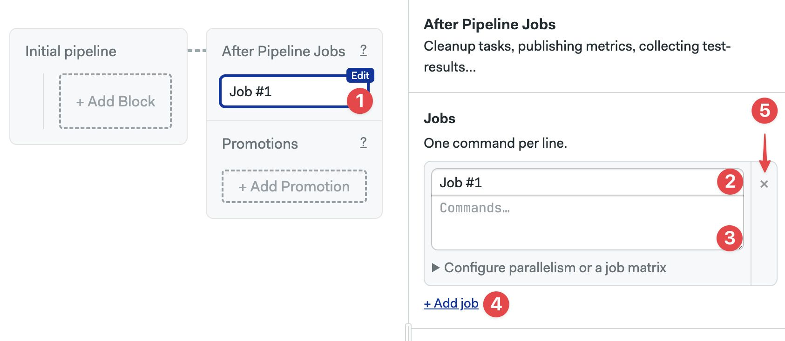

# Pipelines

import Tabs from '@theme/Tabs';
import TabItem from '@theme/TabItem';
import Available from '@site/src/components/Available';
import VideoTutorial from '@site/src/components/VideoTutorial';

A pipeline is a group of connected blocks. This page explains what pipelines are, how they organize workflow execution order, and what settings are available.

## Overview {#overview}

The purpose of a pipeline is to connect blocks using dependencies. This lets your plan the execution order.

Pipelines are also the *unit of configuration*. Each pipeline is encoded as separate a YAML file in the `.semaphore` folder. For reference, here is an example pipeline with its respective YAML.

<Tabs groupId="editor-yaml">
<TabItem value="editor" label="Example pipeline">

 

</TabItem>
<TabItem value="yaml" label="YAML">

```yaml title=".semaphore/semaphore.yml"
version: v1.0
name: Initial Pipeline
agent:
  machine:
    type: e1-standard-2
    os_image: ubuntu2004
blocks:
  - name: Build
    task:
      jobs:
        - name: Build
          commands:
            - checkout
            - echo "build commands here"
  - name: Test
    dependencies:
      - Build
    task:
      jobs:
        - name: Unit tests
          commands:
            - checkout
            - echo "unit tests commands here"
        - name: Integration tests
          commands:
            - checkout
            - echo "integration tests commands here"
  - name: UI Tests
    dependencies:
      - Test
    task:
      jobs:
        - name: UI Test
          commands:
            - checkout
            - echo "UI tests commands here"
```

</TabItem>
</Tabs>


## Workflow execution order {#dependencies}

In the same way that a block is a group of [jobs](./jobs), a pipeline is a group of blocks. Pipelines connect blocks using dependencies.  Semaphore derives the execution order from the block dependencies.

Take the following example:

- Blocks B and C depend on Block A
- Block D depends on both Blocks B and C

In this scenario Block B and C wait until Block A is done. Block D in turn, waits for Blocks B and C to be finished.



You can reorder blocks by changing their dependencies using the visual editor.

<VideoTutorial title="How to reorder blocks" src="https://www.youtube.com/embed/6o8gssc5JIQ?si=el9coKJyPzMXpKTq" opened={true} />

<details>
 <summary>What if we removed all dependencies?</summary>
 <div>If we removed dependencies between blocks then all of them would run in parallel. 
 Functionally, it would be the same as having all jobs in one big block</div>
</details>

## Connecting pipelines

Multiple pipelines can be chained using [promotions](./promotions) to create branching workflows and implement continuous delivery. The workflow always starts with the default pipeline (located at `.semaphore/semaphore.yml`) and flows from left to right following promotions.


## Pipeline settings {#settings}

Pipeline settings are applied to all its blocks. You can change pipeline settings with the editor or directly in the YAML. 

### Agents {#agents}

<Available/>

Agents are the environment where jobs run. Semaphore keeps a pool of warm agents at all times to be sure there's always one ready to work.

Semaphore Cloud provides the following agent types in x86 and ARM architectures:
- [Linux Machines] presented as VMs or [Docker containers](#docker-environments)
- [Apple macOS Machines]
- [Windows Machines] (only for [self-hosted agents]) 

:::info

Register your own machines as agents by [installing self-hosted agents].

:::

To select the agent running your jobs by default:

<Tabs groupId="editor-yaml">
<TabItem value="editor" label="Editor">

1. Select the pipeline
2. Select the **Environment Type**
3. Select the **Operating System**
4. Select the [machine type]

The available hardware changes depending on the type of environment you selected.



</TabItem>
<TabItem value="yaml" label="YAML">

1. Add the `agent` and `machine` keys
2. Add the hardware `type`. The value must be one of the supported [machine types]
3. Add the `os_image`. Value must be one of the supported [operating systems]

```yaml title=".semaphore/semaphore.yml"
version: v1.0
name: Initial Pipeline
# highlight-start
agent:
  machine:
    type: e1-standard-2
    os_image: ubuntu2004
# highlight-end
blocks:
  - name: 'Block #1'
    dependencies: []
    task:
      agent:
        machine:
          type: e1-standard-2
          os_image: ubuntu2004
      jobs:
        - name: 'Job #1'
          commands:
            - checkout
```

</TabItem>
</Tabs>

### Docker containers {#docker-environments}

:::tip

If you want to build and run Docker images in your jobs, check the [working with Docker Images documentation].

:::

Jobs can run inside Docker containers. This allows you to define a custom-build environment with pre-installed tools and dependencies needed for your project. You can enable this setting in the pipeline agent or in the [block agent override](./jobs#agent-override).

You can run multiple containers at the same time. The job runs in the first container (called `main`) and attaches the other of the containers to the same network. This is similar to how containers inside a Kubernetes pod communicate. 

The network addresses of all containers are mapped to their names. Let's say you have two containers, "main" and "mysql", you can connect to the database from main with:

```shell title="container 'main'"
mysql --host=mysql --user=root
```

To run the job inside a Docker container:

<Tabs groupId="editor-yaml">
<TabItem value="editor" label="Editor">

1. Select the pipeline
2. In **Environment Types** select **Docker Container(s)**
3. Select the [machine type]
4. Type the **Image** name for this container
5. Optionally, add environment variables
6. Optionally, add more containers



</TabItem>
<TabItem value="yaml" label="YAML">

1. Add the `agent` and `machine`
2. Add a `containers` key
3. Each list item is a container. The first one must be called `main`
4. Add the `image`
5. Optionally, add `env_vars`
6. Optionally, add more containers

```yaml title=".semaphore/semaphore.yml"
version: v1.0
name: Initial Pipeline
agent:
  machine:
    type: e1-standard-2
    os_image: ubuntu2004
  # highlight-start
  containers:
    - name: main
      image: 'semaphoreci/ubuntu:20.04'
      env_vars:
        - name: FOO_1
          value: BAR_1
    - name: web
      image: nginx
  # highlight-end
blocks:
  - name: 'Block #1'
    dependencies: []
    task:
      jobs:
        - name: 'Job #1'
          commands:
            - 'curl http://web'
```

</TabItem>
</Tabs>

:::warning

Due to the introduction of [Docker Hub rate limits](https://docs.semaphoreci.com/ci-cd-environment/docker-authentication/), Semaphore automatically redirects any image pulls from the semaphoreci Docker Hub repository to the [Semaphore Container Registry].

:::

### Prologue {#prologue}

Commands in the *prologue* run before the commands in all blocks. Semaphore will preprend these commands to every job contained in the pipeline. This works like the [block prologue](./jobs#prologue) but for all blocks in the pipeline.

<Tabs groupId="editor-yaml">
<TabItem value="editor" label="Editor">



</TabItem>
<TabItem value="yaml" label="YAML">

```yaml title=".semaphore/semaphore.yml"
version: v1.0
name: Initial Pipeline
agent:
  machine:
    type: e1-standard-2
    os_image: ubuntu2004
# highlight-start
global_job_config:
  prologue:
    commands:
      - checkout
      - npm install
# highlight-end
blocks:
  - name: Build
    dependencies: []
    task:
      jobs:
        - name: Build
          commands:
            - npm run build
  - name: Tests
    dependencies:
      - Build
    task:
      jobs:
        - name: Lint
          commands:
            - npm run build
```

</TabItem>
</Tabs>

### Epilogue {#epilogue}

Commands in the *epilogue* run at the end of the jobs in all blocks. Semaphore will append these commands to every job contained in the pipeline.  This works like the [block epilogue](./jobs#epilogue) but for all blocks in the pipeline.

<Tabs groupId="editor-yaml">
<TabItem value="editor" label="Editor">


</TabItem>
<TabItem value="yaml" label="YAML">

```yaml title=".semaphore/semaphore.yml"
version: v1.0
name: Initial Pipeline
agent:
  machine:
    type: e1-standard-2
    os_image: ubuntu2004
# highlight-start
global_job_config:
  epilogue:
    always:
      commands:
        - echo "the job has ended"
    on_pass:
      commands:
        - echo "the job has passed"
    on_fail:
      commands:
        - echo "the job has failed"
# highlight-end
blocks:
  - name: Build
    dependencies: []
    task:
      jobs:
        - name: Build
          commands:
            - npm run build
  - name: Tests
    dependencies:
      - Build
    task:
      jobs:
        - name: Lint
          commands:
            - npm run build
```
</TabItem>
</Tabs>

### Execution time limit {#time-limit}

The time limit for job execution. Defaults to 1 hour. Jobs running longer that the limit are forcibly terminated.

<Tabs groupId="editor-yaml">
<TabItem value="editor" label="Editor">



</TabItem>
<TabItem value="yaml" label="YAML">

```yaml title=".semaphore/semaphore.yml"
version: v1.0
name: Initial Pipeline
agent:
  machine:
    type: e1-standard-2
    os_image: ubuntu2004
# highlight-start
execution_time_limit:
  hours: 2
# highlight-end
blocks:
  - name: Build
    dependencies: []
    task:
      jobs:
        - name: Build
          commands:
            - npm run build
  - name: Tests
    dependencies:
      - Build
    task:
      jobs:
        - name: Lint
          commands:
            - npm run build
```
</TabItem>
</Tabs>

### Fail-fast {#fail-fast}

Changes Semaphore behavior when a job fails. The possible actions are:

- **Stop**: stop all running jobs
- **Cancel**: already-running jobs are allowed to finish

The available strategies are:

- **Do nothing**: fail fast is disabled
- **Stop all remaining jobs**: stops the jobs
- **Cancel pending jobs**: cancels the jobs
- **Stop remaining jobs, unless on the master branch**: stops the jobs except when the current branch is "master"
- **Run a custom fail-fast strategy**: define custom conditions for stop and cancel. Uses the [conditions DSL]

<Tabs groupId="editor-yaml">
<TabItem value="editor" label="Editor">



</TabItem>
<TabItem value="yaml" label="YAML">

```yaml title=".semaphore/semaphore.yml"
version: v1.0
name: Initial Pipeline
agent:
  machine:
    type: e1-standard-2
    os_image: ubuntu2004
# highlight-start
fail_fast:
  stop:
    when: 'true'
# highlight-end
blocks:
  - name: Build
    dependencies: []
    task:
      jobs:
        - name: Build
          commands:
            - npm run build
  - name: Tests
    dependencies:
      - Build
    task:
      jobs:
        - name: Lint
          commands:
            - npm run build
```

</TabItem>
</Tabs>

### Auto-cancel {#auto-cancel}

Define what happens when changes are pushed to the remote repository while a pipeline is running. By default, all pipelines will enter a First-In-First-Out (FIFO) queue and be executed in turn.

The possible strategies when a new pipeline is queued are:

- **running**: stops and cancels all pipelines in the queue. Starts the new pipeline immediately
- **queued**: cancels queued but no-yet-started pipelines. Waits for running pipelines to finish before starting the new one

The options are:

- **Do nothing**: disables auto-cancel
- **Cancel all pipelines, both running and queued**: stops running pipelines and cancel queued pipelines
- **Cancel only queued pipelines**: cancels queued pipelines, wait for already-started pipelines to finish
- **On the master branch cancel only queued pipelines, on others cancel both running and queued**: a mix of the last two strategies
- **Run a custom auto-cancel strategy**: define custom conditions for stop and cancel. Uses the [conditions DSL]

<Tabs groupId="editor-yaml">
<TabItem value="editor" label="Editor">



</TabItem>
<TabItem value="yaml" label="YAML">

```yaml title=".semaphore/semaphore.yml"
version: v1.0
name: Initial Pipeline
agent:
  machine:
    type: e1-standard-2
    os_image: ubuntu2004
# highlight-start
auto_cancel:
  running:
    when: 'true'
# highlight-end
blocks:
  - name: Build
    dependencies: []
    task:
      jobs:
        - name: Build
          commands:
            - npm run build
  - name: Tests
    dependencies:
      - Build
    task:
      jobs:
        - name: Lint
          commands:
            - npm run build
```
</TabItem>
</Tabs>


### YAML file path {#yaml-path}

This option overrides the location of the pipeline file. This option is not available for the default pipeline (located at `.semaphore/semaphore.yml`).

<Tabs groupId="editor-yaml">
<TabItem value="editor" label="Editor">



</TabItem>
<TabItem value="yaml" label="YAML">

```yaml title=".semaphore/deploy.yml"
version: v1.0
name: Deploy
agent:
  machine:
    type: e1-standard-2
    os_image: ubuntu2004
blocks:
  - name: 'Block #1'
    task:
      jobs:
        - name: 'Job #1'
          commands:
            - echo "job 1"
```

</TabItem>
</Tabs>

### After pipeline jobs {#after-pipeline-job}

You can configure jobs to run once a pipeline stops, even if it ended due to a failure, stopped, or canceled.

After-pipeline jobs are executed in parallel. Typical use cases for after-pipeline jobs are sending notifications, collecting [test reports](./test-reports), or submitting metrics to an external server.

You can add after-pipeline jobs using YAML or the editor.

<Tabs groupId="editor-yaml">
<TabItem value="editor" label="Editor">

1. Press **+Add After Jobs**
2. Type the name of the job
3. Add your commands
4. Optionally, you can add more jobs
5. To delete them, click the X next to the job



</TabItem>
<TabItem value="yaml" label="YAML">

1. Add `after_pipeline` key at the top level of the YAML.
2. Create a `task.jobs` key
3. Add the list of jobs with `name` and `commands`

```yaml title=".semaphore/semaphore.yml"
version: v1.0
name: Initial Pipeline
agent:
  machine:
    type: e1-standard-2
    os_image: ubuntu2004
blocks:
  - name: 'Block #1'
    dependencies: []
    task:
      agent:
        machine:
          type: e1-standard-2
          os_image: ubuntu2004
      jobs:
        - name: 'Job #1'
          commands:
            - checkout
            - make build
# highlight-start
after_pipeline:
  task:
    jobs:
      - name: Submit metrics
        commands:
          - export DURATION_IN_MS=$((SEMAPHORE_PIPELINE_TOTAL_DURATION * 1000))
          - 'echo "ci.duration:${DURATION_IN_MS}|ms" | nc -w 3 -u statsd.example.com'
# highlight-end
```

</TabItem>
</Tabs>
