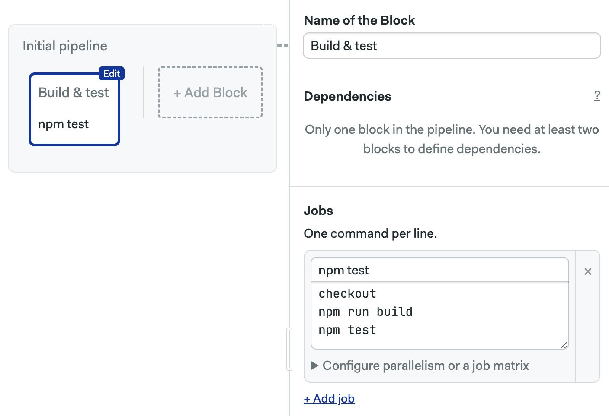

# Pipelines

DO WE NEED A WORKFLOW/Promotions page?

import Tabs from '@theme/Tabs';
import TabItem from '@theme/TabItem';

Blocks can have dependencies, which force blocks to run sequentially. Below is a more complex example:
- Block B and C depend on Block A. That means that Block B and C won't start until all Block A is done. 
- Block D only starts when Block B AND Block C have finished.


<details>
  <summary>What if we removed all dependencies?</summary>
  <div>If we removed all block dependencies between blocks then all of them would run in parallel. 
  Functionally, it would be the same as having all jobs in one big block</div>
</details>


## Pipelines

MENTION PIPELINE is the configuration unit, link to pipelines

Every pipeline is stored as a separate file inside the `.semaphore` folder in your repository. Semaphore uses YAML to encode all the elements in the pipeline including blocks, jobs, and commands. For reference, here is an example pipeline with its respective YAML. We'll learn how it works in the course of this document.

<Tabs groupId="jobs">
  <TabItem value="editor" label="Editor">
  
  </TabItem>
  <TabItem value="yaml" label="YAML">
  ```yaml title=".semaphore/semaphore.yml"
  version: v1.0
  name: Initial pipeline
  agent:
    machine:
      type: e1-standard-2
      os_image: ubuntu2004
  blocks:
    - name: Build & test
      task:
        jobs:
          - name: npm test
            commands:
              - checkout
              - npm run build
              - npm test
  ```
  </TabItem>
</Tabs>

### Pipelines and workflows

A pipeline is a group of blocks, usually connected via dependencies. Pipelines are used to fulfill specific goals like build, test, or deploy. But there is no rule; you can organize your pipelines in any shape you like.

You can have as many pipelines as you like inside your repository. Pipelines can be connected using promotions to make more complex workflows.


