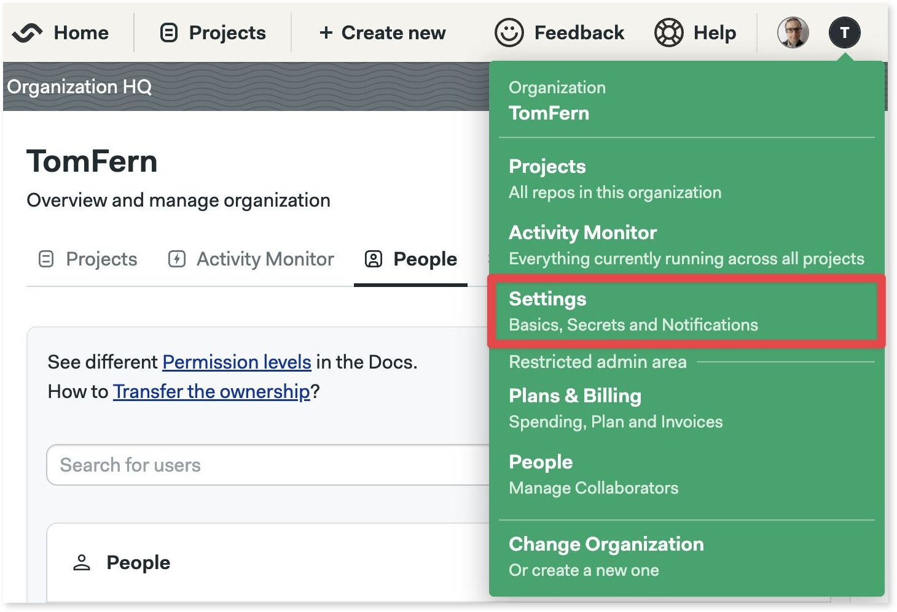

# Organizations

import Tabs from '@theme/Tabs';
import TabItem from '@theme/TabItem';

The fist time you log in to Semaphore you'll be prompted to create an *organization*. An organization is the basic unit of administration. 

All organizations have a name, a [billing plan](https://semaphoreci.com/pricing), one or more administrators and collaborators, and settings to manage how to run your [pipelines](./pipelines).

## How to change organizations

To view or create other organizations, open the organization menu on the top right corner and select **Change Organization**.

TODO: CLI connect and switch https://docs.semaphoreci.com/reference/sem-command-line-tool/#overview

## Organization settings

To access your organization settings, open the organization menu and select **Settings**.

### General settings

The general settings lets you:

- change the name and URL of the organization
- delete the organization
- restrict workflows

edit: the edit command is used for editing existing projects, secrets, notifications, dashboards and deployment-targets using your configured text editor.
apply: the apply command is used for updating existing projects, secrets, dashboards, notifications and deployment-targets using a corresponding YAML file, and requires the use of the -f flag.

### Secrets

### Notifications

### Initialization jobs

### Okta integration

Availability?

### Contacts

## Managing collaborators

## Audit logs

## Activity monitor

## Plans and billing
