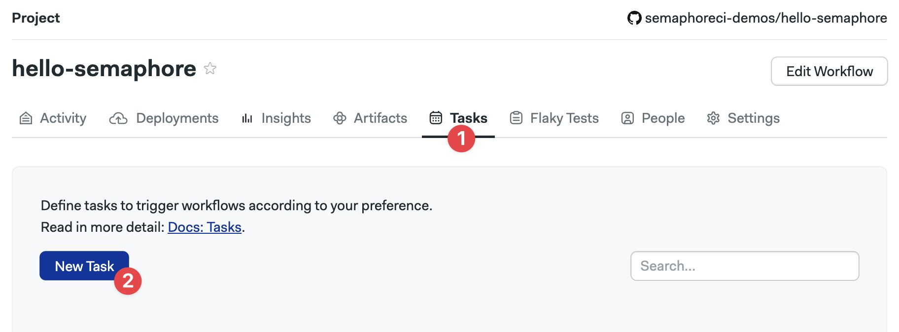
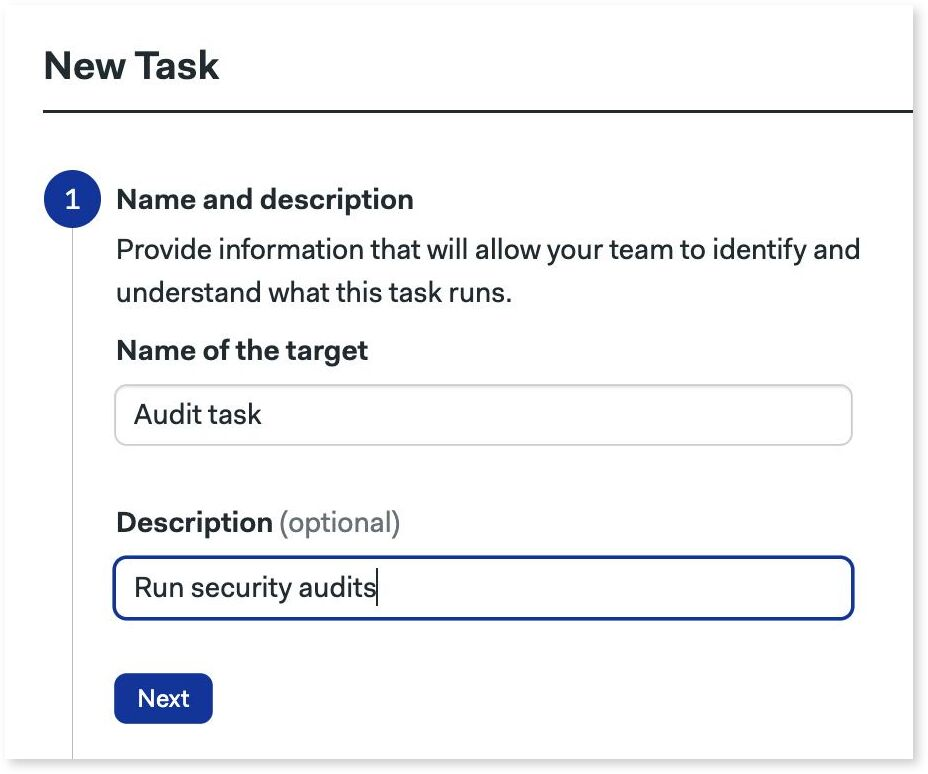
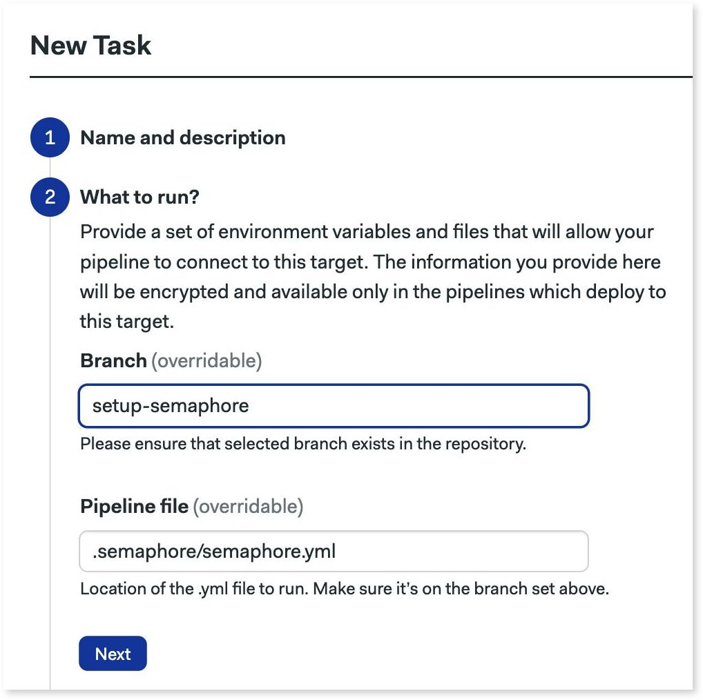
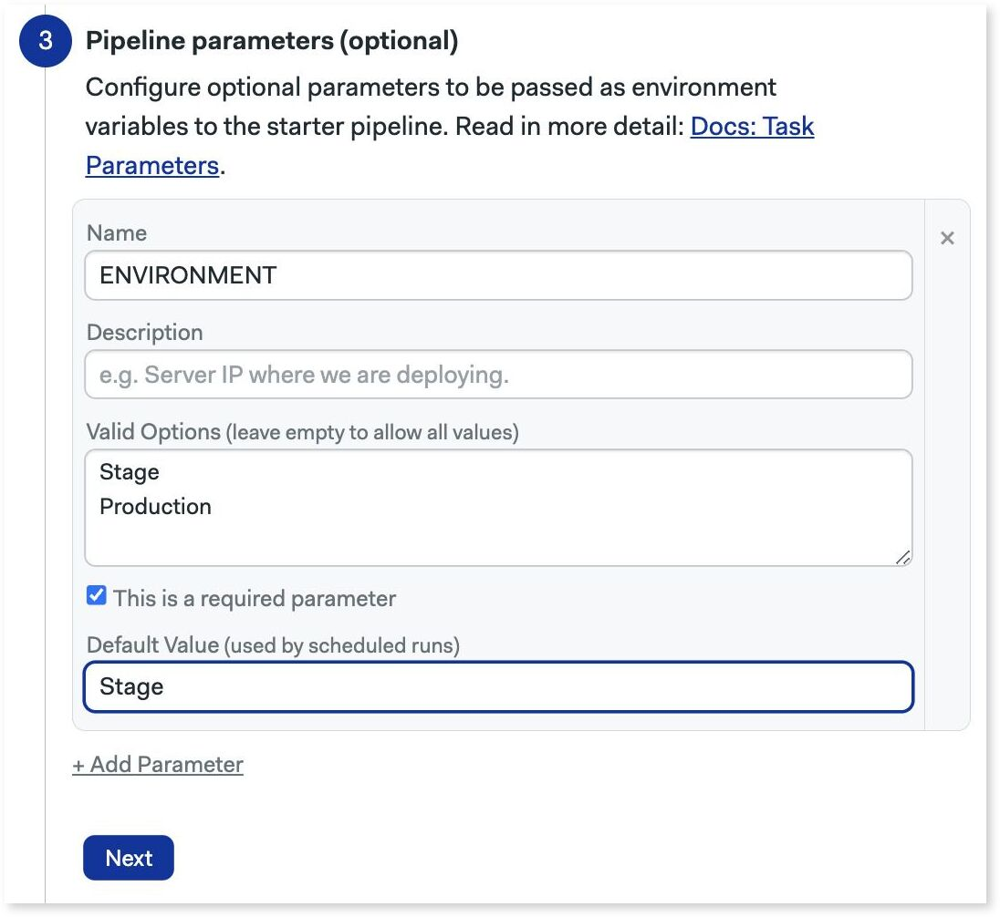
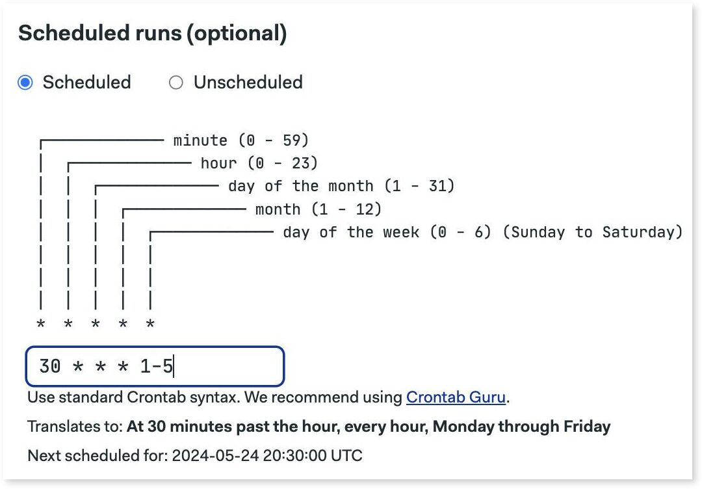
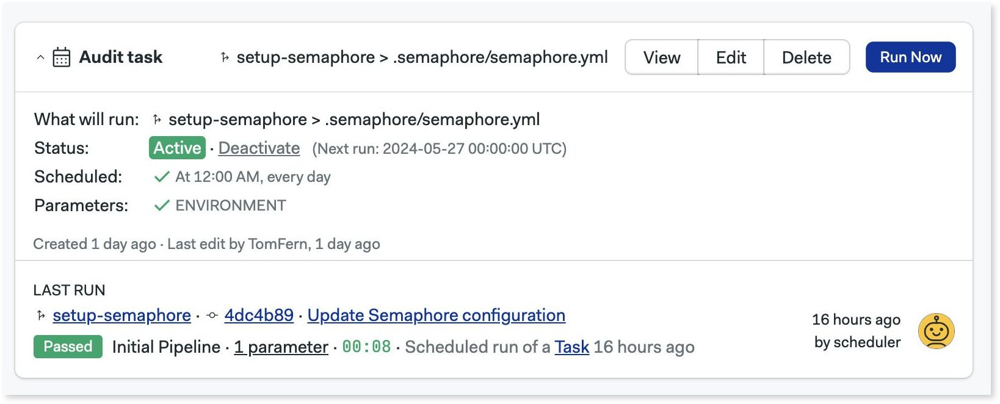
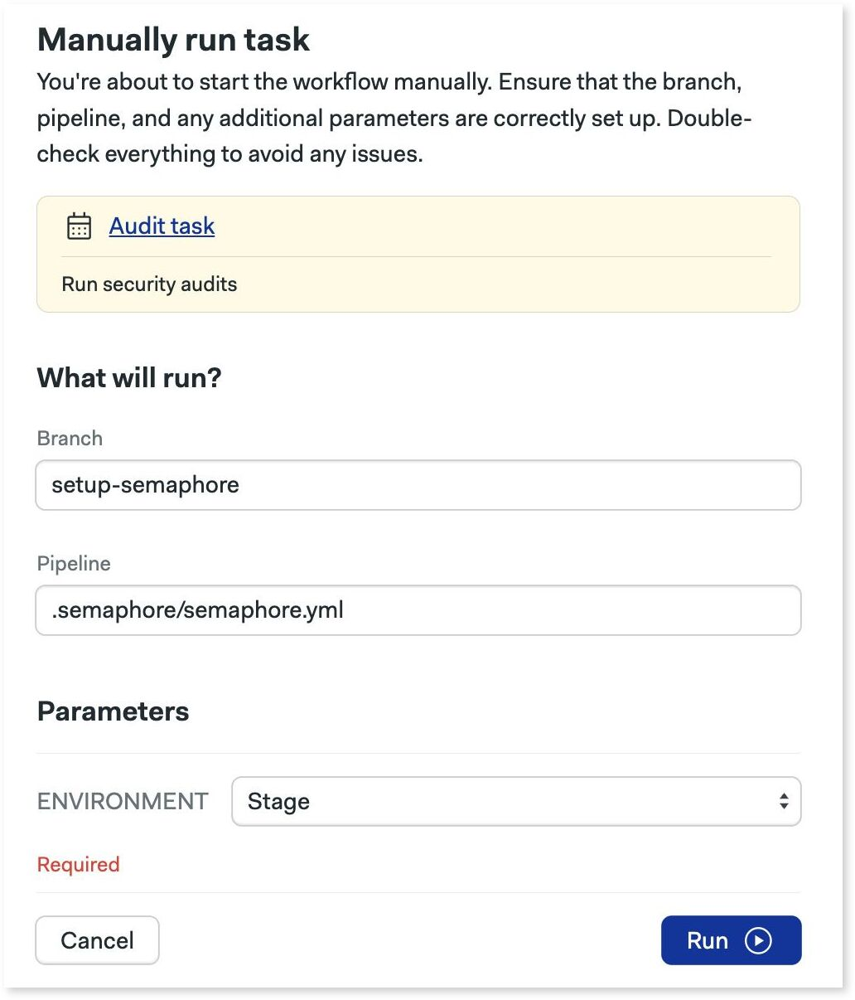

# Tasks

import Tabs from '@theme/Tabs';
import TabItem from '@theme/TabItem';

Task allow you to trigger specific [pipelines](./pipelines) on a schedule or manually. 

## Overview {#overview}

The main use cases for tasks are to:

- Run long or resource-intensive jobs outside the usual continuous integration workflow.
- Trigger pipelines not connected to any [promotions](./pipelines#promotions)
- Periodically rebuild an application or run security audits
- Continue testing projects even when they are inactive (not getting new commits)
- Run arbitrary code, track results, and get notifications
- Execute maintenance chores such as such database backups
- Running exceptional corrective actions such as pruning the [cache](./jobs#cache)


## Limitations {#limitations}

Scheduled tasks have some limitations:

- Pipelines are triggered at a random second inside the scheduled minute. This helps disperse the load on the system.
- Tasks do not start automatically in the first 60 seconds after being created or edited.
- In the rare cases in which the scheduler fails to start a task, Semaphore retries it every 10 seconds for the following 15 minutes.

## How to manage tasks {#manage-tasks}

To create a task, open your project and follow these steps. You can create tasks with the UI, or use Semahore CLI.

<Tabs groupId="ui-cli">
<TabItem value="ui" label="UI">

1. Select the **Tasks** tab
2. Press **New task**
        <details>
        <summary>Show me</summary>
        <div>
            
        </div>
        </details>  
3. Type the task's name and description
4. Press **Next**
    <details>
        <summary>Show me</summary>
        <div>
        
        </div>
    </details>
5. Type the repository branch and [pipeline](./pipelines) file to execute. The only requisite is that the pipeline file exists in that branch. It doesn't need (but it can) to be conencted with a promotion to any other pipeline
6. Press **Next**
    <details>
        <summary>Show me</summary>
        <div>
        
        </div>
    </details>
7. Optionally, you can add parameters. These work exacly the same as [parameterized promotions](./pipelines#parameters)
    <details>
        <summary>Show me</summary>
        <div>
        
        </div>
    </details>
8. Press **Next**
9. Define the schedule using [crontab syntax](https://crontab.guru/). The example below is running Check the option "Unscheduled" if you want to only run the task manually
    <details>
        <summary>Show me</summary>
        <div>
        
        </div>
    </details>
10. Press **Next** and **Create**

</TabItem>
<TabItem value="cli" label="CLI">

You can add tasks by editing the project using the _Semaphore command line tool_.

1. Run `sem edit project <project-name>`
2. An editor should open showing the project settings. For example, this is a project called "hello-semaphore"

    ```yaml title="sem edit projet hello-semaphore"
    apiVersion: v1alpha
    kind: Project
    metadata:
      name: hello-semaphore
      id: a2ba1008-afc9-4326-b994-58fb816fc4d5
      description: "This is a test project"
    # ...
    ```
3. Add a `task` section. Each item in the list is a task. The example below shows two tasks:
   - Task "nightly-deploys" runs the `nighthly-deploys.yml` on "master" branch pipeline at 12:15 am every day.
   - Task "canary-setup" runs the same pipeline in "develop" branch with [parameters](./pipelines#parameters)

    ```yaml title="sem edit projet hello-semaphore"
    # ...
    # This section defines two tasks
      tasks:
      - name: nightly-deploys
        branch: master
        scheduled: true
        at: "15 12 * * *"
        pipeline_file: .semaphore/nightly-deploys.yml
      - name: canary-setup
        branch: develop
        scheduled: false
        pipeline_file: .semaphore/nightly-deploys.yml
        parameters:
        - name: CANARY_VERSION
          required: true
          default_value: "1.0.0"
    ```

4. Save the file to submit your changes

</TabItem>
</Tabs>

## Working with tasks {#create-task}

Go to the **Tasks** tab in your project to view the configured tasks.



You can control tasks using the UI:
- Press **Run now** to start the task
- **Deactivate** disables the task's schedule
- **View** shows the task's execution history
- **Delete** deletes the task
- **Edit** let's you modify the task

### Running tasks manually {#run-tasks}

Pressing **Run now** shows you the following screen.



Here you can change the branch, pipeline file, and define parameter values. Press **Run** to start the task immediately.
