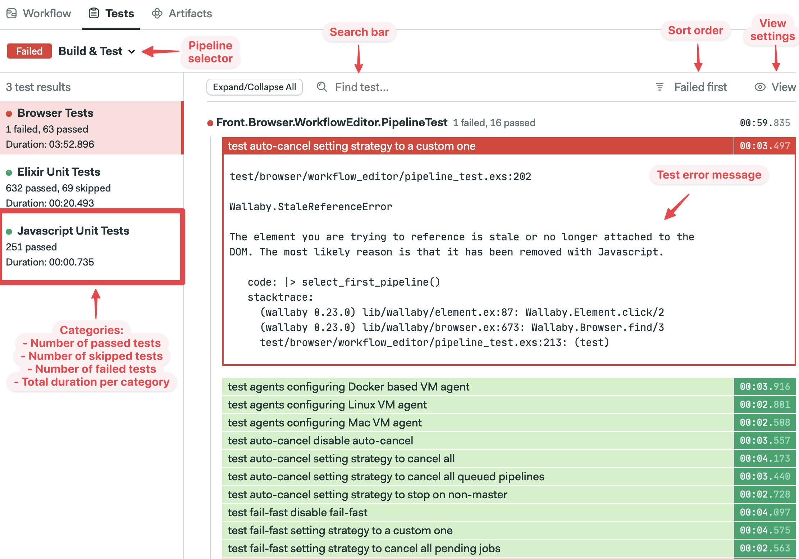
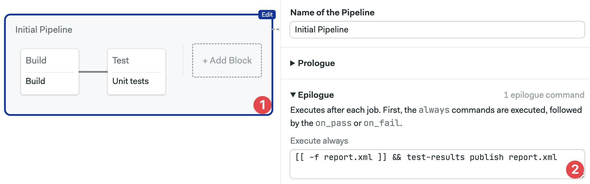
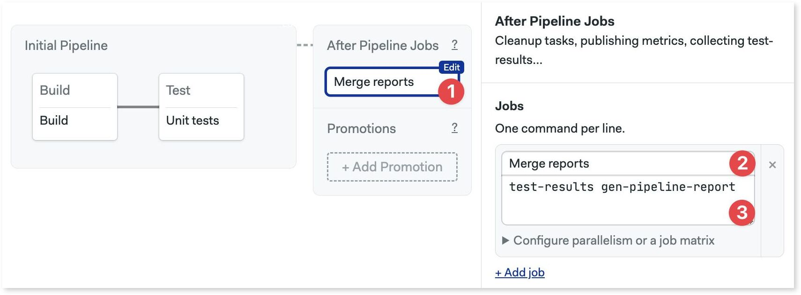
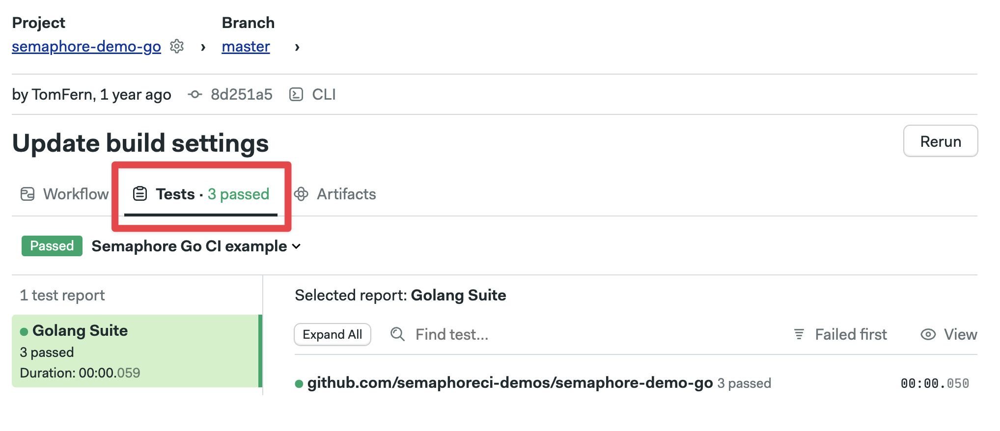
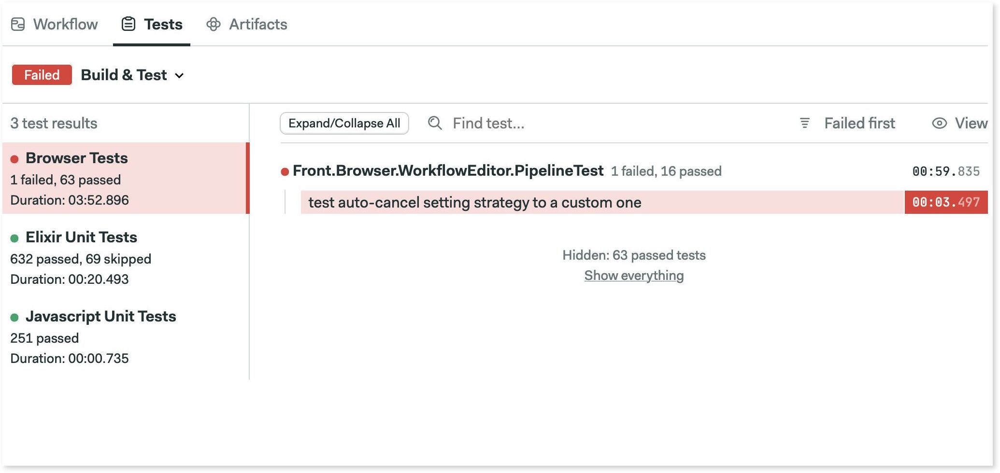
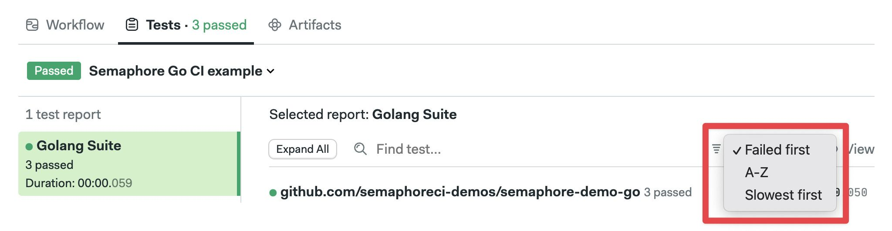
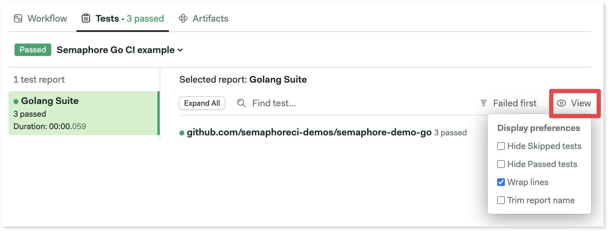

# Tests Reports

import Tabs from '@theme/Tabs';
import TabItem from '@theme/TabItem';
import VideoTutorial from '@site/src/components/VideoTutorial';

<VideoTutorial title="How to set up test reports" src="https://www.youtube.com/embed/9L0Z9xcKiYU?si=IdSsYfGLU7btYVwq" />

Test reports shows a unified view of all your tests in a [pipeline](./pipelines). This page explains how to configure test reports and interpret the test dashboard.

## Overview {#overview}

The test tab in your project offers a unified view of the state of tests across all your pipelines. The test reports dashboard highlights test failures and can be filtered in many ways to provide insights into your test suite.



## How to set up test reports {#setup}

Before you can view your tests in the Test tabs, you need to perform a one-time setup. The benefit of having all tests in one place is usually worth the effort of this setup.

1. **Format**: format test results in JUnit XML
2. **Publish**: push results file into the [artifact store](./jobs#artifact)
3. **Merge**: collect and process all result files


Once test reports are configure the [flaky test detection](./flaky-tests) feature is automatically enabled.

### Step 1 - Format {#step1}

The JUnit XML format was created by the [JUnit Project](https://junit.org/junit5/) for Java but has been so popular that many other frameworks in diverse languages have implemented it. 

```xml title="Example JUnit Report (report.xml)"
<?xml version="1.0" encoding="UTF-8"?>
<testsuites tests="3" failures="2" errors="0" time="0.850294">
    <testsuite tests="3" failures="2" time="0.063000" name="github.com/semaphoreci-demos/semaphore-demo-go" timestamp="2024-05-27T22:14:24Z">
        <properties>
            <property name="go.version" value="go1.22.3 linux/amd64"></property>
        </properties>
        <testcase classname="github.com/semaphoreci-demos/semaphore-demo-go" name="Test_count" time="0.020000">
            <failure message="Failed" type="">=== RUN   Test_count&#xA;dial tcp [::1]:5432: connect: connection refused&#xA;dial tcp [::1]:5432: connect: connection refused&#xA;dial tcp [::1]:5432: connect: connection refused&#xA;dial tcp [::1]:5432: connect: connection refused&#xA;    main_test.go:84: Select query returned 0&#xA;dial tcp [::1]:5432: connect: connection refused&#xA;--- FAIL: Test_count (0.02s)&#xA;</failure>
        </testcase>
        <testcase classname="github.com/semaphoreci-demos/semaphore-demo-go" name="Test_record" time="0.000000">
            <failure message="Failed" type="">=== RUN   Test_record&#xA;dial tcp [::1]:5432: connect: connection refused&#xA;dial tcp [::1]:5432: connect: connection refused&#xA;Serving: /getdata&#xA;Served: &#xA;    main_test.go:144: Wrong server response!&#xA;dial tcp [::1]:5432: connect: connection refused&#xA;--- FAIL: Test_record (0.00s)&#xA;</failure>
        </testcase>
    </testsuite>
</testsuites>
```

The first step is to configure your test runner to generate a JUnit report. The format command runs as another command in the job — usually near the end. 

:::tip

To make setup easier, it's recommended to save all report files to the same path and filename. We'll use `report.xml` for the rest of the document.

:::

Below there are examples of generating reports in different test runners.

<details>
<summary>Ruby on Rails example</summary>
<div>

To generate JUnit reports on Ruby on Rails projects we need to add the [rspec_junit_formatter](https://github.com/sj26/rspec_junit_formatter) Gem:

```ruby title="Gemfile"

group :development, :test do
  # ...
  gem "rspec_junit_formatter"
end
```

After running `bundle install`, we need to tell RSpec to use the new formatter. We can do this by extending the `.rspec` configuration file:

```ruby title=".rspec"
--format RspecJunitFormatter
--out report.xml
--format documentation
```

Alternatively, we can change pass the configuration via command line arguments:

```shell
bundle exec rspec --format RspecJunitFormatter --out report.xml --format documentation
```

Either way should generate a `report.xml` file at the root of the project.

</div>
</details>

<details>
<summary>Go example</summary>
<div>

A project using [GoTestSum](https://github.com/gotestyourself/gotestsum) as the test runner can generate JUnit reports by `--junitfile` to the test command in the [job](./jobs):

```shell
checkout
go get .
go install gotest.tools/gotestsum
# highlight-next-line
gotestsum --junitfile report.xml
```

</div>
</details>

<details>
<summary>Elixir example</summary>
<div>

To generate JUnit reports for your Elixir project, follow these steps:

1. Add [junit-formatter](https://github.com/victorolinasc/junit-formatter) to your `mix.exs`

    ```elixir title="mix.exs"
    defp deps do
    [
        # ...
        {:junit_formatter, "~> 3.1", only: [:test]}
    ]
    end
    ```

2. Install the dependencies:

    ```shell
    mix deps.get
    ```

3. Extend your `config/test.exs`

    ```elixir title="config/test.exs"
    config :junit_formatter,
        report_dir: "/tmp",
        report_file: "report.xml", 
        print_report_file: true,
        include_filename?: true,
        prepend_project_name?: false,
        include_file_line?: true
    ```

4. Extend your `test/test_helper.exs`

    ```elixir title="test/test_helper.exs"
    ExUnit.configure(formatters: [JUnitFormatter, ExUnit.CLIFormatter])
    ExUnit.start()
    ```

5. Run the tests. This should generate `report.xml`

    ```shell
    mix test
    mv /tmp/report.xml .
    ```

</div>
</details>

The table shows possible test runners for popular languages. If your test runner is not listed here, you can still use test reports, but you need to find a test formatter that can export results to JUnit XML.


| Language   | Test Runner | Formatter                                                                                     |
| ---------- | ----------- | --------------------------------------------------------------------------------------------- |
| JavaScript | Mocha       | [mocha-junit-reporter](https://www.npmjs.com/package/mocha-junit-reporter)                    |
| JavaScript | Karma       | [karma-junit-reporter](https://www.npmjs.com/package/karma-junit-reporter)                    |
| JavaScript | ESLint      | [built-in](https://eslint.org/docs/user-guide/formatters/#junit)                              |
| JavaScript | Jest        | [jest-junit](https://www.npmjs.com/package/jest-junit)                                        |
| Ruby       | RSpec       | [rspec_junit_formatter](https://github.com/sj26/rspec_junit_formatter)                        |
| Ruby       | Cucumber    | [built-in](https://relishapp.com/cucumber/cucumber/docs/formatters/junit-output-formatter)    |
| Elixir     | ExUnit      | [junit-formatter](https://github.com/victorolinasc/junit-formatter)                           |
| Go         | GoTestSum   | [built-in](https://github.com/gotestyourself/gotestsum#junit-xml-output)                      |
| PHP        | PHPUnit     | [built-in](https://phpunit.readthedocs.io/en/9.5/textui.html?highlight=junit)                 |
| Python     | PyTest      | [built-in](https://docs.pytest.org/en/6.2.x/usage.html#creating-junitxml-format-files)        |
| Bash       | Bats        | [built-in](https://bats-core.readthedocs.io/en/latest/usage.html)                             |
| Rust       | Cargo Test  | [junit-report](https://crates.io/crates/junit-report)                                         |
| Java       | Maven       | [maven-surefire](https://maven.apache.org/surefire/maven-surefire-plugin/examples/junit.html) |


### Step 2 - Publish {#step2}

The publish step uploads all report files to the [artifact store](./jobs#artifact). This is accomplished using the `test-results` tool which is part of the _Semaphore toolbox_.

Assuming the file is called `report.xml`, you can publish the report with the following command, which runs only if the file exists.

```shell
[[ -f report.xml ]] && test-results publish report.xml
```

To simplify this step, you can add a [pipeline epilogue](./pipelines#settings) to run the publish command after every job ends.

<Tabs groupId="editor-yaml">
<TabItem value="editor" label="Editor">

1. Select the pipeline with the test jobs
2. Add the publish command in the "Execute always" box of the Epilogue



</TabItem>
<TabItem value="yaml" label="YAML">

1. Open the pipeline file with the test jobs
2. Add a `global_job_config` key at the YAML root
3. Type the publish command under `epilogue.always.commands`

```yaml title=".semaphore/semaphore.yml"
# ...
global_job_config:
  epilogue:
    always:
      commands:
         # highlight-next-line
         - '[[ -f report.xml ]] && test-results publish report.xml'
```

</TabItem>
</Tabs>

### Step 3 - Merge {#step3}

The final step is to merge and process all report files. This is achieved using an [after-pipeline job](./pipelines#after-pipeline-job).

<Tabs groupId="editor-yaml">
<TabItem value="editor" label="Editor">

1. Press **+Add After Jobs**
2. Type a name for the job
3. Type the command `test-results gen-pipeline-report`



</TabItem>
<TabItem value="yaml" label="YAML">

1. Open the pipeline with the test jobs
2. Add an `after_pipeline` key at the YAML root
3. Add the `name` under `task.jobs`
4. Type the merge command `test-results gen-pipeline-report` in the `commands` section

```yaml title=".semaphore/semaphore.yml"
# ...
after_pipeline:
  task:
    jobs:
      - name: Merge reports
        commands:
          # highlight-next-line
          - test-results gen-pipeline-report
```

</TabItem>
</Tabs>

## How to view test reports {#view}

To view test results, navigate to your pipeline and go to the **Tests** tab.



:::info

The test tab is only populated for the pipelines where [test reports are configured](#setup). If you don't see anything yet, try rerunning the pipeline.

:::

The default Test view shows failed tests first.



Click on "Failed first" to change the sort order. You can sort by "Slowest first" or alphabetically.



Click on "View" to change display preferences. You can hide passed or skipped tests and change how the report looks.


