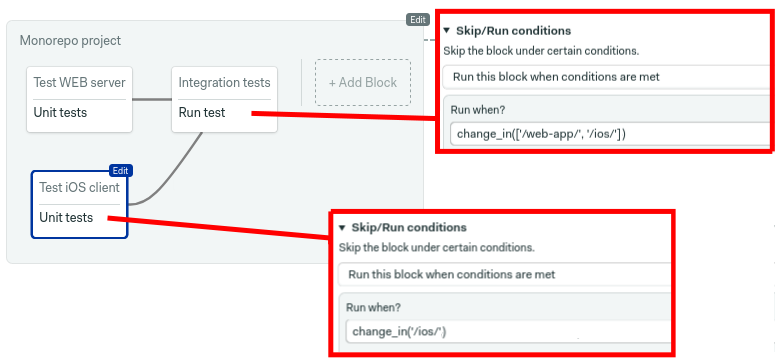
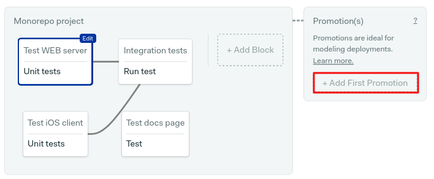

# Monorepo Workflows

A [monorepo](https://semaphoreci.com/blog/what-is-monorepo) (short for
monolithic repository) is a software development strategy where code for
many applications, which may or may not be mutually dependent, is stored
in the same version-controlled repository. This guide shows you how to
optimize your Semaphore workflow for monorepo projects.

Some advantages of a monorepo approach are:

- Ease of code reuse — it is easy to abstract shared behavior into common libraries.
- Simplified dependency management — third-party dependencies are easily shared.
- Atomic commits across multiple applications — you can refactor multiple applications at once with a single commit.
- Single source of truth — there’s only one version of each dependency.
- Unified CI/CD — a standardized process can build and deploy every application in the repository.

Semaphore comes with out-of-box support for monorepos and provides
an [example project][monorepo-example] for you to try.

## Setting up a monorepo project

Let's say you have a simple monorepo project that consists of:

- A web application located inside `/web-app/` directory.
- An iOS client application located inside `/ios/` directory.
- A separate docs web page located inside `/docs/` directory.

We can set up a Semaphore pipeline that builds and tests each one of these
components.


The YAML for this pipeline is:

```yaml
version: "v1.0"
name: Monorepo project
agent:
  machine:
    type: e1-standard-2
    os_image: ubuntu1804

blocks:
  # Run this block on changes in the web-app folder at the root of the repository
  - name: Test WEB server
    dependencies: []
    run:
      when: "change_in('/web-app/')"
    task:
      jobs:
        - commands:
            - checkout
            - cd web-app
            - make test

  # Run this block on changes in the ios folder at the root of the repository
  - name: Test iOS client
    dependencies: []
    run:
      when: "change_in('/ios/')"
    task:
      agent:
        machine:
          type: a1-standard-4
          os_image: macos-xcode12
      jobs:
        - commands:
            - checkout
            - cd ios
            - make test

  # Run this block on changes in the docs folder at the root of the repository
  - name: Test docs page
    dependencies: []
    run:
      when: "change_in('/docs/')"
    task:
      jobs:
        - commands:
            - checkout
            - cd docs
            - make test

  # Run this block on changes in web-app or ios folders at the root of the repository
  - name: Integration tests
    dependencies: ["Test WEB server", "Test iOS client"]
    run:
      when: "change_in(['/web-app/', '/ios/'])"
    task:
      jobs:
        - commands:
            - checkout
            - make integration-tests
```

With this setup, we run separate tests for each part of the system and
integration tests once both web application and iOS client tests pass.

## Change-based block execution

You can set the criteria for running the jobs within a block in the
*Skip/Run conditions* section. The [run property][run-ref] is evaluated on
each workflow to decide if the block should be run or skipped.


When combined with `change_in` function, which checks whether there were
recent changes on a given path, allows us to only run tests for those
parts of the project that are currently being worked on.

In the example below, this means that if we are working only on the iOS
client app within the `/ios/` directory of the repository, the only blocks
that will be executed are the `Test iOS client` and `Integration tests`.
Everything else will be skipped.



This can significantly reduce the time and cost while still providing you
with required feedback for the changes introduced into the monorepo.

The `change_in` function checks for changed files in recent commits. The
commit range analyzed depends on whether you're working on `master/main`
or on a branch/pull request. For more details and ways in which this can
be modified please check the [reference][change-in-ref].

## Set up the automatic deployments for a monorepo project

Here we will assume that you already have three pipelines for:

- Deploying the web app.
- Releasing the iOS client.
- Publishing the documentation pages.

You can find examples for various kinds of deployments in the [use
cases][use-cases] section of our docs. We will focus on auto-promoting the
right pipelines using change detection. To achieve this, we need to
introduce [promotion][promotions-ref] conditions.



Ticking **Enable automatic promotion** brings up the conditions field.
Semaphore supports using `change_in` in this field. You can combine it
with the `branch` and `result` properties to start a pipeline on a given
branch. For example, for the web app:


To complete the example, this is how the `iOS Release` and `Publish
docs` pipelines should look:


The resulting YAML for the promotions is:

```yaml
promotions:
  # deploy web app when test pass on master branch and there are changes in the web-app folder
  - name: Deploy Web Server
    pipeline_file: web-prod.yml
    auto_promote:
      when: "branch = 'master' and result = 'passed' and change_in('/web-app/')"
  # deploy web app when test pass on master branch and there are changes in the ios folder
  - name: Release iOS client
    pipeline_file: ios-prod.yml
    auto_promote:
      when: "branch = 'master' and result = 'passed' and change_in('/ios/')"
  # deploy web app when test pass on master branch and there are changes in the docs folder
  - name: Publish docs
    pipeline_file: docs-prod.yml
    auto_promote:
      when: "branch = 'master' and result = 'passed' and change_in('/docs/')"
```

Each part of the system will be automatically deployed when the tests pass on
the master branch, only if the push that initiated workflow contains changes in
the locations monitored by the `change_in` function.

## Additional examples of monorepo configuration

### When a directory changes

```yaml
change_in('/web-app/')
```

### When a file changes

```yaml
change_in('../Gemfile.lock')
```

### Changing the default branch from master to main

```yaml
change_in('/web-app/', {default_branch: 'main'})
```

### Exclude changes in the pipeline file

**Note:** If you change the pipeline file, Semaphore will consider `change_in`
as true. The following illustrates how to disable this behaviour.

```yaml
change_in('/web-app/', {pipeline_file: 'ignore'})
```

## See also

- [Skip block execution][skip-ref]
- [Deploying with promotions][promotions-guided]
- [Defining 'when' conditions][conditions-ref]
- [Try our monorepo demo project][demo]

[run-ref]: https://docs.semaphoreci.com/reference/pipeline-yaml-reference/#run-in-blocks
[change-in-ref]: https://docs.semaphoreci.com/reference/conditions-reference/#change_in
[use-cases]: https://docs.semaphoreci.com/examples/tutorials-and-example-projects/
[promotions-ref]: https://docs.semaphoreci.com/reference/pipeline-yaml-reference/#promotions
[skip-ref]: https://docs.semaphoreci.com/reference/pipeline-yaml-reference/#skip-in-blocks
[promotions-guided]: https://docs.semaphoreci.com/guided-tour/deploying-with-promotions/
[conditions-ref]: https://docs.semaphoreci.com/reference/conditions-reference/
[demo]: https://github.com/semaphoreci-demos/semaphore-demo-monorepo
[monorepo-example]: https://docs.semaphoreci.com/examples/change-based-execution-for-monorepos
