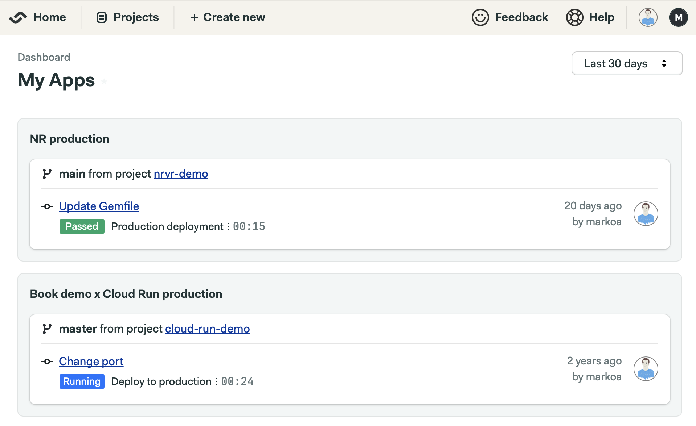

# Deployment Dashboards

Dashboards allow you to create custom Semaphore screens that show deployment
activity across multiple projects.

For example, you can define a dashboard that shows which versions of all your
applications have been deployed in staging and production environments.



## Prerequisites

To create and manage dashboards you need to have:

- One or more Semaphore projects, preferrably with separate [deployment pipelines][promotions].
- [Semaphore CLI][sem-cli] installed on your computer.

## Creating a dashboard

Start by creating a blank dashboard in your terminal:

``` bash
$ sem create dashboard demo-deployment
Dashboard 'demo-deployment' created.
```

Open the dashboard configuration:

``` bash
$ sem edit dashboard demo-deployment
```

At this point you have a blank dashboard definition open in your default editor.
It looks something like this:

``` yaml
apiVersion: v1alpha
kind: Dashboard
metadata:
  name: demo-deployment
  title: demo-deployment
  id: d0013e29-e4f9-43a6-9322-b5d843accd7d
  create_time: "1543855505"
  update_time: "1543855839"
spec:
  widgets: []
```

## Adding widgets to a dashboard

Dashboard widgets show information from a pipeline in a project.

Recall that on Semaphore we model deployment using [promotions][promotions] that
trigger separate pipelines. So a typical deployment dashboard would define
widgets based on these deployment pipelines.

A minimal configuration would be as follows:

``` yaml
spec:
  widgets:
  - name: Deploys to production
    type: list_pipelines
    filters:
      project_id: 8781bf53-d0d9-4836-8379-32d3e02b9d3c
      pipeline_file: .semaphore/production-deployment.yml
```

Because a dashboard can show widgets from multiple projects, you need to
reference a `project_id`. To find the ID of your project, run `sem get projects`,
then `sem get project <projectname>`:

```
$ sem get projects
NAME                              REPOSITORY
haskell-demo                      git@github.com:markoa/haskell-demo.git
gatsby-blog                       git@github.com:markoa/gatsby-blog.git
(...)

$ sem get project gatsby-blog
apiVersion: v1alpha
kind: Project
metadata:
  name: gatsby-blog
  id: 8781bf53-d0d9-4836-8379-32d3e02b9d3c
  description: ""
(...)
```

Finally, specify the path to the target pipeline configuration file.

That's it! Once you save the file and exit your editor, sem will automatically
update the dashboard definition.

## Viewing a dashboard in the web interface

In the Semaphore web interface, you will find the link to your dashboard in the
top-level **Projects** menu, **Dashboards** list.

## Additional options

A dashboard can apply additional conditions and display data from more than one
source. For more information, consult the
[dashboard YAML reference documentation][dashboard-ref].

[sem-cli]: ../reference/sem-command-line-tool.md
[promotions]: ../essentials/deploying-with-promotions.md
[dashboard-ref]: ../reference/dashboards-yaml-reference.md
