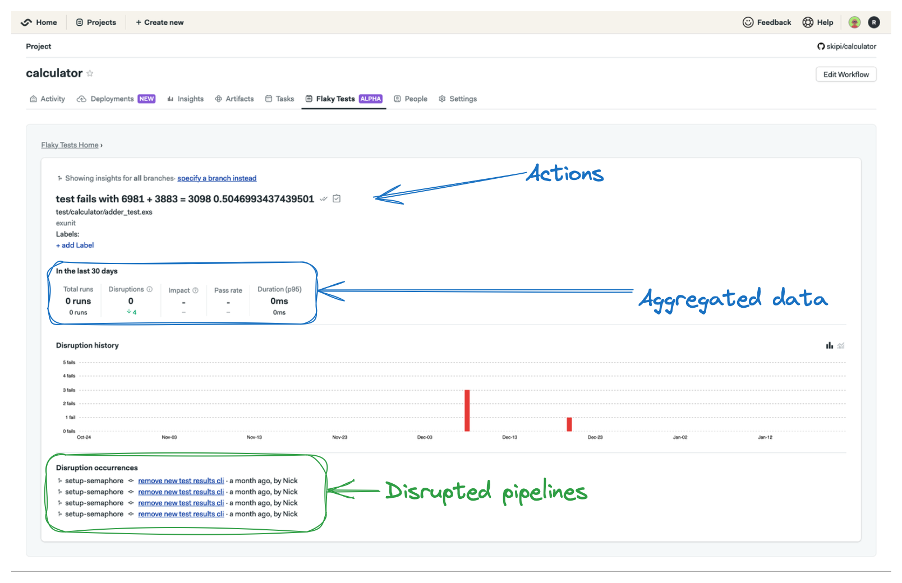

# Flaky Tests

Flaky test detection helps identify and manage unreliable tests in a test suite.
By detecting flaky tests, development teams can take specific actions to address
these issues and improve the overall reliability of their testing pipeline.

!!! info "Definition"
      A test is considered flaky when it produces different results within the same Git commit. For example, the test may fail at one point and subsequently pass without any alterations to the codebase. 


## Configuring flaky test detection

There are two steps needed to enable flaky tests detection: the first is to set up [test reports][test-reports-ref] in your projects,
and the second is to go to your project and initialize flaky test detection.

To initialize flaky test detection, find your project in Semaphore and:

1. Select the Flaky tests tab.
2. Click Initialize.


!!! warning "Note: It may take some time for flaky tests to be detected as your pipeline runs."

##  Flaky Tests UI

In the Flaky Tests UI, you can filter, sort, mark tests as resolved, link tickets, and access a detailed view for deeper analysis.


### Filtering

The Flaky Tests UI provides multiple filtering options, allowing you to refine results based on criteria such as status, date, test name, etc.
See the table bellow for an exastive list.

| Filter key        | Filter Name         | Filter Type         |
| :--------------:  | :-----------------: | :-----------------: | 
| @git.branch       | Git branch          | text                |
| @git.commit_sha   | Git commit sha      | text                |
| @test.name        | Test name           | text                |
| @test.group       | Group that the test is assigned to | text |
| @test.file        | Test file           | text                |
| @test.class.name  | Name of the test class | text             |
| @test.suite       | Name of the test suite | text             |
| @test.runner      | Name of the test runner | text            |
| @metric.age       | Time passed (days) since first flake | numeric |
| @metric.pass_rate | Pass rate of a test | numeric             |
| @metric.disruptions | Number of disruptions of a test | numeric |
| @label            | Assigned label of the test | text           |
| @is.resolved      | Filter by resolved or unresolved tests | boolean |
| @is.scheduled     | Filter by scheduled or unscheduled tests | boolean |
| @date.from        | Starting date range   | text             | 
| @date.to          | End of filtering range | text        | 


#### Text:

Text filters allow you to specify criteria using alphanumeric characters. Examples include filtering by test name, Git branch, file names, or labels.

!!! info "Special cases"
    * The `@date.from` and `@date.to` are special cases, you can specify the date in either of the following formats: YYYY-MM-DD or now-30d (30 could be replaced any number of days).
    * Wildcard characters (* or %) can be used if you want to do searches based on a specified pattern, for example: @test.group:"Elixir.Calculator*". 
 

#### Numeric:
Numeric filters enable you to set criteria based on numerical values. You can use operations such as greater than (>), less than (<), equal to (=), not equal to (!=), greater than or equal to (>=), and less than or equal to (<=). Examples include filtering by test age, pass rate, or number of disruptions.

#### Boolean:

Boolean filters limit options to true or false values. This type is useful for filters that represent binary conditions. Examples include filtering tests based on whether they are resolved or unresolved, or scheduled or unscheduled.

#### Creating new filters

These are the steps to create a new filter:

1. Type the query into the searchbox.
2. Search by pressing the return key.
3. Click the "Create new filter" button on the right hand side of the search box.
4. Give the new filter a name and click the Save button.


#### Editing an existing filter

These are the steps to edit an existing filter:

1. Select the filter in the filter dropdown menu.
2. Change the search query.
3. Click the "Save current query" button.


#### Renaming a filter

These are the steps to change a filter name:

1. Select the filter to be renamed.
2. Click the "Change filter name" button.
3. Enter a new name.
4. Click the "Save filter name" button.


#### Removing a filter

These are the steps to delete a filter:

1. Select the filter to be deleted.
2. Click the "Delete this filter" button.


#### Default filters

When you first initialize Flaky Test detection, there are 5 default filters for you to use.

!!! warning "Note: You can remove the default filters if you wish, but be sure to keep at least one filter, whether default or custom. Failure to retain at least one filter will prompt a request to reinitialize flaky test detection. This does not impact the processing of your flaky tests."

| Filter name | Filter value |
|-------------| -------------|
| Current 30 days | @is.resolved:false @date.from:now-30d |
| Previous 30 days | @is.resolved:false @date.from:now-60d @date.to:now-30d |
| Current 90 days | @is.resolved:false @date.from:now-90d |
| Master branch only | @is.resolved:false @git.branch:master @date.from:now-60d |
| More than 10 disruptions | @is.resolved:false @date.from:now-90d @metric.disruptions:>10 |

### Sorting

You can sort the table using three columns: Flaky Test Age (since first flake), Last Flaked, and Disruptions. By default, sorting is based on the number of disruptions, in descending order.

### Actions

You have several actions you can take on a flaky test. For instance, you can attach a label to assign a team or team member to fix the test in question.
Additionally, you can mark a flaky test as resolved or mark it as unresolved if it was previously marked as resolved. Another option is to link a ticket to the flaky test, providing the ability to filter by scheduled status.

#### Marking as resolved/unresolved

To mark a flaky test as resolved or unresolved, locate the flaky test and click the first button (Mark as resolved) in the actions column.

#### Linking to a ticket

To add a ticket link to your flaky test, start by locating the flaky test. In the actions column, click on the second button (Create a ticket for this test). Finally, copy the flaky test information in markdown and save the link after creating the ticket.

If needed, you can unlink an existing ticket by clicking the "Unlink" option.

#### Labels

To add labels, click the "+ add label" button, give the label a name, and click "OK". Keep in mind that you can only add 3 labels to any given test.

### Charts

There are to charts at the top of the page, they show the number of new flaky tests and the number of disruptions caused by flaky tests.

The "New flaky tests" chart defaults to displaying data in a daily overview. However, you can opt for a cumulative view by clicking
the "Cumulative overview" button located on the top right-hand side of the chart.

The "Disruptions caused by a flaky test" chart presents data in a cumulative overview by default. If you prefer a daily overview,
you can select this option by clicking the "Daily overview" button at the top right-hand side of the chart.

### Detailed view

In the detailed view, there is the same set of actions available in the main view. You can add labels to a flaky test, mark it as resolved or unresolved, and include a link to the ticket where the test is being addressed. Additionally, you'll find aggregated data detailing the impact of the selected flaky test, such as the P95 runtime, total number of runs, and the pass rate of the test.

The detailed view also provides a list of flaky occurrences, allowing you to navigate to the specific jobs where the test flaked. Furthermore, a wider view of the Disruption History chart is available for analysis. You have the option to select the branch for which you want to view data; by default, the displayed data encompasses all branches.




### Notifications

Flaky tests utilize webhook-based notifications that are dispatched when new flaky tests are identified. When the conditions for notifications are satisfied, Semaphore will transmit an HTTP POST payload to the configured URL of the webhook. This can be utilized, for instance, to establish alerts when new flaky tests emerge for a specific team.

#### Configuring webhook notifications for a project

To enable notifications, follow these steps on the Flaky Tests page:

1. Navigate to the Flaky Tests page.
2. Click on the bell icon next to the filter actions.
3. Enter the webhook URL (it must be an HTTPS URL).
4. Optionally, you can also specify the branches for which you want to receive notifications (leave this field blank if you want to receive notifications for all branches).
5. Click on Activate and Save.

!!! info "Branches"
        We allow basic regular expressions in the branches field. For instance, you can use patterns like `release-*` or `.*`.
        Please note that there's a character limit of 100 for the branches field. If you wish to specify multiple branches, you can separate them using a comma.


#### Notification payload

Your endpoint is set to receive an HTTP POST request with a specific schema.
This request will have the Content-Type header set to application/json.
It is expected that your endpoint responds with a status code within the 200 range.
If the response status code is outside this range, we will attempt to resend the request four additional times,
employing an exponential backoff strategy for these retries.

```spec
type: object
properties:
  id:
    type: string
    format: uuid
    example: "a01e9b47-7e3c-4165-9007-8a3c1652b31a"
  project_id:
    type: string
    format: uuid
    example: "4627d711-4aa2-xe1e-bc5c-e0f4491b8735"
  test_id:
    type: string
    format: uuid
    example: "3177e680-46ac-4c39-b9fa-02c4ba71b644"
  branch_name:
    type: string
    example: "main"
  test_name:
    type: string
    example: "Test 1"
  test_group:
    type: string
    example: "Elixir.Calculator.Test"
  test_file:
    type: string
    example: "calculator_test.exs"
  test_suite:
    type: string
    example: "suite1"
  created_at:
    type: string
    format: date-time
    example: "2025-03-22T18:24:34.479219+01:00"
  updated_at:
    type: string
    format: date-time
    example: "2025-03-22T18:24:34.479219+01:00"
required:
  - id
  - project_id
  - test_id
  - branch_name
  - test_name
  - test_group
  - test_file
  - test_suite
  - created_at
  - updated_at
```

Example

```json
{
  "id": "a01e9b47-7e3c-4165-9007-8a3c1652b31a",
  "project_id": "4627d711-4aa2-xe1e-bc5c-e0f4491b8735",
  "test_id": "3177e680-46ac-4c39-b9fa-02c4ba71b644",
  "branch_name": "main",
  "test_name": "Test 1",
  "test_group": "Elixir.Calculator.Test",
  "test_file": "calculator_test.exs",
  "test_suite": "suite1",
  "created_at": "2025-03-22T18:24:34.479219+01:00",
  "updated_at": "2025-03-22T18:24:34.479219+01:00"
}
```

## See also

- [Test reports][test-reports-ref]


[test-reports-ref]: ../essentials/test-summary.md
