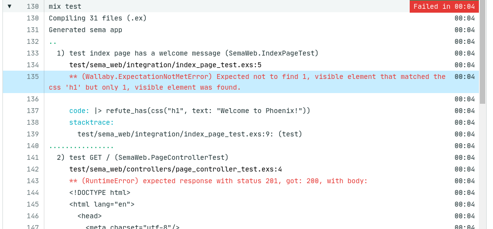
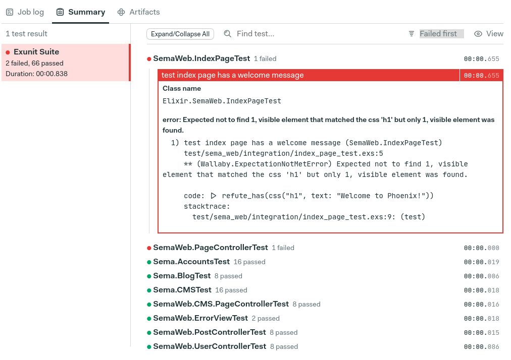

# Tests

Working with tests in your projects should be efficient and easy. The bigger your project
becomes, the harder it is to track all the failures in your workflows. Firstly
you have to navigate to specific job and then search through the logs for failure messages:



Job summary provides you with a dashboard where you can track your suites and quickly find failing specs.



## How does it work?

Test summary relies on [JUnit xml format&nbsp;↗][junit-schema]{target="_blank"} report files generated by your test runner.
JUnit XML report is compiled by [Test Results CLI&nbsp;↗][github-test-results-cli]{target="_blank"} and sent to your artifact store.
See Test Results CLI [documentation page&nbsp;↗][test-results-cli]{target="_blank"} for more details about the compiler.

## How to use it?

Firstly you have to generate a JUnit report. Most test runners have configurable JUnit formatters that can be used for that.

- RSpec - [rspec_junit_formatter&nbsp;↗](https://github.com/sj26/rspec_junit_formatter){target="_blank"}
- Elixir - [junit-formatter&nbsp;↗](https://github.com/victorolinasc/junit-formatter){target="_blank"}
- Go - [gotestsum&nbsp;↗](https://github.com/gotestyourself/gotestsum){target="_blank"}

After this step is complete, you need to compile and publish test results to artifact store. Usualy it's being done in `epilogue` block:

```yaml
epilogue:
  always:
    commands:
      - test-results publish PATH_TO_YOUR_JUNIT_FILE
```

This way if your test runner exits with non-zero status(due to the spec failure) report will be published.

There might be circumstances where only some jobs provide JUnit result reports. You can configure your workflow to reflect that:

```yaml
blocks:
 - name: Build image
   task:
      prologue:
        commands:
          - checkout
          - make install

      jobs:
        - name: Lint code
          commands:
            - make code.lint
        - name: Static code analysis
          commands:
            - make code.static-check
        - name:
          commands:
            - export PUBLISH_TEST_RESULTS=true
            # Generates junit.xml file
            - make test

      epilogue:
        always:
          commands:
            # Publishes test results only if PUBLISH_TEST_RESULTS environment variable is present
            - '[[ -v PUBLISH_TEST_RESULTS ]] && test-results publish junit.xml'
```

If you're looking for stack specific configuration [check here](/essentials/test-summary/#framework-configuration).

### Interface

The UI gives you access to:

Suite ordering

- names, alphabetically
- execution times, the slowest first
- failed cases first

Querying your results to filter out tests which doesn't include given string.

By default, skipped and passed tests are not being displayed.

## Advanced configuration

- [merging test results using CLI&nbsp;↗](/reference/test-results-cli-reference/#merging-test-results){target="_blank"}.
- [working with docker&nbsp;↗](/reference/test-results-cli-reference/#working-with-docker){target="_blank"}.

## Framework configuration

Currently, the following stacks are fully supported. More will be added in the future.

- [Ruby / RSpec&nbsp;↗][ruby-test-summary]{target="_blank"}
- [Go / gotestsum&nbsp;↗][go-test-summary]{target="_blank"}
- [Elixir / ExUnit&nbsp;↗][elixir-test-summary]{target="_blank"}

[ruby-test-summary]: /programming-languages/ruby/#test-summary
[go-test-summary]: /programming-languages/go/#test-summary
[elixir-test-summary]: /programming-languages/elixir/#test-summary
[junit-schema]: https://www.ibm.com/docs/en/adfz/developer-for-zos/9.1.1?topic=formats-junit-xml-format
[github-test-results-cli]: https://github.com/semaphoreci/test-results
[test-results-cli]: /reference/test-results-cli-reference/
