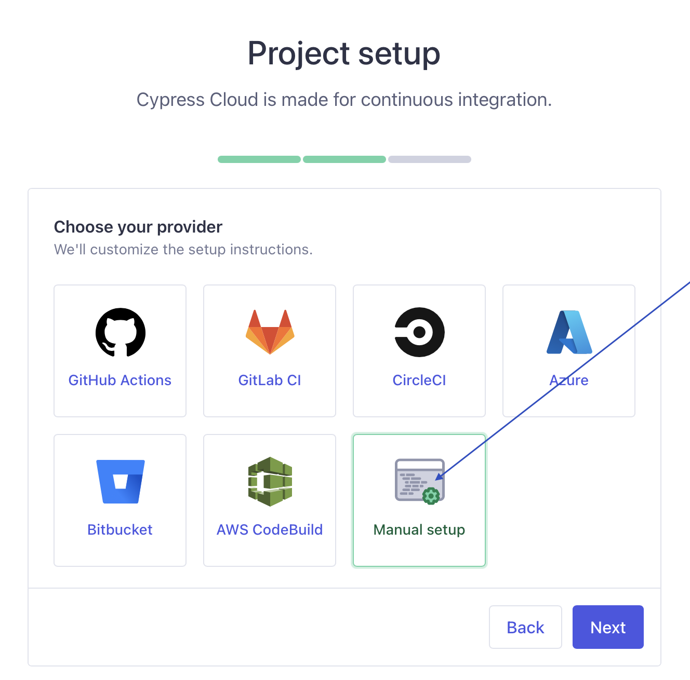
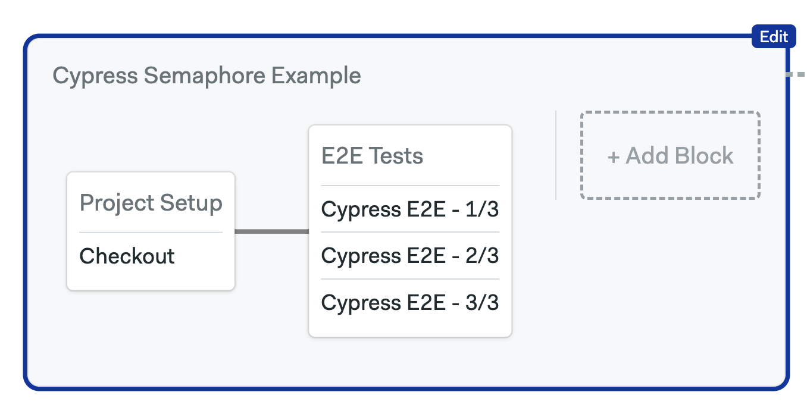

# Cypress

> Cypress is an open-source end-to-end testing framework for modern web applications. It
allows developers to write and execute tests that simulate user interactions within a
web browser, ensuring the reliability of web applications.

This guide shows you how to integrate [Cypress][cypress] into your Semaphore workflows.

## Creating a Cypress project

> If you already have a Cypress project, please copy the *Project ID* and prepare your `CYPRESS_RECORD_KEY` and skip this step.

First we need to create a Project on Cypress. When you are located on the dashboard, go
to Projects and click on *New Project*.

Give your project a name.


Copy the code from the provided screen and paste it in the file `cypress.config.js` in
the root folder of your project.


Now click on *Ok, I added my project ID* and click on *Next*.

Select *Manual Setup* and click on *Next*.



From this screen copy the `CYPRESS_RECORD_KEY` variable, we will be needing it in our
next steps.


## Creating Semaphore testing block

### Adding Record Key to Project Secrets

In your *Project page* on Semaphore, click on *Settings* and then on the *Secrets* section
and the on the *Add* button.

Here we will add the `CYPRESS_RECORD_KEY`.


Name the secret Cypress and optionally add a description.

In the environment variables section, add the name `CYPRESS_RECORD_KEY` and paste in your
record key.

Click on *Save Secret* to proceed.


### Adding Cypress test block to Workflow

Go to your Project and click on *Edit Workflow*.

Now click on *Add Block*.

Now you can set-up basic testing or parallel testing. If your test suite is large,
it is recommended to set-up parallel testing.

Name your block E2E Tests, as a dependency be sure to setup anything that is needed to
be run before you run your tests. In the Jobs part paste in the following snippet:

``` bash
npx cypress run --record --key $CYPRESS_RECORD_KEY --parallel --group "Semaphore 3x"
```


Then click on *Configure parallelism or a job matrix* and select *Multiple Instances*.

Here you can select how many machines you want to parallelize your tests on.


Now click on the *Prologue* section and insert the following snippet:

``` bash
nvm install 20
npm install -g npm
checkout
cache restore npm-$SEMAPHORE_GIT_BRANCH-$(checksum package-lock.json)-$(checksum .semaphore/semaphoreyml)
cache restore cypress-$SEMAPHORE_GIT_BRANCH-$(checksum package-lock.json)-$(checksum .semaphore/semaphore.yml)
npm install
npm ci
npm run cy:verify
cache store npm-$SEMAPHORE_GIT_BRANCH-$(checksum package-lock.json)-$(checksum .semaphore/semaphore.yml) ~/.npm
cache store cypress-$SEMAPHORE_GIT_BRANCH-$(checksum package-lock.json)-$(checksum .semaphore/semaphore.yml) ~/.cache/Cypress
npm run print-env -- SEMAPHORE
npm run build
npm run start &
```

Now click on the *Secrets* section. Here we will include our `CYPRESS_RECORD_KEY` value.

Click on the *Cypress* checkbox to include it.


Now click on the *Agent* section.

For *Environment Type* select the environment you want to use and also select the 
*OS Image* you want to use. You can also keep the default values.

Your E2E Block should now look like this:



Now click on *Run the Workflow* and save your settings.

[cypress]: https://cypress.io
