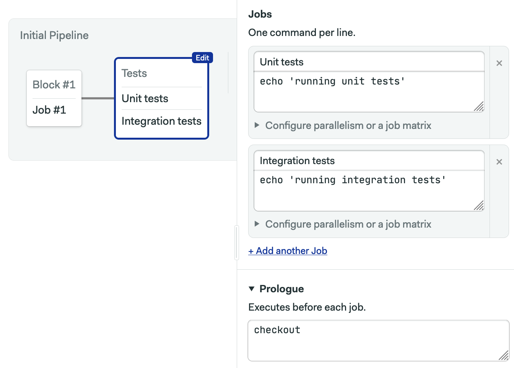
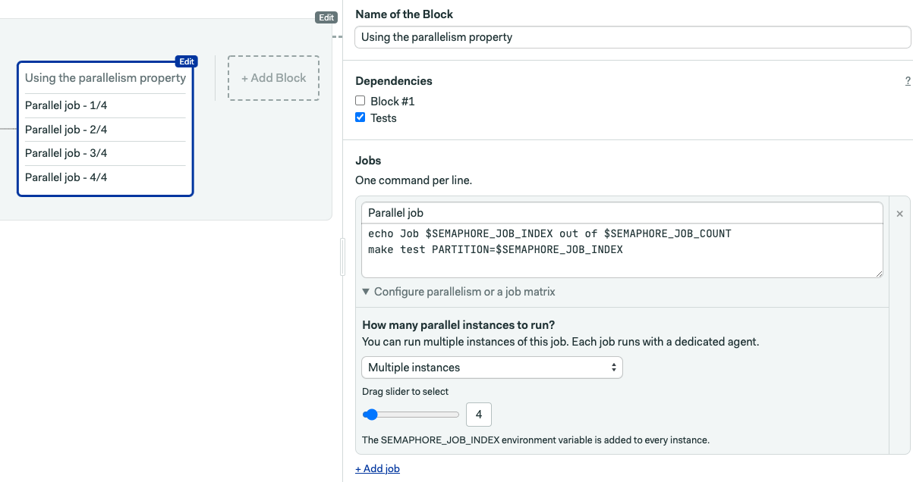

# Migrating from Jenkins to Semaphore

In this document, you will find an overview of the main differences between Jenkins and Semaphore, 
as well as an overview of how to migrate from Jenkins to Semaphore.

## Why migrate from Jenkins to Semaphore?

Jenkins and Semaphore are very different in terms of operation and maintenance. 
Semaphore is a SaaS product that offers both a cloud and on-premise service. Jenkins can only work on-premise.

Here are a few other things that set Semaphore apart from Jenkins:
1. **Project setup**. To set up a project in Semaphore, you’ll need to authenticate with a Git provider and select a pipeline. 
In Jenkins, you’ll need provision machines and manually install Jenkins on them.
2. **Pipeline configuration**. In Semaphore, you can configure your CI/CD pipeline either by using the visual Workflow Builder or via YAML. 
Jenkins operates multiple domain-specific languages.
3. **Maintenance**. In the hosted version of Semaphore, all maintenance is handled on the Semaphore side. 
In Jenkins, your engineering team will have to maintain the machines and the whole infrastructure.

Let’s take a closer look at how Jenkins and Semaphore compare in terms of key concepts (pipeline configuration, project setup, etc).

## Key concepts

### Using Docker containers

Semaphore provides a series of convenience Docker images that are hosted on the Semaphore Container Registry. 
Using these images results in much faster downloads since the images will be pulled from the Semaphore Container Registry. 
And you’re not limited to the images in the registry, you can use any image from any provider.

To see how to work with a Docker environment, refer to [Custom CI/CD Environment with Docker][custom-cicd-docker]. 
To see all available convenience images, refer to [Semaphore Registry Images][semaphore-registry-images].

Jenkins doesn’t provide any built-in support for this. Your team will have to ensure that Docker is installed and available in your environment.

### Pipeline configuration

Since Jenkins can only be used fully on-premise, Jenkins projects are configured via the Jenkins web interface
while all the files are stored on Jenkins servers. 
This makes it difficult for developers to access them and focus on quality, shorten test cycles, and ensure safe deployment.

In Semaphore, all configuration files are stored in the `.semaphore/semaphore.yml` file in the same repo as your project 
and are easily accessible by other people in the team with the right level of access. 

For sensitive data such as passwords and API keys, Semaphore provides [secrets][secrets], 
which are configured separately in Semaphore and are not stored in the .yml file.

### Project setup

To setup a project in Semaphore, you’ll need to authenticate with a Git provider (GitHub and Bitbucket are supported), 
select a repository and import the repository as a project.

In Jenkins, project setup is as follows:

1. Install your application stack
2. Install Jenkins on them
3. Install plugins for Git integration and any additional functionality

Semaphore comes as a standardized product, and all people in your team have access to the same product. 
In Jenkins, you have to compile functionality together from various plugins with varying syntax.

### Pipeline configuration

If you ever tried to configure a pipeline in Jenkins, 
you almost certainly have used some kind of a plugin that would provide you with this functionality. 
In Jenkins, you have to enter your pipeline syntax to be able to configure your pipeline. 
Pipeline configuration in Jenkins is manual.

In Semaphore, all the necessary functionality is already built in the product. 
Semaphore offers a convenient visual Workflow Builder that allows anyone to configure pipelines with a point and click interface. 
You can also use the declarative YAML configuration for all features.



### Parallelism

The `parallelism` property in Semaphore allows you to easily generate a set of jobs with the same commands that can be parameterized. 
You can configure a set of jobs and their run order. This saves your team time on builds, as jobs can run in parallel. 
Each job runs in an isolated environment. In the hosted version, Semaphore provisions as machine machines as needed to achieve
the desired level of parallelism.

Here’s an example of defining parallel jobs in Semaphore:

```yaml
version: v1.0
name: Using the parallelism property
agent:
  machine:
    type: e1-standard-2
    os_image: ubuntu1804
blocks:
  - name: Example for parallelism
    task:
        jobs:
        - name: Parallel job
          parallelism: 4
          commands:
            - echo Job $SEMAPHORE_JOB_INDEX out of $SEMAPHORE_JOB_COUNT
            - make test PARTITION=$SEMAPHORE_JOB_INDEX
```


In Jenkins, you can also configure jobs to run in parallel. However, this might cause issues due to shared resources like filesystems and databases. 
You need to provision and maintain enough machines to keep your CI/CD pipeline performant.

Do you have questions about how to migrate from Jenkins to Semaphore? Contact us via this [form][form], and we’ll get back to you shortly.


[custom-cicd-docker]: ../ci-cd-environment/custom-ci-cd-environment-with-docker.md
[semaphore-registry-images]: ../ci-cd-environment/semaphore-registry-images.md
[secrets]: ../essentials/using-secrets.md
[form]: https://semaphoreci.com/contact
