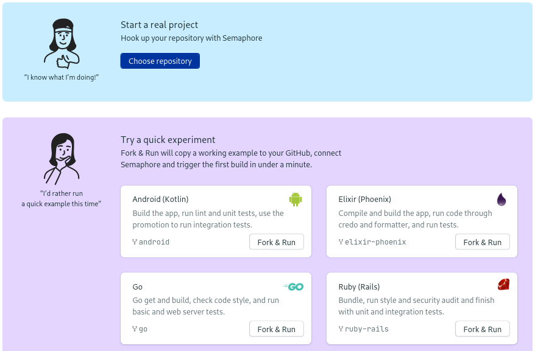

# Adding a Git repository

To build, test and deploy your code on Semaphore, you'll need to
create a project for it to live in.

## Creating a project

Once you're inside an organization that you've created or were invited to,
you're ready to create a CI/CD project.

Click on the **+ create new** button in the application header.

Now you have two options:

-  **Choose repository**: choose this if you want to add CI/CD into an existing Git repository.
-  **Fork & Run**: this option will create a quick repository and setup a starter pipeline to play and experiment with.

### Choosing a repository

If you want to add a CI/CD pipeline in an already-existing Git repository choose this option.

1. Semaphore will show the list of repositories you have granted access to.
2. The next page will let you grant access to Semaphore to other people in the repository.
3. Finally, you will asked to pick a starter pipeline. We’ll learn how to configure pipelines in the [next page][next].

### Fork & Run

If you'd like to try a quick experiment, this option will fork an example repository and setup an initial pipeline for you. All you need to do is click on the **Fork and Run** button next to the programming language of your choice.

## Moving on

Congratulations! You've successfully created your first project. In the [next page][next] page you’ll learn how to customize the pipeline.

[next]: https://docs.semaphoreci.com/guided-tour/creating-your-first-pipeline/
[github-connection]: https://github.com/settings/connections/applications/328c742132e5407abd7d

