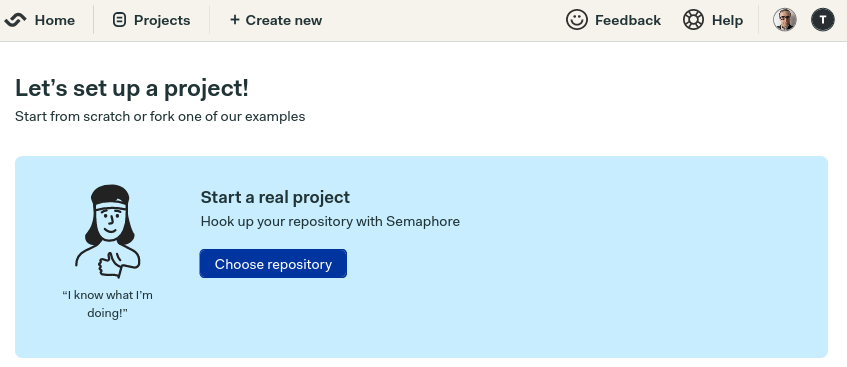

# Working with GitHub repositories

Whether public or private, Semaphore can work with any GitHub repository.

## Create new project

Once logged into Semaphore, click **+ create new** near the top of the page.

The next page will show you two ways of setting up a project: <u>start a real project</u> or <u>try a quick experiment</u>.

Click on **choose repository** to continue.

Semaphore will show you a searchable list of repositories. The green ➡️ will begin the setup process.

After some initialization steps, the next page will let you onboard other GitHub users to the pipeline. Click on **continue to workflow setup** when ready.

Should the repository already contain a pipeline, you will be asked if you want to keep it or start from scratch.

The next page will show you CI/CD starter templates to choose from.

These templates cover many popular frameworks and languages. You can, for instance, quickly test a Ruby on Rails applications, build a Docker image, or compile a Go application.

If you're unsure which template to pick, select **single job** and click on **looks good, start**. The pipeline should begin running soon.

Alternatively, clicking on **customize** will drop you into the workflow editor.

Use the **run the workflow** button to save and start the pipeline.

Once configured, the pipeline will automatically run whenever commits are pushed into your GitHub repository.

## Learn more

-   How to change which actions [trigger a pipeline](https://docs.semaphoreci.com/essentials/project-workflow-trigger-options/).
-   If pipelines do not start, [check that Semaphore has access to GitHub](https://docs.semaphoreci.com/account-management/checking-the-connection-between-github-and-semaphore-2.0/).
-   Learn how Semaphore [integrates with GitHub](https://docs.semaphoreci.com/account-management/working-with-github-sso/).
-   You can also change [where pipelines files are stored](https://docs.semaphoreci.com/essentials/configuring-github-status-checks/).

## Next steps

It's time to delve into Sempahore finer details. Next, we'll learn how to run pipelines using [different VMs and OSs](/guided-tour/choosing-a-machine/).
