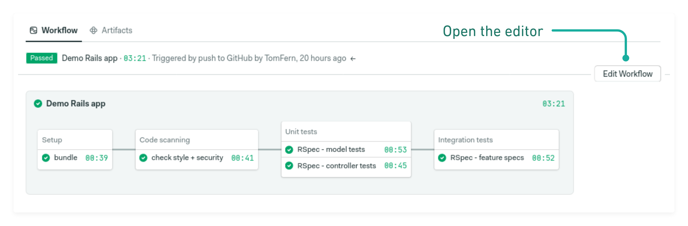

# Choosing a build machine

The build machines run your [continuous integration and delivery](https://semaphoreci.com/cicd) (CI/CD) jobs. They are managed Semaphore, so there is no need for you to install software or maintain infrastructure.

## Pipeline settings

As we’ve seen on [getting started](file:///getting-started/), a pipeline is composed of blocks and jobs. Jobs perform the steps required to build, test, and deploy your applications. Powering all this there is a virtual machine (VM) which we call the *agent*.

To view or change the agent, open the workflow editor and click on the pipeline area.

## Pipeline settings

    

        
The right pane shows the pipeline settings.

        
Pipelines, like blocks and jobs, have descriptive names. Below it, you’ll find the agent configuration.

        
Machines come in different CPU, memory, disk sizes to accomodate different workloads. In many cases, jobs can be speed up by choosing a more powerful machine. For instance, Linux-based VMs come in three capacities.

    

    

The **environment type** sets the operating system and hardware for the build machine. There are three types of build environments available:

- **Linux**: runs on an optimized [Ubuntu](https://docs.semaphoreci.com/ci-cd-environment/ubuntu-18.04-image/) for CI/CD preloaded with popular languages, frameworks, and utilities.
- **MacOS**: runs a [MacOS Catalina image](https://docs.semaphoreci.com/ci-cd-environment/macos-xcode-12-image/) that includes common tools needed for iOS development.
- **Docker**: allows you to run CI/CD jobs [inside Docker containers](https://docs.semaphoreci.com/ci-cd-environment/custom-ci-cd-environment-with-docker/).

All machines come with full sudo access to customize the environment however you need.

    

        
Available settings will change depending on the chosen environment type. Here, for example, we’re presented with different OS and hardware combinations for Apple-based machines.

        
To see all available machine combinations, read the <a href="https://docs.semaphoreci.com/ci-cd-environment/machine-types/">machine types reference</a>.

    

    

## Docker environments

    

        
Docker-based environments are a bit different. They share the same hardware settings as Linux, but there’s one extra parameter: the container. Here, we can define the name and image where the pipeline jobs will run.

        
You may even start several containers at once and link them to build complex composer-like build environments. For more information, consult the <a href="https://docs.semaphoreci.com/ci-cd-environment/custom-ci-cd-environment-with-docker/">custom CI environment with Docker</a> page.

    

    

## Global pipeline settings

    

        
Further scrolling down the settings page, we find more ways of customizing it:

        <ul>
            <li>Global <strong>prologue</strong> and <strong>epilogue</strong>: define commands to run before and after every job in the pipeline.</li>
            <li><a href="https://docs.semaphoreci.com/reference/quotas-and-limits/")>Time limit</a>: enforces a time limit to avoid pipelines from running too long, by default 1 hour.</li>
            <li><a href="https://docs.semaphoreci.com/essentials/fail-fast-stop-running-tests-on-the-first-failure/">Fail fast</a>: tells Semaphore what to do when a job fails.</li>
            <li><a href="https://docs.semaphoreci.com/essentials/auto-cancel-previous-pipelines-on-a-new-push/">Auto cancel</a>: defines how Semaphore queues pipeline executions.</li>
        </ul>
    

    

## Learn more

- How to [choose between VM and Docker-based environment](https://docs.semaphoreci.com/ci-cd-environment/choosing-between-a-vm-and-docker-based-environment/).
- Using <a href="https://docs.semaphoreci.com/examples/using-docker-compose-in-ci/">Docker Compose in CI</a>.
- [Nested virtualization](https://docs.semaphoreci.com/ci-cd-environment/nested-virtualization/) in Linux.

## Next steps

In the next part of the guided tour, we’ll see how to [customize the build environment](/guided-tour/tailoring-the-environment/).
