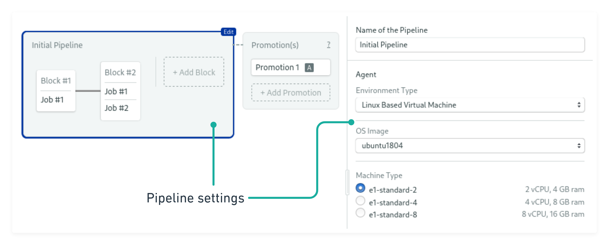

# Concepts

Semaphore manages your build, test and deployment workflows with _pipelines_,
_blocks_, and _promotions_:

- _Blocks_ define what to do at each step in the pipeline.
- Blocks run in _agents_ that define the hardware and software environment.
- Workflows may contain multiple pipelines, for example one to run tests and
  another for deployment.
- _Promotions_ connect different pipelines.

Internally, all configuration is specified in YAML files. The initial pipeline is always
sourced from `.semaphore/semaphore.yml`. Additional pipelines triggered via
promotions are defined in separate files.

## Blocks & Tasks

Blocks are the building blocks of a pipeline. Each block has at least one job. Jobs specify the _commands_ to execute.

If a block contains multiple jobs, Semaphore will execute them in parallel.
Each job runs in a separate, isolated machine that boots a clean environment.
For example, a `Tests` block may define jobs for running unit and integration
tests in parallel, making the block finish faster.

By default blocks run sequentially, waiting for all tasks in the previous block
to complete before continuing.  However, you can also define your pipeline as a
dependency graph or run blocks in parallel by defining
[block dependencies](https://docs.semaphoreci.com/essentials/modeling-complex-workflows/).

Each block can have a different environment,
including machine type, environment variables and predefined secrets.

## Agents, Machines, and Containers

Semaphore makes sure that there are always agents ready to run all your jobs.
When configuring an agent, you can select from a number of [memory/CPU
combinations][machine-types] and virtual machine (VM) operating system
environments.

The [Ubuntu Linux][ubuntu] and [MacOS][macos] VM environments have
common build tools and programming languages preinstalled, so you can
run your code without an overhead of installing many dependencies in
every workflow. Agents provide full `sudo` access to you so you can install
additional software when needed.

Agents can also use [custom Docker containers][docker-containers] to run your
jobs. This is an alternative to using Semaphore VMs which gives you complete
control over your CI/CD environment.

## That’s it

You have successfully completed the guided tour to Semaphore. Happy building 🚀

[next]: https://docs.semaphoreci.com/guided-tour/customizing-your-pipeline/
[machine-types]: https://docs.semaphoreci.com/ci-cd-environment/machine-types/
[ubuntu]: https://docs.semaphoreci.com/ci-cd-environment/ubuntu-18.04-image/
[macos]: https://docs.semaphoreci.com/ci-cd-environment/macos-xcode-11-image/
[docker-containers]: https://docs.semaphoreci.com/ci-cd-environment/custom-ci-cd-environment-with-docker/
