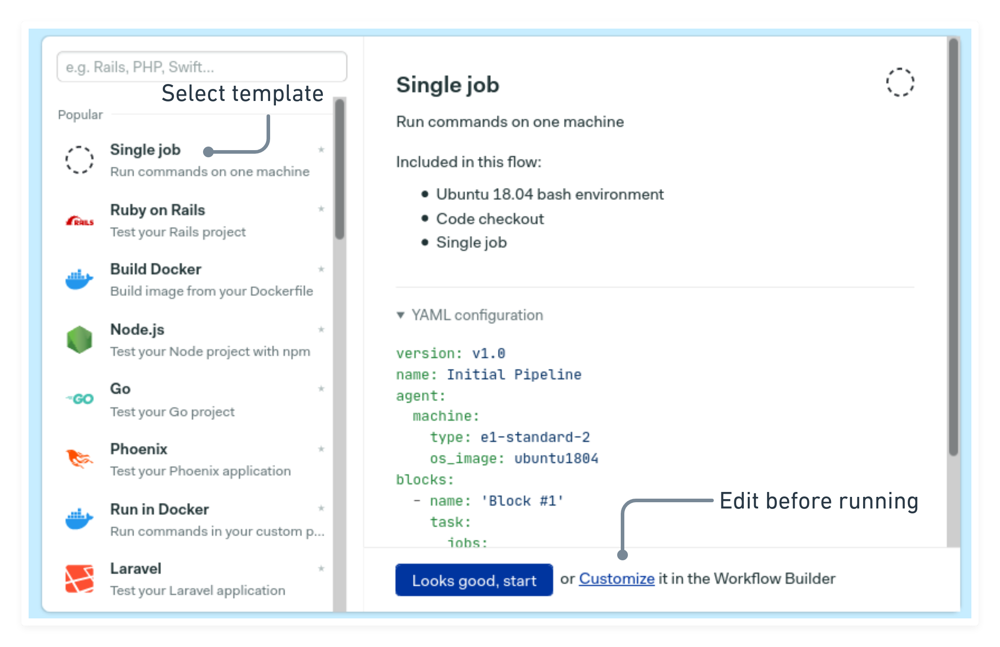
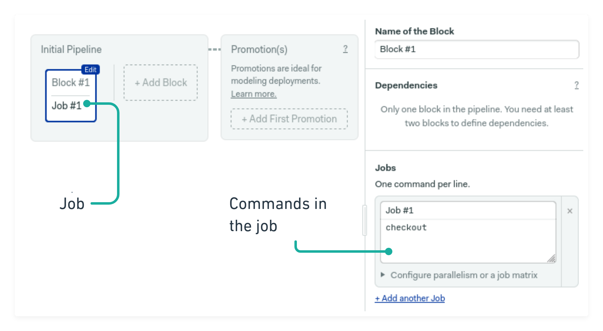
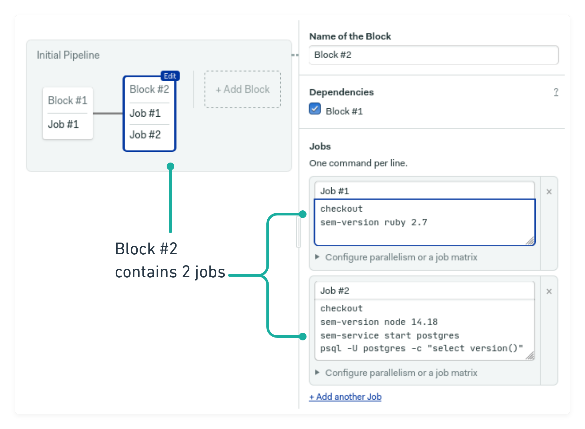
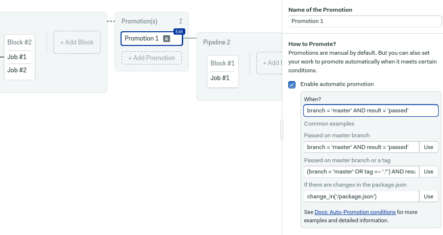

# Creating your first pipeline

A [pipeline](https://semaphoreci.com/blog/cicd-pipeline) is the heart of a continuous integration and delivery process. It describes the sequence of steps needed to build, test, and deploy applications.

## Choosing an starter workflow

In the [previous page][previous] you’ve connected a Git repository to Semaphore. Now you’ll learn how to define a pipeline.

After adding a new repository, Semaphore will show you a list of starter templates. Choose the one that best adapts to your repository language and structure. If in doubt, pick the “single job” template.



Pressing the button will start the pipeline immediately, while clicking on **customize** will open the <u><u>workflow editor</u></u>.

## Setting up jobs

A job is a list of commands that do some work. Jobs are used everything, from building and testing, to deploying software on different environments.

The starter pipeline comes with a job named “Job \#1”. Feel free to change the name to describe what the job does. On the pane to the right, you’ll see a list of commands that make up the job.



The [checkout](https://docs.semaphoreci.com/reference/toolbox-reference/#checkout) script is part of Semaphore’s toolbox, a set of powerful utilities that help you run common CI/CD tasks. In particular, `checkout` clones the Git repository into the CI machine and changes the directory. You can assume that commands after `checkout` will be executed inside the cloned repository.

Consider using [sem-service](https://docs.semaphoreci.com/guided-tour/using-databases-and-services/) before or after `checkout` to set the active version for the language of your choice. For instance, this sets the Ruby version to 2.7:

``` bash
sem-version ruby 2.7
```

`sem-service` works out-of-the-box with any of the [supported languages](https://docs.semaphoreci.com/programming-languages/android/). For some languages, you can alternatively use the more traditional language-selection tools. For example, both of the following commands do the same, change the active Node version.

``` bash
# you may change Node.js version with nvm
nvm use

# or with sem-version
sem-version node 14.17
```

At this point you may type in the commands that build or test your code. Remember that you have full `sudo` powers to install software as needed.

## Running jobs in parallel

You can run multiple jobs in parallel. This is great for speeding up tests.

Click on the **add block** button to create a second block. Type in the commands in the job box and then click on **add another job**. Then, add the commands for the second job.



If you need to start up a database, you may use the [sem-service](https://docs.semaphoreci.com/guided-tour/using-databases-and-services/) script. For instance, this starts a blank-password PostgreSQL database:

``` bash
sem-service start postgres
```

Scrolling down the right pane you’ll find other useful sections:

-   [Prologue](https://docs.semaphoreci.com/reference/pipeline-yaml-reference/#prologue): commands located here will be executed *before* any jobs in the block.
-   [Epilogue](https://docs.semaphoreci.com/reference/pipeline-yaml-reference/#epilogue): same as the prologue, but commands are executed *after* each job in the block.
-   [Environment variables](https://docs.semaphoreci.com/guided-tour/environment-variables-and-secrets/): lets you define environment variables that apply for all jobs in the block.

## Configuring promotions

_Promotions_ are junction blocks in your larger workflow. Promotions are commonly used for deployment builds in different environments such as staging or production. Using promotions, you can create multiple branches for your CI/CD process.

Clicking the **add promotion** button will create a brand new pipeline. By default, promotions must be started manually, but enabling automatic promotion option brings up a box where you can type in autostart conditions. For more details, check the [conditions](https://docs.semaphoreci.com/reference/conditions-reference/) reference page.



## Secrets

Your deployment jobs may need sensitive information to work. For instance, you may need to import SSH keys, usernames, password, or API keys.

_Secrets_ are used to store and retrieve sensitive data such as API keys,
which should never be committed to source control. Semaphore securely manages
sensitive data for use in blocks via encrypted environment variables
or files.

Secrets are defined globally in your organization and imported in a block by checking them in the **secrets** section. For more details, check the [secrets](https://docs.semaphoreci.com/essentials/using-secrets/) reference page.

## Next steps

When you’re done configuring the pipeline, click on the **run the worflow** button on the top-right corner and then **looks good, start**. This will save the pipeline in the repository and immediately start the CI/CD process.

Jump to the [next page][next] to learn about Semaphore key concepts.

[previous]: https://docs.semaphoreci.com/guided-tour/adding-a-git-repo/
[next]: https://docs.semaphoreci.com/guided-tour/concepts/
