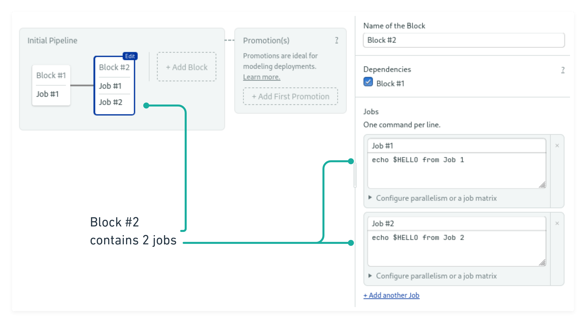
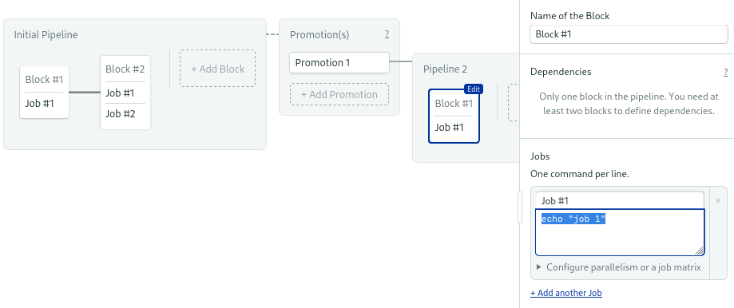
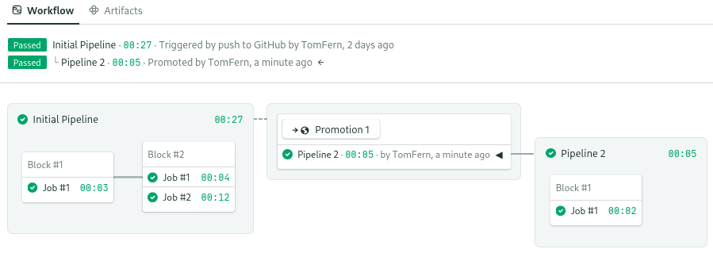

# Creating your first workflow

The workflow, which is the heart of the CI/CD process, describes the sequence needed to build, test, and deploy software.

## Choosing an starter workflow

In the [previous page][previous] you’ve connected Semaphore to one of your Git repositories. At this point, Semaphore shows you a list of starter templates, with a range of languages and frameworks to choose from.

Choose the “single job” template and click on *customize* to open the <u>workflow builder</u>.

## Customizing the CI environment

The workflow builder lets you visually define the jobs that make up the CI/CD process.


The single job template comes with a job named “Job \#1”. Feel free to change the name to describe its function.


Type the following commands in the job:

```bash
checkout
sem-version ruby 2.7
echo "These are the contents of README.md"
cat README.md
```

The first two lines invoke commands in the built-in [Semaphore toolbox][toolbox].

-  ~checkout~ clones the Git repository into the CI machine. You can assume that commands after `checkout` will be executed inside the cloned repository.

-  ~sem-version~ changes the active version of a given language. This command works with any of the [supported languages][langs].

The default CI machine runs on [Ubuntu][ubuntu], and includes a rich set of popular software development tools. In addition, you have full ~sudo~ powers to install software.

Semaphore also features [MacOS][mac] support for building on Apple-compatible infrastrucutre and [Docker-based][docker] environments.

## Managing execution flow

You can control the execution flow by changing the block’s dependencies and by adding multiple jobs per block.

Jobs sharing a block run in simulateneously. Once all the jobs in a block complete, the next block starts.

Click on the **add block** button to create a second block. Type in the commands in the box.

```bash
echo $HELLO from Job 1
```

Click on **add another job** and add the commands for the second job.

```bash
echo $HELLO from Job 2
```

Next, scroll down in the right pane until you reach the [environment variables][env-vars] section. Create a variable called “HELLO” and type in its contents: “Hi, world”.



## Setting up a continuous deployment

_Promotions_ are junction blocks in your larger workflow. Promotions are commonly used for deployment builds in different environments such as staging or production. Using promotions, you can create multiple branches for your CI/CD process.

Clicking the **add promotion** button will create a brand new pipeline.



In the new pipeline first job, type the following line:

```bash
echo "${DOCKER_PASSWORD}" | docker login -u "${DOCKER_USERNAME}" --password-stdin
```

Create environment variables with your Docker Hub credentials: -  `DOCKER_USERNAME` and `DOCKER_PASSWORD`.

The deployment job now can connect with the Docker Hub to pull and push images, the first step towards releasing containerized software or applications to Kubernetes.

For best safety, instead of using environment variables, you can define global secrets. Semaphore securely manages sensitive data for use in blocks via encrypted environment variables
or files. For more details, check the [secrets](https://docs.semaphoreci.com/essentials/using-secrets/) reference page.

## Running the workflow

When you’re done configuring the pipeline, click on the **run the worflow** button on the top-right corner and then **looks good, start**. This will save the pipeline in the repository and immediately start the CI/CD process.



Clicking any of the jobs will show the log and give you options for troubleshooting.

## Next steps

Jump to the [next page][next] to learn about Semaphore key concepts.

[langs]: https://docs.semaphoreci.com/programming-languages/android/
[docker]: https://docs.semaphoreci.com/ci-cd-environment/custom-ci-cd-environment-with-docker/
[mac]: https://docs.semaphoreci.com/ci-cd-environment/macos-xcode-12-image/
[ubuntu]: https://docs.semaphoreci.com/ci-cd-environment/ubuntu-20.04-image/
[previous]: https://docs.semaphoreci.com/guided-tour/adding-a-git-repo/
[next]: https://docs.semaphoreci.com/guided-tour/concepts/
