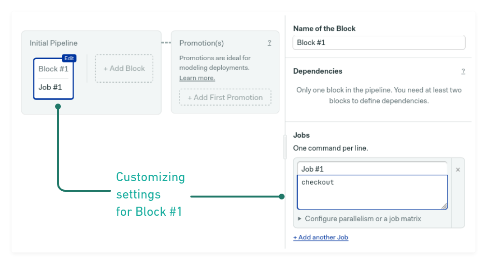

# Customizing the build environment

Blocks have some settings we have not seen in [getting started](/getting-started/). In this section, we’ll learn how to use them to customize the environment where jobs run.

## Environment Variables

    

        
Environment variables are essential for defining the build environment. Variables are set before any commands are executed.

    

    

## Parallelism

When you need to run many copies of the same job, the easiest way of doing it is with *parallel jobs*. To see this option, open **configure parallelism os a job matrix** below the job definition and select **multiple instances**.

The slider will let you select how many copies of the job to run. The jobs will run in parallel.

## Job Matrix

A [job matrix](https://docs.semaphoreci.com/essentials/build-matrix/) lets you try the same commands with different combinations of environment variables values. For instance, to test software using various versions of a language.

Selecting **multiple instances based on a matrix** inside the parallelism sections brings up the job matrix options. You can assign many comma-separated values to variables and have numerous variables defined. Semaphore configure a job for every possible combination of variables and values.

## Secrets

    

        
Secrets,like environment variables, import files or variables into jobs before any command is executed. They are used for securely injecting sensitive data such as passwords or API keys.

    

    

The main difference is that they are defined in a central per-organization location. And once created, they cannot be viewed. To learn how create secrets, read [using secrets](https://docs.semaphoreci.com/essentials/using-secrets/).

## Skip/Run conditions

    

        
The skip/run conditions let us choose the criteria to execute or skip a block. These settings can be used to set <a href="https://docs.semaphoreci.com/essentials/building-monorepo-projects/">monorepo pipelines</a>. For more information, consult the <a href="https://docs.semaphoreci.com/reference/conditions-reference">conditions reference</a>.

    

    

## Overriding the agent

    

        
As we’ve seen on the <a href="/choosing-a-machine/">previous page</a>, all jobs run on the machine type defined at pipeline level. But this setting lets you override the global pipeline machine type and operating system.

    

    

## Learn more

- Check the available [quotas and limits](https://docs.semaphoreci.com/reference/quotas-and-limits/) for jobs.
- Working on mobile? Learn how to build [Android](https://docs.semaphoreci.com/ci-cd-environment/android-images/) and [iOS](https://docs.semaphoreci.com/ci-cd-environment/macos-xcode-12-image/) projects.
- Read all about supported [programming languages](https://docs.semaphoreci.com/programming-languages/android/).

## Next steps

Most projects will need some amount of customization. Once you start diving deep, you’ll want to learn how to [troubleshoot](/troubleshooting-pipelines/) pipelines.
