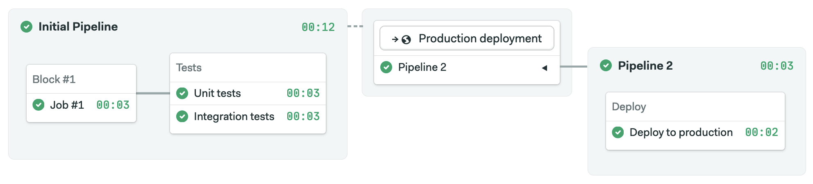
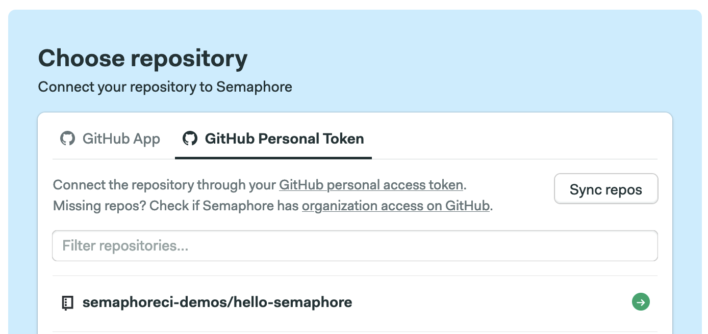
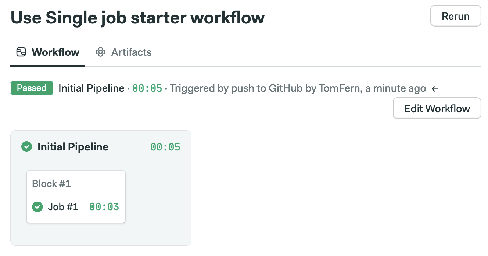
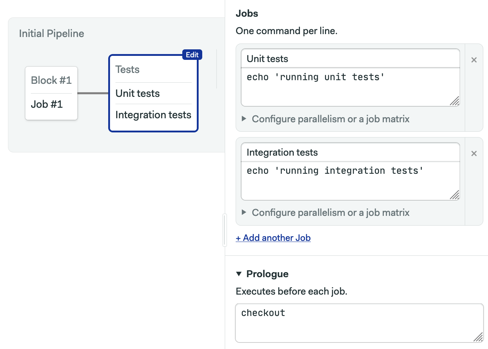
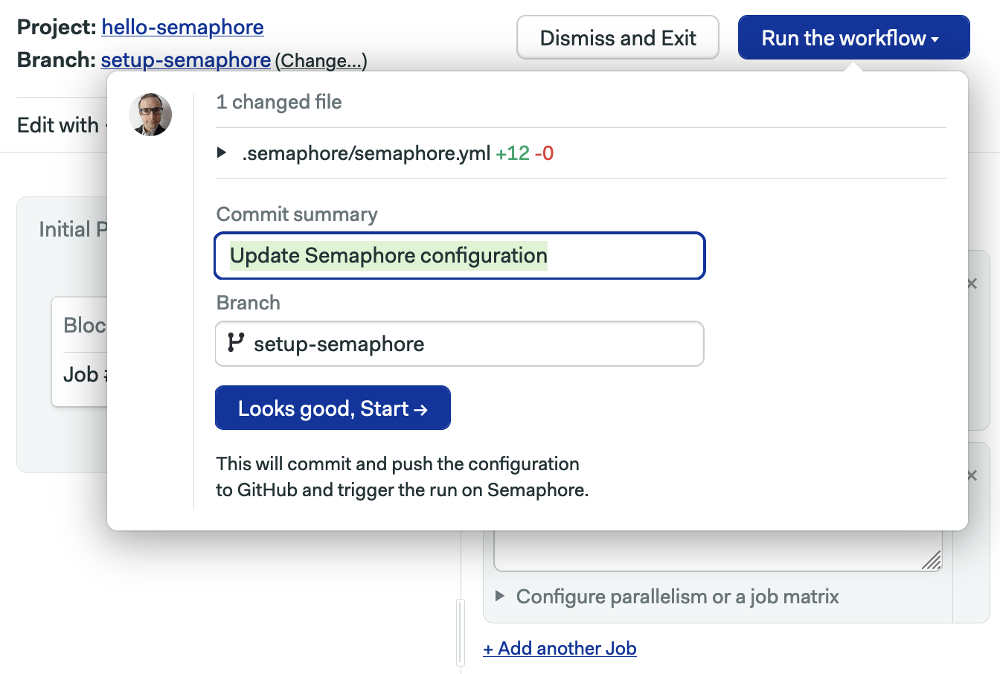
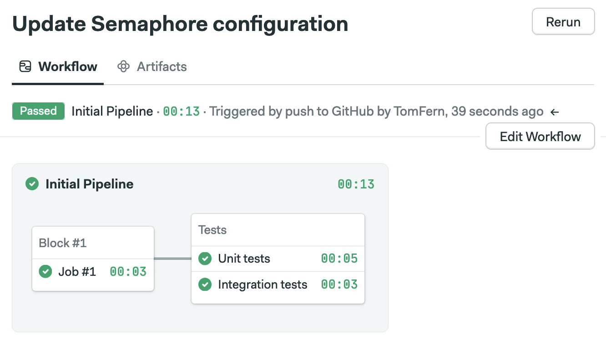
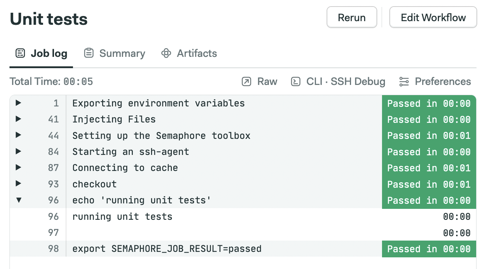
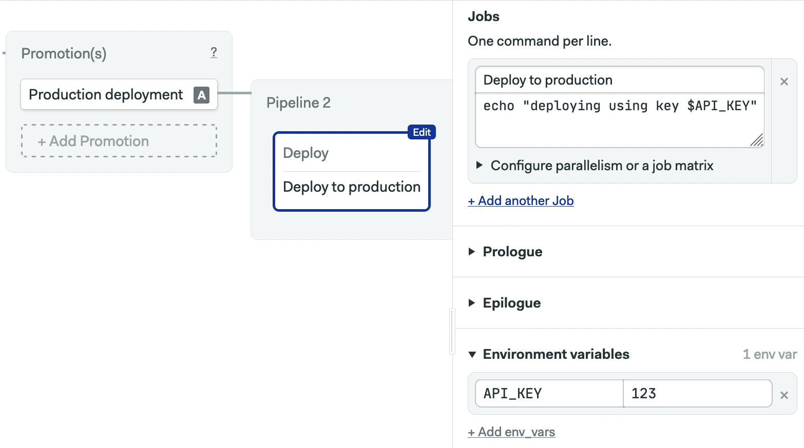

# Creating Your First CI/CD Pipeline

This step-by-step tutorial will have you running a successful CI/CD pipeline on Semaphore in minutes.

## About Semaphore

Semaphore is a cloud-based automation service for building, testing, and
deploying software.

Semaphore is **built for developer productivity** and guided by three principles:

1. **Speed**: Developers must work in a fast feedback loop, so CI/CD workflows
   must be fast.
3. **Power**: The CI/CD tool needs to be able to run any automated software
   workflow, at any scale.
2. **Ease of use**: CI/CD must be easy enough for every developer to use so
   that they are in close contact with the operation of their software and its
   impact on users.

## Prerequisites

To complete this tutorial, you will need:

- Basic knowledge of Git
- Basic knowledge of the command line
- A [Semaphore account][semaphore-home]
- A [GitHub account][github]

## Creating a Git repository

Start by creating a new Git repository on GitHub. You may skip this section if you
plan to use an existing repository.

- Navigate to GitHub and [create a new repository][github-new].
- Enter the name of your repository, for example `hello-semaphore`, then click **Initialize this repository with: Add a README file**. Finally, click **Create repository**.

## Creating a Semaphore project

1. Log in to your [Semaphore account][semaphore-login].
2. If you are part of multiple organizations, select the one in which you plan
   to host the project you are about to create.
3. In the top navigation, click **Create new**.
4. In the **Start a real project** section, click **Choose repository**.
5. Follow on-screen instructions to authorize Semaphore to access a GitHub
   repository of your choice. In case you need help, consult the detailed [guide
   to connecting your GitHub account with Semaphore][github-guide].
   
6. Wait a few seconds for Semaphore to initialize the project.
7. The following screen lets you invite other people who have access to the
   GitHub repository to your Semaphore project. Click **Continue to workflow
   setup** to proceed.
8. Use one of the templates to get to the first green build quickly: select
   **Single job**, then click **Looks good, start**.
9. You will see your first workflow running and within seconds completing
   successfully.

## Adding a test block to your CI pipeline

Let's customize your pipeline so that it looks more like a continuous integration (CI) process for a real project.

If you open your repository on GitHub, you will notice that there is a new
branch: **setup-semaphore**. Opening that branch will reveal that Semaphore has
pushed a `semaphore.yml` configuration file inside the `.semaphore` directory.

Semaphore, like most modern CI/CD tools, creates workflows based on
YAML configuration files. However, you don't need to write YAML by hand.
Semaphore features a **visual Workflow Builder**, which lets anyone create
and modify pipelines using a point-and-click interface. Of course, you can also always edit
your configuration by hand in your favorite editor.

### Adding a block with parallel jobs using Workflow Builder

To extend your pipeline:

1. On the workflow page, click **Edit Workflow**.
2. Inside **Initial pipeline**, click **Add block**.
3. In the pane on the right-hand side, change **Name of the block** to `Tests`.
4. Change the name of the first job from `Job #1` to `Unit tests`, and in the
   **Commands** text area, enter `echo 'running unit tests'`.
5. Click on the **Add another job** link to add a parallel job. Name it
   `Integration tests` and enter `echo 'running integration
   tests'` in the commands text area.
6. Click **Prologue** and enter `checkout` as a command to run. This is [a
   built-in script][checkout] that downloads the content of your Git
   repository. By placing it in the prologue, we reuse it as a starting command
   in both parallel jobs.
   
7. In the top-right corner of your screen, click **Run the workflow**.
8. In the pop-up screen, you can view the diff in the YAML
   that Semaphore will append to `.semaphore/semaphore.yml`. Click **Looks good,
   start**. This will push the changes to the GitHub repository and start a new
   workflow.
   

At this point, you have a multi-stage CI pipeline with parallel jobs:

### Understanding the basic building blocks of Semaphore workflows

On each change in your Git repository, Semaphore runs a **workflow**. Your last
workflow, for example, contains a single pipeline called `Initial pipeline`.

But, workflows can be composed of more than one pipeline. Additional pipelines
can be triggered manually or automatically based on custom conditions. We will
see an example of that in a minute.

A **pipeline** can contain multiple blocks. For example, your pipeline right now
contains two blocks: `Block #1` runs first and when it completes the `Tests`
block runs next.

**Blocks** can contain a single job or many parallel jobs. For example, your
`Tests` block contains two parallel jobs.

!!! info "Running parallel jobs simultaneously is possible under open source, free trial, or paid [plans][plans]."

**Jobs** are basic units of execution. Semaphore runs each job as a sequence of
commands in a clean, isolated environment that it creates on-demand and destroys
as soon as its last command is finished. If the exit code of each command is
`0`, Semaphore records the job as successful (passed).

### Viewing logs

In your workflow, click **Unit tests** to view the output log of that job. You
will see the command `echo 'running unit tests'` that you wrote previously.
Clicking on it will expand its output.

You will also notice that Semaphore transparently displays all the commands that
it performs to prepare your job for execution. This enables you to have
full insight and control over your CI/CD environment.

## Adding a CD pipeline

Semaphore has first-class support for continuous delivery (CD) via
**promotions** which trigger other pipelines. By combining promotions and
pipelines, you can:

- Manage multiple release targets
- Implement any deployment strategy
- Perform rollbacks
- Manage infrastructure
- Automate any DevOps task with a full log of who did what and when

### Adding an automatic promotion and a deployment pipeline

Let's extend our workflow by implementing continuous deployment to a
production environment whenever the CI pipeline on the `main` branch has passed.

1. From your workflow or job, click **Edit Workflow**.
2. On the right-hand side following your `Initial Pipeline`, click **Add First
   Promotion**.
3. Enter `Production deployment` as the name of your promotion.
4. Check **Enable automatic promotion**.
5. As the conditions for automatic promotion, enter `branch = 'main' AND result ='passed'`.
6. If needed, scroll the left-hand side of your screen to the right, so that
   a new pipeline is visible on your screen. By default, it will be called
   `Pipeline 2`. You can always change this later.
7. Click on `Block #1` and rename the block to `Deploy`.
8. Rename the job to `Deploy to production`.
9. Add a command `echo "deploying using key $API_KEY"`.`
9. Click **Environment variables**, then click **Add env vars**. Define `API_KEY` with value `123`.

10. Click **Run the workflow**.

When this workflow runs, it will not run your promotion. This is because we are
still working in the `setup-semaphore` branch, while we configured our
promotion to run automatically only on the `main` branch.

### Running a promotion manually

Before merging to main, we can verify our promotion by running it manually:

1. On the workflow page, click **Production deployment** then **Start promotion**.
2. Click on `Pipeline 2` to expand the deployment pipeline. Voilà!

## Wrapping up

To finish the implementation of your Semaphore project, open a pull request on
GitHub from the `setup-semaphore` branch.

After you merge, Semaphore will trigger a new workflow on the `main` branch, and
it will run both the CI and CD pipelines.

Here are a few ideas about what you could do next as an exercise:

- Edit any of the Semaphore configuration files by hand. Does pushing the change
  trigger a new workflow? Is the change reflected in Workflow Builder?
- Add one more block to the production deployment pipeline which would perform
  a smoke test.
- Add another promotion for manually deploying to a staging environment.

## Where to go next

In this tutorial, we have covered the very basics of Semaphore. Here are some
pointers for moving forward as you implement CI/CD pipelines for your projects:

- Explore the default [Linux][linux-env] and [macOS][macos-env] environments,
  which come with the most common open source build tools, languages, and databases.
- Install [Semaphore CLI][cli] so you can easily [debug jobs with
  SSH][debugging].
- Use [secrets][secrets] to authenticate with APIs and deploy to cloud environments.
- Use [cache][cache] to reuse project dependencies.
- Study [example projects][example-projects].
- Connect with other Semaphore users and get help on the [community forum][forum].

[semaphore-home]: https://semaphoreci.com
[github]: https://github.com
[github-new]: https://github.com/new
[semaphore-login]: https://id.semaphoreci.com
[github-guide]: ../account-management/connecting-github-and-semaphore.md
[checkout]: ../reference/toolbox-reference.md#checkout
[plans]: ../account-management/plans.md
[linux-env]: ../ci-cd-environment/ubuntu-18.04-image.md
[macos-env]: ../ci-cd-environment/macos-xcode-12-image.md
[example-projects]: ../examples/tutorials-and-example-projects.md
[cli]: ../reference/sem-command-line-tool.md
[debugging]: ../essentials/debugging-with-ssh-access.md
[secrets]: ../essentials/using-secrets.md
[cache]: ../essentials/caching-dependencies-and-directories.md
[forum]: https://discuss.semaphoreci.com/
