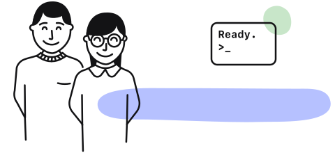

#Hello, how can we help?

    

        Welcome to Semaphore 2.0 Documentation. All pages are open sourced. If you feel something could be improved, don’t be affraid to propose changes!
    

    

    

        

            <h2 id="newtosemaphore20">New to Semaphore 2.0?</h2>
            
Learn the basic concepts

            <ul>
                <li><a href="guided-tour/creating-first-project">Creating your first project</a></li>
                <li><a href="guided-tour/getting-started">Getting Started</a></li>
                <li><a href="use-cases/tutorials-and-examples">Tutorials and Example Projects</a></li>
                <li><a href="reference/pipeline-yaml-reference">Pipeline YAML Reference</a></li>
                <li><a href="reference/sem-command-line-tool">sem command line tool</a></li>
            </ul>
        

        

            <h2 id="mostpopulararticles">Most popular articles</h2>
            
What others are searching

            <ul>
                <li><a href="use-cases/docker-layer-caching">Docker layer caching</a></li>
                <li><a href="reference/pipeline-yaml-reference">Pipeline YAML Reference</a></li>
                <li><a href="ci-cd-environment/macos-mojave-xcode-10-image">macOS Mojave Xcode 10 Image</a></li>
                <li><a href="ci-cd-environment/macos-mojave-xcode-11-image">macOS Mojave Xcode 11 Image</a></li>
                <li><a href="reference/semaphore-changelog">Semaphore Changelog</a></li>
            </ul>
        

    

    

        

            <h2 id="semaphore20features">Semaphore 2.0 features</h2>
            
Latest in product

            <ul>
                <li><a href="use-cases/artifacts">Artifacts</a></li>
                <li><a href="use-cases/auto-cancel-previous-pipelines-on-a-new-push">Auto-cancel previous pipelines on a new push</a></li>
                <li><a href="use-cases/fail-fast-stop-running-tests-on-the-first-failure">Fail-Fast: Stop running tests on the first failure</a></li>
            </ul>
        

        

            <h2 id="languagespecificconfiguration">Language specific configuration</h2>
            
Dive into the details

            <ul>
                <li><a href="programming-languages/c">C</a></li>
                <li><a href="programming-languages/cpp">C++</a></li>
                <li><a href="programming-languages/clojure">Clojure</a></li>
                <li><a href="programming-languages/elixir">Elixir</a></li>
                <li><a href="programming-languages/erlang">Erlang</a></li>
                <li><a href="programming-languages/go">Go</a></li>
                <li><a href="programming-languages/java">Java</a></li>
                <li><a href="programming-languages/javascript-and-node-js">JavaScript and Node.js</a></li>
                <li><a href="programming-languages/php">PHP</a></li>
                <li><a href="programming-languages/python">Python</a></li>
                <li><a href="programming-languages/ruby">Ruby</a></li>
                <li><a href="programming-languages/rust">Rust</a></li>
                <li><a href="programming-languages/scala">Scala</a></li>
                <li><a href="programming-languages/swift">Swift</a></li>
            </ul>
        

    

