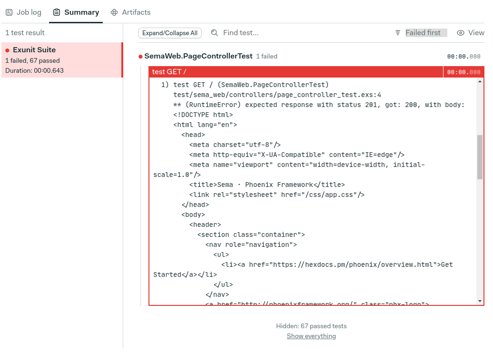

# Elixir

This guide covers configuring Elixir projects on Semaphore.
If you’re new to Semaphore please read our
[Guided tour](https://docs.semaphoreci.com/guided-tour/getting-started/) first.

## Hello World

```yaml
# .semaphore/semaphore.yml
version: v1.0
name: Hello Semaphore
agent:
  machine:
    type: e1-standard-2
    os_image: ubuntu1804
blocks:
  - name: Elixir example
    task:
      jobs:
      - name: Run some code
        commands:
          - elixir 'IO.puts "Hello world!"'
```

## Phoenix example project

Semaphore provides a tutorial and demo Phoenix application with a working
CI pipeline that you can use to get started quickly:

- [Elixir Phoenix Continuous Integration tutorial][tutorial]
- [Demo project on GitHub][demo-project]

## Supported Elixir versions

Semaphore supports all versions of Elixir. You have the following options:

- Linux: Elixir is available out-of-the-box in the [Ubuntu 18.04 VM image][ubuntu-elixir].
- Docker: use [semaphoreci/elixir](/ci-cd-environment/semaphore-registry-images/#elixir) or
  [your own Docker image][docker-env] with the version of Elixir and other
  packages that you need.

Follow the links above for details on currently available language versions and
additional tools.

### Selecting an Elixir version on Linux

Semaphore uses [kiex](https://github.com/taylor/kiex) to manage
Elixir versions. Any version installable with kiex is supported on
Semaphore. You may install new versions and change them with `sem-version`.
Here's an example:

``` yaml
blocks:
  - name: Tests
    task:
      prologue:
        commands:
          - kiex install 1.6
          - sem-version elixir 1.6
      jobs:
        - name: Tests
          commands:
            - elixir --version
```

## Test summary

!!! beta "Feature in beta"
    Beta features are subject to change.

General test summary guidelines are [available here ↗](/essentials/test-summary/#how-to-use-it){target="_blank"}.



### Generating JUnit XML report

We will start with adding [junit-formatter ↗][junit-formatter]{target="_blank"} to your `mix.exs` dependencies:

```Elixir
defp deps do
  [
    # ...
    {:junit_formatter, "~> 3.1", only: [:test]}
  ]
end
```

Then installing the dependencies:

```shell
mix deps.get
```

Now we have to make sure that our formatter is properly configured and used by rspec.
There are two ways we can do this:

- Extend your `config/test.exs` configuration file

```Elixir
config :junit_formatter,
  report_dir: "/tmp",
  report_file: "junit.xml", # Save output to "/tmp/junit.xml"
  print_report_file: true, # Adds information about file location when suite finishes
  include_filename?: true, # Include filename and file number for more insights
  include_file_line?: true
```

- Extend your `test/test_helper.exs` configuration file

```Elixir
ExUnit.configure(formatters: [JUnitFormatter, ExUnit.CLIFormatter])
ExUnit.start()
```

Running your tests with this setup will also generate `junit.xml` summary report.

### Publishing results to Semaphore

To make Semaphore aware of your test results you can publish them using [test results CLI ↗][test-results-cli]{target="_blank"}:

```shell
test-results publish /tmp/junit.xml
```

We advise to include this call in your epilogue:

```yaml
epilogue:
  always:
    commands:
      - test-results publish /tmp/junit.xml
```

This way even if your job fails(due to the test failures) results will still be published for inspection.

### Example configuration

Your CI configuration should look similiar to this:

```yaml
- name: Tests
  task:
    prologue:
      commands:
        - checkout
        - mix deps.get
    jobs:
      - name: Elixir Tests
        commands:
          - mix test
    epilogue:
      always:
        commands:
          - test-results publish /tmp/junit.xml
```

### Demos

You can see how test results are setup in one of our [demo projects ↗][demo-project]{target="_blank"}.

## Dependency caching

You can use Semaphores `cache` command to store and load the build and
dependency cache. In the following configuration example, we install
dependencies and warm the cache in the first block, then use the cache
in subsequent blocks.

``` yaml
version: v1.0
name: Elixir & Phoenix Example
agent:
  machine:
    type: e1-standard-2
    os_image: ubuntu1804

blocks:
  - name: Install dependencies
    task:
      env_vars:
        - name: MIX_ENV
          value: test
      jobs:
        - name: mix and cache
          commands:
            - checkout
            # Be sure to use --force to skip confirmation prompts
            - mix local.hex --force
            - mix local.rebar --force
            - cache restore
            - mix do deps.get, compile
            - cache store
  - name: Tests
    task:
      env_vars:
        - name: MIX_ENV
          value: test
      prologue:
        commands:
          - checkout
          # Restore dependencies and compiled code
          - cache restore
      jobs:
        - name: Everything
          commands:
            - mix test
```

## Environment variables

Semaphore doesn't set language specific environment variables like
`MIX_ENV`. You can set these at the task level.

``` yaml
blocks:
  - name: Tests
    task:
      env_vars:
        - name: MIX_ENV
          value: test
      jobs:
        - name: Everything
          commands:
            - mix test
```

## System dependencies

Projects may need system packages things like database drivers. You
have full `sudo` access so you may install required packages. Here's
an example of installing the Postgres dependencies.

``` yaml
blocks:
  - name: Tests
    task:
      prologue:
        commands:
          - sudo apt-get update && sudo apt-get install -y libpq-dev
          - mix install
      jobs:
        - name: Everything
          commands:
            - mix test
```

[ubuntu-elixir]: https://docs.semaphoreci.com/ci-cd-environment/ubuntu-18.04-image/#erlang-and-elixir
[docker-env]: https://docs.semaphoreci.com/ci-cd-environment/custom-ci-cd-environment-with-docker/
[tutorial]: https://docs.semaphoreci.com/examples/elixir-phoenix-continuous-integration/
[demo-project]: https://github.com/semaphoreci-demos/semaphore-demo-elixir-phoenix
[junit-formatter]: https://github.com/victorolinasc/junit-formatter
[test-results-cli]: /reference/test-results-cli-reference/
