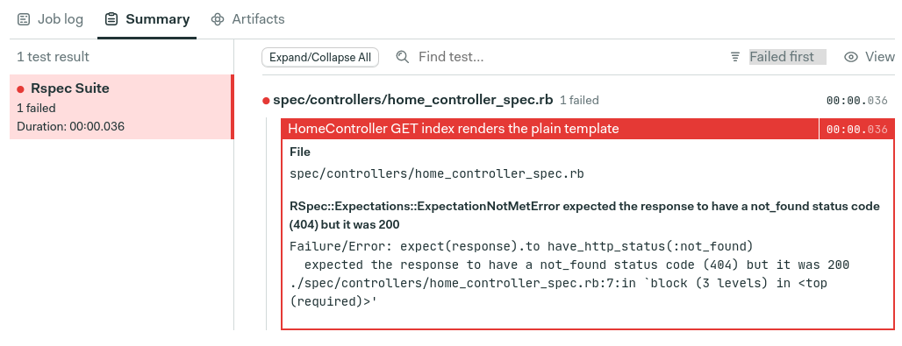

# Ruby

This guide will help you get started with a Ruby project on Semaphore.
If you’re new to Semaphore please read our
[Guided tour](https://docs.semaphoreci.com/guided-tour/getting-started/) first.

## Hello world

``` yaml
# .semaphore/semaphore.yml
version: v1.0
name: Ruby example
agent:
  machine:
    type: e1-standard-2
    os_image: ubuntu1804
blocks:
  - name: Hello world
    task:
      jobs:
        - name: Run some code
          commands:
            - ruby -e 'puts "evol".reverse'
```


## Ruby on Rails example project

Semaphore provides a tutorial and demo Rails application with a working
CI pipeline that you can use to get started quickly:

- [Ruby on Rails Continuous Integration tutorial][rails-tutorial]
- [Demo project on GitHub][rails-demo-project]

## Supported Ruby versions

Semaphore supports all versions of Ruby. You have the following options:

- Linux: Ruby is available out-of-the-box in the [Ubuntu 18.04 VM image][ubuntu-ruby].
- macOS: Ruby is available out-of-the-box in the [macOS VM image][macos-ruby].
- Docker: use [semaphoreci/ruby](/ci-cd-environment/semaphore-registry-images/#ruby) or
  [your own Docker image][docker-env] with the version of Ruby and other
  packages that you need.

Follow the links above for details on currently available language versions and
additional tools.

#### Selecting a Ruby version on Linux

On Linux, Semaphore uses [rbenv](https://github.com/rbenv/rbenv) to manage the supported
Ruby versions. Any Ruby version listed in
[Ubuntu image reference][ubuntu-ruby]
is supported and can be used on Semaphore jobs. The default version is set by the
`.ruby-version` file in your repository. If the `.ruby-version` file is present,
then you cannot force any other Ruby version for that directory. In that case
you will need to modify or delete `.ruby-version` in order to choose a different
Ruby version.

You can also change the active Ruby version by calling `sem-version ruby`
followed by the desired Ruby version. Using `sem-version ruby [ruby-version] -f` the
desired ruby version can be forced. In this case `.ruby-version` file is not taken into account.
Here's an example:

``` yaml
blocks:
  - name: Tests
    task:
      prologue:
        commands:
          - sem-version ruby 2.5 -f
      jobs:
        - name: Tests
          commands:
            - ruby --version
```

If the version of Ruby that you need is not currently available in the Linux VM,
we recommend running your jobs in [a custom Docker image][docker-env].

## Test summary

Test summary relies on [junit xml format ↗][junit-schema] report files generated by your test runner.
With test summary you can inspect results of your test suites runs. When tests fail, you'll get detailed report on the issue:



### Generating JUnit XML report

In this guide we will focus on `RSpec` test runner. If you use TestUnit you can see look for runners that [supports junit file generation↗][test-unit-runner]

We will start with adding [rspec_junit_formatter ↗][rspec-junit-formatter] to your Gemfile:

```Ruby
gem "rspec_junit_formatter", :group => [:test]
```

Then installing the dependencies:

```shell
bundle install
```

Now we have to make sure that our formatter is properly configured and used by rspec.
There are two ways we can do this:

- Use `.rspec` configuration file

```dotfile
--format RspecJunitFormatter
--out /tmp/rspec.xml
--format documentation
```

- Adjust your run command:

```shell
  bundle exec rspec --format RspecJunitFormatter --out /tmp/junit.xml --format documentation
```

Running your tests with this setup will also generate `/tmp/junit.xml` summary report.
If your setup is based on docker, please refer to [docker based setup][test-summary-docker].

### Publishing results to Semaphore

To make Semaphore aware of your test results you can publish them using [test results CLI ↗][test-results-cli]:

```shell
test-results publish /tmp/junit.xml
```

We advise to include this call in your epilogue:

```yaml
epilogue:
  always:
    commands:
      - test-results publish /tmp/junit.xml
```

This way even if your job fails(due to the test failures) results will still be published for inspection.

### Example configuration

Your CI configuration should look similiar to this:

```yaml
- name: Tests
    task:
      prologue:
        commands:
          - checkout
          - bundle install

      job:
        name: "Tests"
        commands:
          - bundle exec rspec --format RspecJunitFormatter --out /tmp/junit.xml --format documentation

      epilogue:
        always:
          commands:
            - test-results publish /tmp/junit.xml
```

This way even failed jobs (due to the failed tests) will publish test results

### Test summary docker

[ WIP ]

## Dependency caching

You can use Semaphores `cache` command to store and load a gem bundle
and configuration. In the following configuration example, we install
dependencies and warm the cache in the first block, then use the cache
in subsequent blocks.

``` yaml
#.semaphore/semaphore.yml

version: v1.0
name: Example Ruby pipeline
agent:
  machine:
    type: e1-standard-2
    os_image: ubuntu1804

blocks:
  - name: Install dependencies
    task:
      jobs:
        - name: cache bundle
          commands:
            - checkout
            - cache restore
            - bundle install --deployment --path vendor/bundle
            - cache store

  - name: Tests
    task:
      prologue:
        commands:
          - checkout
          - cache restore
          - bundle install --deployment --path vendor/bundle
      jobs:
        - name: Test all the things
          commands:
            - bundle exec rake test
```

If you need to clear cache for your project, launch a
[debug session](https://docs.semaphoreci.com/essentials/debugging-with-ssh-access/)
and execute `cache clear` or `cache delete <key>`.

## Environment variables

Semaphore doesn't set language specific environment variables like
`RAILS_ENV` or `RACK_ENV`. You can set these at the task level.

``` yaml
blocks:
  - name: Tests
    task:
      env_vars:
        - name: RACK_ENV
          value: test
      jobs:
        - name: Everything
          commands:
            - bundle exec rake test
```

## Database configuration

Rails 4.1+ supports using the `DATABASE_URL` to [configure a
database][rails-database-configuration]. Older versions of Rails need
to generate a `database/config.yml` manually.

### 4.1+ - Using DATABASE_URL

Rails will read database configuration from `DATABASE_URL` if set and
`config/database.yml` is empty. So, start a database with
[sem-service][sem-service], set `DATABASE_URL`, and clear the
existing `config/database.yml`. Here's an example block:

``` yaml
blocks:
  - name: Tests
    task:
      env_vars:
        # Matches the configuration used in sem-service
        - name: DATABASE_URL
          value: postgresql://postgres@localhost/test?encoding=utf8
        - name: RAILS_ENV
          value: test
      jobs:
        - name: Test all the things
          commands:
            - checkout
            - sem-service start postgres
            # Clear existing config/database.yml
            - cat /dev/null > config/database.yml
            - bin/rails db:create
            - bin/rails test
```

### Older Rails Versions

If your Rails version does not support `DATABASE_URL`, then you can
use a separate `config/database.yml` for CI.

Create a `database.yml` in `.semaphore` along side your pipeline
configurations. The configured `username` and `password` match the
connection info from [sem-service][sem-service].

``` yaml
# .semaphore/database.yml

test:
  adapter: postgresql
  database: test
  pool: 5
  username: postgres
  password: ~
```

Next, set `RAILS_ENV` and replace the existing `config/database.yml`
before running tests.

``` yaml
blocks:
  - name: Tests
    task:
      env_vars:
        - name: RAILS_ENV
          value: test
      jobs:
        - name: Test all the things
          commands:
            - checkout
            - sem-service start postgres
            # Use CI's database.yml
            - cp .semaphore/database.yml config/database.yml
            - bin/rails db:create
            - bin/rails test
```

## C-Extensions & system dependencies

Projects may need system packages to install gems like `pg`. Semaphore provides
full `sudo` access so you may install all required packages. Here's an
example of installing the `pg` gem.

``` yaml
blocks:
  - name: Tests
    task:
      prologue:
        commands:
          - sudo apt-get update && sudo apt-get install -y libpq-dev
          - gem install pg
      jobs:
        - name: Everything
          commands:
            - bundle exec rake test
```

## Browser testing

[Capybara](http://teamcapybara.github.io/capybara) is the recommended
solution for browser tests in Ruby. The Firefox, Chrome, and Chrome Headless
drivers work out of the box.

Refer to the [Ubuntu image reference](https://docs.semaphoreci.com/ci-cd-environment/ubuntu-18.04-image/)
for details on preinstalled browsers and testing tools on Semaphore.

[rails-tutorial]: https://docs.semaphoreci.com/examples/rails-continuous-integration/
[rails-demo-project]: https://github.com/semaphoreci-demos/semaphore-demo-ruby-rails
[browser-ref]: https://docs.semaphoreci.com/ci-cd-environment/ubuntu-18.04-image/#browsers-and-headless-browser-testing
[sem-service]: https://docs.semaphoreci.com/ci-cd-environment/sem-service-managing-databases-and-services-on-linux/
[rails-database-configuration]: https://guides.rubyonrails.org/configuring.html#configuring-a-database
[rails-guide]: https://docs.semaphoreci.com/examples/rails-continuous-integration/
[ubuntu-ruby]: https://docs.semaphoreci.com/ci-cd-environment/ubuntu-18.04-image/#ruby
[macos-ruby]: https://docs.semaphoreci.com/ci-cd-environment/macos-xcode-11-image/#ruby
[docker-env]: https://docs.semaphoreci.com/ci-cd-environment/custom-ci-cd-environment-with-docker/

## Running RSpec and Cucumber in parallel

To run Cucumber or RSpec suites in parallel across multiple jobs you can use `semaphore_test_boosters` gem.

To set it up use the following snippet for your RSpec block:

``` yaml
jobs:
  - name: RSpec
    parallelism: 5 # Number of jobs to run in parallel
    commands:
      - gem install semaphore_test_boosters
      - rspec_booster --job $SEMAPHORE_JOB_INDEX/$SEMAPHORE_JOB_COUNT # Use environment variable to run portion of a spec suite
```

 The similar setup is also used for Cucumber block:

``` yaml
jobs:
  - name: Cucumber
    parallelism: 5  # Number of jobs to run in parallel
    commands:
      - gem install semaphore_test_boosters
      - cucumber_booster --job $SEMAPHORE_JOB_INDEX/$SEMAPHORE_JOB_COUNT # Use environment variable to run portion of a spec suite
```

[rspec-junit-formatter]: https://github.com/sj26/rspec_junit_formatter
[junit-schema]: https://www.ibm.com/docs/en/adfz/developer-for-zos/9.1.1?topic=formats-junit-xml-format
[test-unit]: https://github.com/test-unit/test-unit
[test-unit-runner]: https://github.com/kenichiice/test-unit-runner-junitxml
[test-summary-docker]: /programming-languages/ruby/#test-summary-docker
[test-results-cli]: /reference/test-results-cli-reference/
