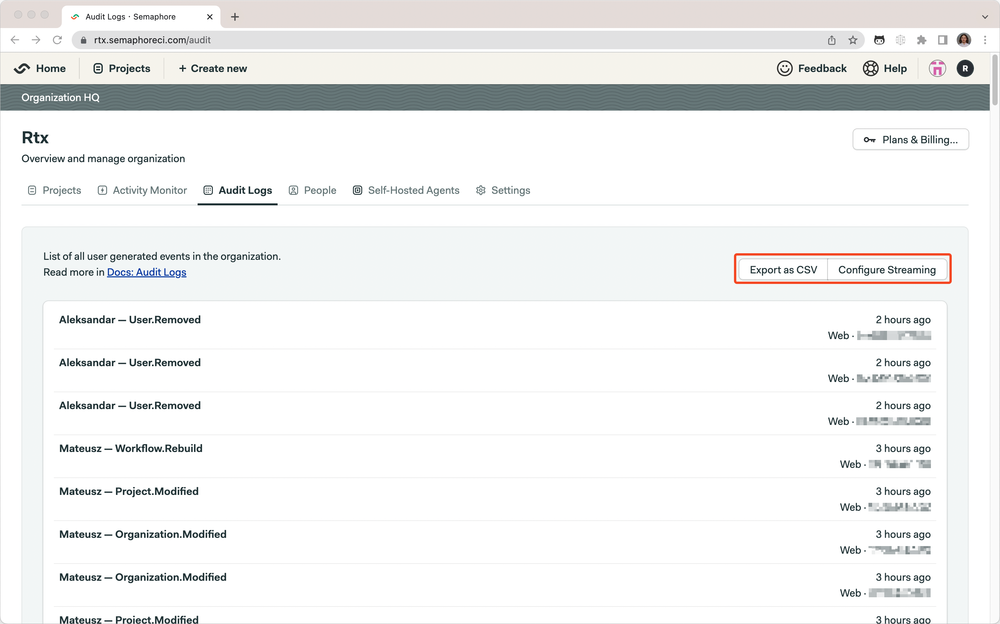
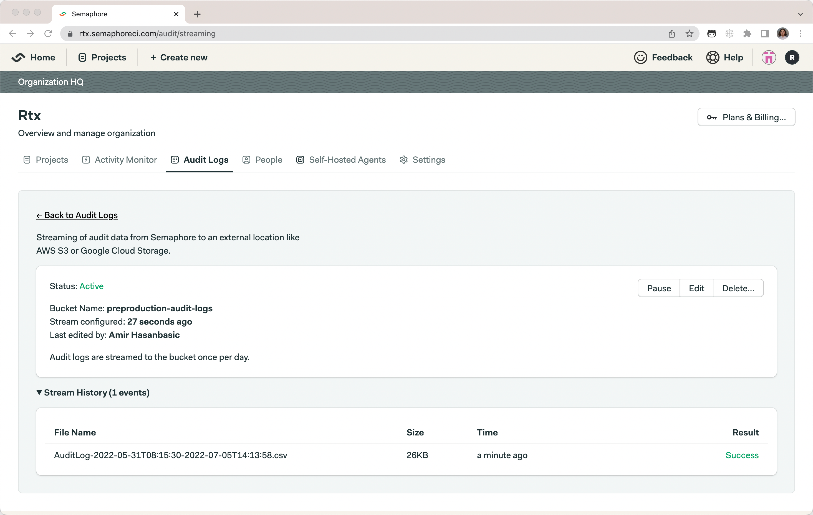

# Audit logs exporting

!!! plans "Available on: Scaleup"

Audit logs can be manually downloaded with **Export as CSV** button or logs can be automatically exported every day to AWS S3 or Google Cloud Storage by setting up our logs streaming.

## Downloading CSV
You can download CSV containing all audit logs for your organization with **Export as CSV** which can be seen highlighted in the image above.

## Streaming
Collection of audit logs can be done securely by exporting audit logs periodically to external location like AWS S3 and Google Cloud Storage. You must provide bucket name, key ID, key secret (sometimes refered to as access key id and secret access key). 
Once set up you will be able to see streams history. Pause button pauses streaming of audit logs to external location **not** the collection of the audit logs!

[form]: https://semaphoreci.com/contact