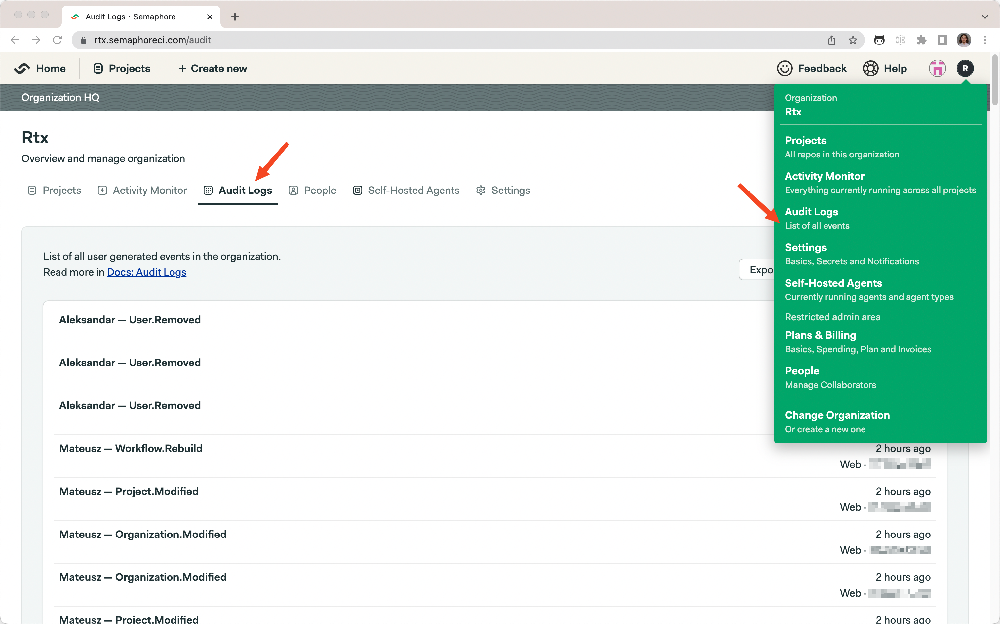

# Audit logs

To support compliance, accountability, and security, Semaphore provides logs of audited events. Audit Log [events][events] are events that affect your organization, projects, users, or any other [resources][resources] in Semaphore.
Events contain information about when who and what was the performed activity. 

You can find audit logs in your organization settings under Audit Logs.

**Note:** Audit logs are only available on our [enterprise plan](https://semaphoreci.com/pricing).

Do you need Audit logs in order to use Semaphore? Contact us via this [form][form], and we’ll get back to you shortly.
[form]: https://semaphoreci.com/contact

[resources]: ./audit-events-reference.md#resource-field
[events]: ./audit-events-reference.md