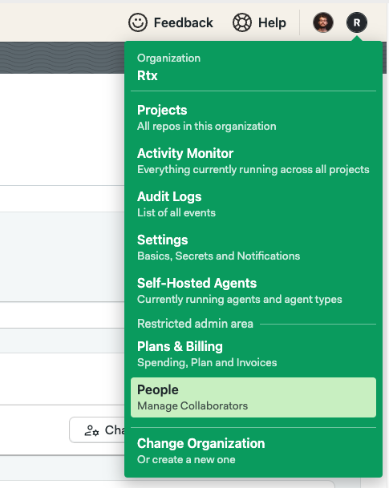
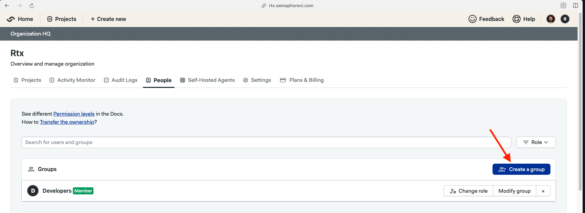
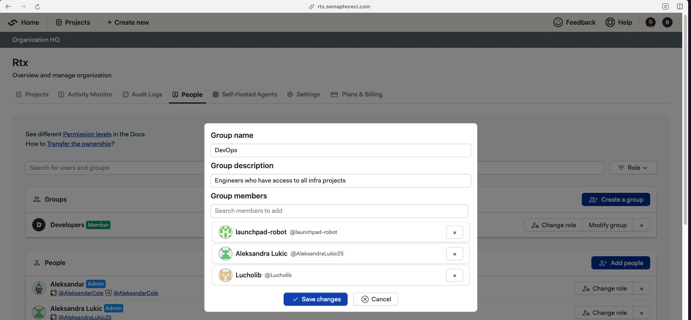
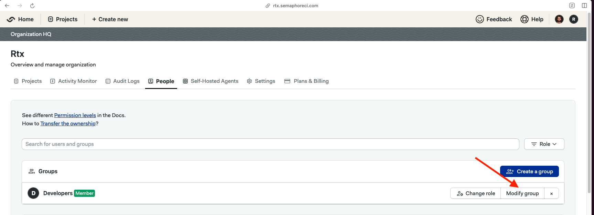
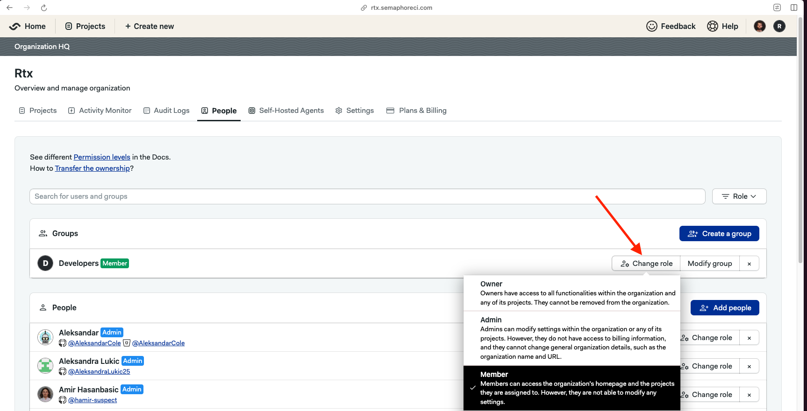
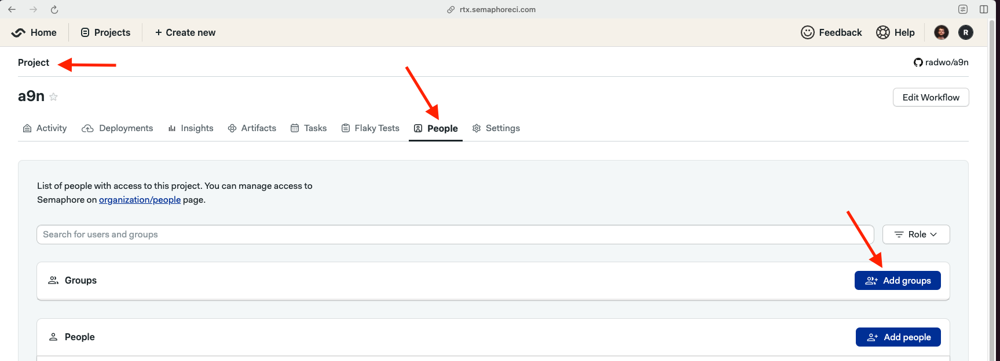

# User Groups

!!! plans "Available on: Scaleup"

Instead of managing users (changing their roles and adding them to individual projects) one by one, you can use User Groups. This feature simplifies user management, enhances access control, and streamlines the assignment of roles and permissions across your projects. With User Groups, you can efficiently organize users into groups, assign roles to these groups, and manage access to your projects at the group level. Here's how it works:

### Creating a User Group
<ul>
 <li> Navigate to the People page. </li>

 <li> If you organization has access to the Groups feature, you should see a "Create a group" button. When you click on it, a pop-up will show, asking for group name, description and it's members. </li>

 <li> As the final step, you need to enter group name and it's description, as well as adding it's members. When you create a new group, by default that group has 'Member' role assigned to it. To read more about our RBAC and roles, [click here](/security/rbac-authorization) </li>

</ul>

### Adding/Removing Users to a User Group
<ul>
 <li> On top of the people page, there is a section listing all the groups that exist within your organization. If you have sufficient permissions, you will see "Modify group" button next to the group name. </li>

 <li> The same popup used to create a new group will appear. Here, you can change add new members, remove existing ones, or change group name and description.</li>
 <li> Once you made all the changes, click on the "Save changes" button. It might take up to a couple of minutes for all the cahnges to propagate through the system, depending on how many users you have added/removed from the group. </li>
</ul>

###  Assigning Roles to a User Group
<ul>
 <li> As mentioned above, whenever you create a new group, it is assigned a 'Member' role within the organization, and it has no access to any of the projects. </li>
 <li> If you go to the organization people page, you will see all the groups listed, togeather with a label stating which role the group (and it's members) have within the organization. If you have sufficient permissions, you will be able to use 'Change role' button next to the group name. </li>

 <li> If you go to the project people page, you will be able to add groups (and all of it's members) to the project. </li>

</ul>
