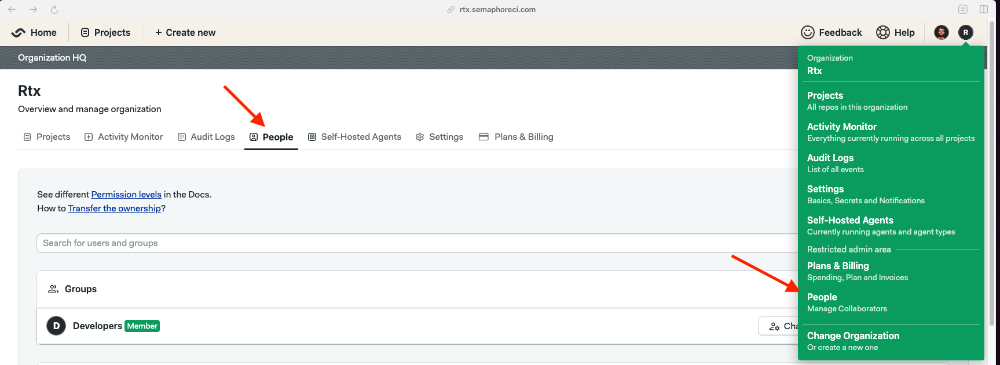

# User Groups

!!! plans "Available on: Scaleup"

Instead of managing users (changing their roles and adding them to individual projects) one by one, you can use User Groups. This feature simplifies user management, enhances access control, and streamlines the assignment of roles and permissions across your projects. With User Groups, you can efficiently organize users into groups, assign roles to these groups, and manage access to your projects at the group level. Here's how it works:

### Creating a User Group
<ul>
 <li> Navigate to the People page. </li>

 <li> If you organization has access to the Groups feature, you should see a "Create a group" button. When you click on it, a pop-up will show, asking for group name, description and it's members. </li>

 <li> As the final step, you need to enter group name and it's description, as well as adding it's members.</li>

</ul>

### Adding Users to a User Group
<ul>
 <li> Select a group: In the User Groups section, click on the group you wish to add users to. </li>
 <li> Add users: Use the "Add Users" option to search for and select the users you want to add to the group. You can typically add users by typing their name or email address and selecting them from the search results. </li>
 <li> Confirm additions: Once you've selected all the users you wish to add, confirm the addition. The users will now be members of the group.</li>
</ul>

### Removing Users from a User Group
<ul>
 <li> Access the group's members: Click on the group from which you want to remove users to see a list of its current members. </li>
 <li> Select users to remove: Choose the users you want to remove by clicking on a remove button or checkbox next to their names. </li>
 <li> Confirm removal: After selecting the users, confirm their removal. They will no longer have access to the roles and permissions assigned to the group. </li>
</ul>

###  Assigning Roles to a User Group
<ul>
 <li> Choose a group: Select the User Group you wish to assign a role to. </li>
</ul>
